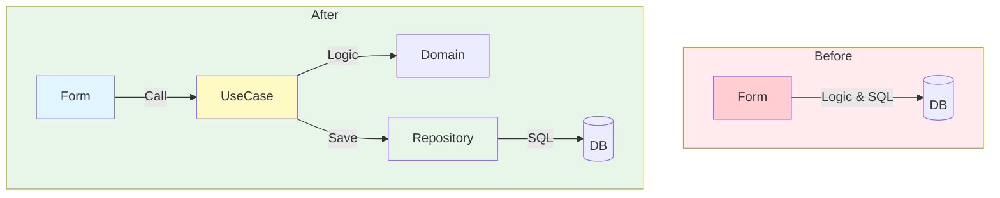

# 第15章：ケーススタディ（フォーム地獄→3分離）📚🔥

（Before：画面に全部入り 😇 → After：UI / UseCase / Repository に分ける ✨）

---

## 15.1 今日のゴール🎯✨

この章が終わると…👇

* 「フォームのボタン押したら全部やってるコード」を見て、**どこが混ざってるか**すぐ分かるようになる👀✨
* **UI / UseCase / Repository** の3つに分けて、**変更に強い形**にできるようになる🧱💪
* 「読みやすさ」「直しやすさ」が、**目に見えて変わる**のを体感できる🫶🌸

---

## 15.2 ケース設定：よくある“注文フォーム”🛒😊

WinFormsで、こんな入力がある画面を想像してね👇

* 単価（例：1200）💰
* 個数（例：3）🔢
* クーポンコード（例：STUDENT10）🎫
* 「注文を確定」ボタン🖱️

業務ルールはこれ👇

* クーポン `STUDENT10` なら **10%OFF** 🎓✨
* 合計が **10,000円以上なら送料0円** 🚚💨
* それ以外は送料 **500円** 📦

そして最後に「保存」もしたい（DBとかファイルとか）🗄️

---

## 15.3 Before：フォーム地獄（全部盛り）😇💥

まずは “ありがち” をわざとやります。
※読むだけでOK！「あるある〜」って思えたら勝ち😂

```csharp
// OrderForm.cs（WinForms）
private void btnConfirm_Click(object sender, EventArgs e)
{
    // 1) UI値を読む（TextBox）
    var unitPriceText = txtUnitPrice.Text;
    var quantityText = txtQuantity.Text;
    var coupon = txtCoupon.Text?.Trim();

    // 2) 入力チェック
    if (!decimal.TryParse(unitPriceText, out var unitPrice))
    {
        MessageBox.Show("単価が数字じゃないよ🥺");
        return;
    }
    if (!int.TryParse(quantityText, out var quantity) || quantity <= 0)
    {
        MessageBox.Show("個数が変だよ🥺");
        return;
    }

    // 3) 業務計算（割引・送料）
    var subTotal = unitPrice * quantity;

    decimal discount = 0;
    if (coupon == "STUDENT10")
        discount = subTotal * 0.10m;

    var totalAfterDiscount = subTotal - discount;

    decimal shipping = 500;
    if (totalAfterDiscount >= 10_000m)
        shipping = 0;

    var grandTotal = totalAfterDiscount + shipping;

    // 4) DB保存（SQL直書き）
    using var con = new SqlConnection(txtConnectionString.Text); // ← UIに接続文字列まである😇
    con.Open();

    using var cmd = con.CreateCommand();
    cmd.CommandText = @"
INSERT INTO Orders(UnitPrice, Quantity, Coupon, SubTotal, Discount, Shipping, GrandTotal)
VALUES(@UnitPrice, @Quantity, @Coupon, @SubTotal, @Discount, @Shipping, @GrandTotal);
SELECT CAST(SCOPE_IDENTITY() AS INT);
";
    cmd.Parameters.AddWithValue("@UnitPrice", unitPrice);
    cmd.Parameters.AddWithValue("@Quantity", quantity);
    cmd.Parameters.AddWithValue("@Coupon", coupon ?? (object)DBNull.Value);
    cmd.Parameters.AddWithValue("@SubTotal", subTotal);
    cmd.Parameters.AddWithValue("@Discount", discount);
    cmd.Parameters.AddWithValue("@Shipping", shipping);
    cmd.Parameters.AddWithValue("@GrandTotal", grandTotal);

    var orderId = (int)cmd.ExecuteScalar();

    // 5) 画面表示（結果）
    lblResult.Text = $"注文OK✅ 注文番号：{orderId} 合計：{grandTotal:n0}円";
}
```

---

## 15.4 何がつらいの？“変更理由”が多すぎる😭🌀

このフォームの `btnConfirm_Click` は、**変更理由が多すぎ**るのが問題だよ〜！

* UIが変わる（テキストボックスが増える）🖥️
* ルールが変わる（クーポン追加、送料条件変更）🧠
* 保存先が変わる（SQL Server→SQLite、API保存、ファイル保存…）🗄️🌐
* エラーメッセージ文言が変わる📝

つまり…
**“ちょっと直しただけ”で、全部が壊れやすい** 😇💥

---

## 15.5 After：3分離の完成形（UI / UseCase / Repository）🧩✨


ここからが本番！分け方はこれだけ👇



### ✅ UI（Form）

* 入力を集める
* UseCaseを呼ぶ
* 結果を表示する

### ✅ UseCase（アプリの手順・業務の中心）

* 入力を受け取る
* ルールで計算する
* 保存は「Repositoryにお願い」する

### ✅ Repository（保存担当）

* DB保存・読み込み
* どのDBでもいいように「差し替え」できる形にする

---

## 15.6 フォルダ構成（迷子防止マップ🗺️💕）

最小でこう分けると分かりやすいよ👇

* `Ui/OrderForm.cs` 🖥️
* `Application/PlaceOrderUseCase.cs` 🧠
* `Application/PlaceOrderCommand.cs` 📩（入力データの箱）
* `Application/PlaceOrderResult.cs` 📦（結果の箱）
* `Domain/OrderCalculator.cs` 🧮（計算だけを隔離してもOK）
* `Infrastructure/IOrderRepository.cs` 🚪（差し替え口）
* `Infrastructure/InMemoryOrderRepository.cs` 🧪（テスト用）
* `Infrastructure/SqliteOrderRepository.cs` 🗄️（本番用の例）

---

## 15.7 After：コード（短くなるのが気持ちいい😍✨）

### ① 入力の箱（Command）📩

```csharp
public sealed record PlaceOrderCommand(
    decimal UnitPrice,
    int Quantity,
    string? Coupon
);
```

### ② 結果の箱（Result）📦

```csharp
public sealed record PlaceOrderResult(
    int OrderId,
    decimal SubTotal,
    decimal Discount,
    decimal Shipping,
    decimal GrandTotal
);
```

### ③ Repositoryの差し替え口🚪

```csharp
public interface IOrderRepository
{
    int Add(OrderRecord record);
}

public sealed record OrderRecord(
    decimal UnitPrice,
    int Quantity,
    string? Coupon,
    decimal SubTotal,
    decimal Discount,
    decimal Shipping,
    decimal GrandTotal
);
```

### ④ UseCase（中心！）🧠✨

```csharp
public sealed class PlaceOrderUseCase
{
    private readonly IOrderRepository _repo;

    public PlaceOrderUseCase(IOrderRepository repo)
    {
        _repo = repo;
    }

    public PlaceOrderResult Execute(PlaceOrderCommand cmd)
    {
        // 入力チェック（UI依存なし）
        if (cmd.UnitPrice <= 0) throw new ArgumentException("単価は0より大きくしてね🥺");
        if (cmd.Quantity <= 0) throw new ArgumentException("個数は1以上にしてね🥺");

        var subTotal = cmd.UnitPrice * cmd.Quantity;

        decimal discount = 0;
        if (cmd.Coupon == "STUDENT10")
            discount = subTotal * 0.10m;

        var afterDiscount = subTotal - discount;

        var shipping = afterDiscount >= 10_000m ? 0 : 500;
        var grandTotal = afterDiscount + shipping;

        var record = new OrderRecord(
            cmd.UnitPrice, cmd.Quantity, cmd.Coupon,
            subTotal, discount, shipping, grandTotal
        );

        var orderId = _repo.Add(record);

        return new PlaceOrderResult(orderId, subTotal, discount, shipping, grandTotal);
    }
}
```

### ⑤ UI（フォーム）が激やせする🖥️🍃

```csharp
public partial class OrderForm : Form
{
    private readonly PlaceOrderUseCase _useCase;

    public OrderForm()
    {
        InitializeComponent();

        // ここは“組み立て場所”（差し替えの起点）✨
        IOrderRepository repo = new InMemoryOrderRepository();
        _useCase = new PlaceOrderUseCase(repo);
    }

    private void btnConfirm_Click(object sender, EventArgs e)
    {
        try
        {
            if (!decimal.TryParse(txtUnitPrice.Text, out var unitPrice))
            {
                MessageBox.Show("単価が数字じゃないよ🥺");
                return;
            }
            if (!int.TryParse(txtQuantity.Text, out var quantity))
            {
                MessageBox.Show("個数が数字じゃないよ🥺");
                return;
            }

            var cmd = new PlaceOrderCommand(
                unitPrice,
                quantity,
                txtCoupon.Text?.Trim()
            );

            var result = _useCase.Execute(cmd);

            lblResult.Text =
                $"注文OK✅ 注文番号：{result.OrderId} 合計：{result.GrandTotal:n0}円";
        }
        catch (Exception ex)
        {
            MessageBox.Show(ex.Message);
        }
    }
}
```

---

## 15.8 Repository実装例：まずはInMemoryでOK🧪✨

「保存」を本物のDBにしないで、まずは動く形にするの大事！🌱

```csharp
public sealed class InMemoryOrderRepository : IOrderRepository
{
    private int _id = 1;
    private readonly List<OrderRecord> _orders = new();

    public int Add(OrderRecord record)
    {
        _orders.Add(record);
        return _id++;
    }
}
```

---

## 15.9 “分けた結果”の嬉しさ：変更がラクになる😍🎉

### ✅ 変更例1：送料ルールを変えたい🚚

* Before：フォームの巨大イベント内を探して修正😇
* After：UseCaseの送料計算だけ直す✨

### ✅ 変更例2：保存先をSQLiteに変えたい🗄️

UseCaseは触らない！
Repositoryを差し替えるだけでOK😆💕

（この「差し替え」発想は、SoCの超重要ご褒美🎁）

---

## 15.10 “読みやすさ”比較（体感ポイント）👀✨

### Before（フォーム地獄）

* 1画面にUI/業務/DBが混在
* どこを読めばいいか分からない
* 変更の影響範囲が読めない

### After（3分離）

* UI：画面のことだけ
* UseCase：ルールと手順だけ
* Repository：保存だけ
* 「読む場所」が決まる＝迷子にならない🧭💕

---

## 15.11 ミニ演習（やってみよ〜！）✍️😺

### 演習A：クーポンを追加🎫✨

* `VIP20` なら **20%OFF**
  → どこを直す？
  ✅ **UseCaseだけ** だよ〜！

### 演習B：UI変更（入力欄の名前変更）🖥️

* `txtUnitPrice` を `txtPrice` に変えた
  ✅ UIだけ直せばOK！

### 演習C：保存先を差し替え🗄️

* `InMemoryOrderRepository` → `SqliteOrderRepository`
  ✅ UIの「組み立て場所」だけ変える（newする所）✨

---

## 15.12 AI（Copilot/Codex）で爆速に分けるコツ🤖💡

この章の作業、AIがめっちゃ得意！😍
（やらせたいことを“超具体的”に言うのがポイント✨）

* 「この `btnConfirm_Click` を、**UI/UseCase/Repository** に分割して」
* 「UseCaseは **UIに依存しない** 形で」
* 「Repositoryは `IOrderRepository` を作って **差し替え可能** にして」
* 「分割後、UIイベントは **UseCase呼び出しだけ** にして」

GitHub CopilotはVisual Studioでも使えるし、セットアップ手順も公式にまとまってるよ📌
([GitHub Docs][1])

---

## 15.13 ちょい最新メモ（2026年1月時点）📝✨

いまの .NET は **.NET 10（LTS）** が中心で、C# は **C# 14** が最新だよ〜💖

* C# 14 は .NET 10 でサポートされてるよ ([Microsoft Learn][2])
* .NET 10 は 2025/11/11 リリースのLTSだよ ([Microsoft][3])
* Visual Studio 2026 側でも .NET 10 が扱える流れになってるよ ([Visual Studio][4])

---

## 15.14 まとめ🎀😊

この章の最重要はこれ！👇

* フォームのイベントに全部入れると、**変更理由が混ざって爆発**💥
* **UI / UseCase / Repository** に分けると、

  * 読む場所が決まる👀✨
  * 変更が局所化する🧱
  * 保存先も差し替えできる🚪

次の章（第16章）では、これをさらに加速する「AI導入前提の学び方」へ行くよ〜！🤖💨

[1]: https://docs.github.com/ja/copilot/how-tos/set-up/install-copilot-extension?utm_source=chatgpt.com "環境への GitHub Copilot 拡張機能のインストール"
[2]: https://learn.microsoft.com/en-us/dotnet/csharp/whats-new/csharp-14?utm_source=chatgpt.com "What's new in C# 14"
[3]: https://dotnet.microsoft.com/ja-jp/platform/support/policy/dotnet-core?utm_source=chatgpt.com ".NET および .NET Core の公式サポート ポリシー"
[4]: https://visualstudio.microsoft.com/insiders/?utm_source=chatgpt.com "Visual Studio 2026 Insiders - Faster, smarter IDE - Microsoft"
