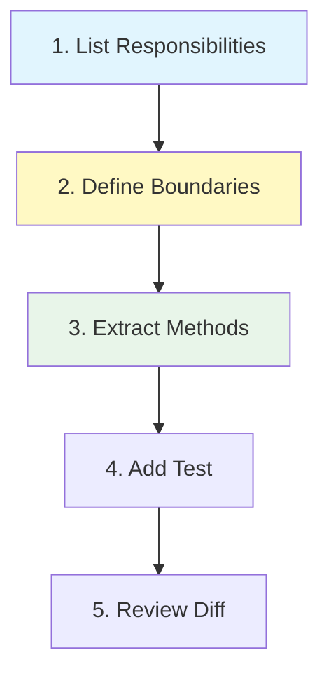

# 第16章：AI導入前提の学び方（Copilot/Codexを味方に🤖💡）

この章は「SoCを“知ってる”から“できる”へ」進むために、AIを**相棒**として使い倒す回だよ〜😊✨
（ポイント：AIに丸投げじゃなくて、**あなたが設計者**で、AIは**助手**ね💪💖）

---

## 16-1. この章のゴール🎯✨

* SoCの“分け方”を、AIと一緒に**手順化**できるようになる🧭🤖
* 「案を複数出させて比較する」癖がつく🧠🧩
* AIの提案を採用する前に、**地雷チェック✅**できるようになる💣➡️🛡️

---

## 16-2. まずは整理：AIは3種類の働き方があるよ🧑‍🤝‍🧑🤖✨


### A) エディタ内の相棒（補完・チャット）📝💬

* コード補完＋チャットで「ここどう分ける？」を即相談できるタイプ✨
* Copilot Chatは、Visual Studio/VS Codeなど複数IDEで使えるよ〜💡 ([GitHub Docs][1])
* Visual Studio側でもCopilotが統合されてきてる（最新の体験が統合…って明記されてる）📌 ([Visual Studio][2])

### B) リポジトリ上の相棒（レビュー・提案）🔍✅

* 「PRの差分見て、責務混ざってない？」みたいなレビュー向き🧠
* GitHub側のCopilotは、周辺のコードや開いてるファイル等を“文脈”として見て提案する仕組みが説明されてるよ📚 ([GitHub][3])

### C) エージェント（タスクを任せる）🧑‍💻➡️🤖🏃‍♀️

* Copilot coding agentは、バグ修正や小機能追加、テスト増強、ドキュメント更新などを**自走で**やる想定🛠️✨ ([GitHub Docs][4])
* OpenAIのCodexも「クラウドのサンドボックスで、リポジトリ入りの環境で並列タスク」みたいな方向に進んでるよ🧰☁️ ([OpenAI][5])
* 直近だと GPT-5.2-Codex（2025/12/18発表）も出てて、長い作業・大規模変更（リファクタや移行）を強化って書かれてる🧠🔧 ([OpenAI][6])

> ざっくり：
> **小さく相談＝チャット**、**差分の確認＝レビュー**、**面倒作業＝エージェント** って使い分けると最強だよ💪🤖✨

---

## 16-3. SoCの学習でAIが一番役立つ瞬間💖

### ①「責務が混ざってる場所」を見つける🔍😵‍💫➡️😄

人間って、慣れてくると混ざりに鈍感になるの…🥲
AIにはこう聞くのが強いよ👇✨

```text
次のコードをSoC観点でレビューして。
- UI/業務/データアクセス(外部)が混ざっている箇所を列挙
- それぞれ「なぜ混ざりやすいか」を一言で
- まず切り出すならどこからが安全か（順番）
（コードは省略せず読む前提でOK）
```

**コツ🍯**：

* 「列挙して」→見落とし減る✅
* 「なぜ」→理解が深くなる🧠
* 「順番」→現実のリファクタになる🔧

---

### ②「分け方の案」を複数出させる🧩🧠✨

SoCって“正解1個”じゃないから、**比較**が大事💖

```text
この機能をSoCで分離したい。3案出して。
各案について：
- 分ける単位（クラス/フォルダ/層）
- 依存の向き（どこがどこを参照するか）
- 長所/短所
- 初心者が実装しやすい順のおすすめ
```

ここでの狙いは「AIに決めさせる」じゃなくて、
**あなたが“納得して選ぶ”材料を集める**ことだよ😊🧡

---

### ③「最小の一歩」を設計させる（いきなり大改造しない）🐣➡️🐤

AIは放っておくと、急に壮大なアーキテクチャ出しがち🤣💦
だから最初から釘を刺す！

```text
大改造は禁止。今の挙動を保ったまま、最小のリファクタだけ提案して。
条件：
- 変更は「メソッド抽出」→「クラス抽出」まで
- ファイル追加は最大2個まで
- public APIは変えない
- 単体テストを1本だけ追加
出力は手順（1,2,3...）と、各手順の目的を一言で。
```

これ、めちゃくちゃ効くよ🥹✨
“やりすぎAI”を防げる🛡️

---

## 16-4. 分離したい時の「プロンプト型」テンプレ🧰💖

SoCのリファクタ相談は、だいたいこの形が強いよ👇

**(1) 現状**：何がどこに混ざってるっぽい
**(2) ゴール**：どこを分離したい（UI/業務/外部）
**(3) 制約**：変えたくないもの（挙動、public API、期限…）
**(4) 受け入れ条件**：成功の定義（テスト、可読性、依存の向き）

テンプレ（そのまま使ってOK）👇

```text
【現状】（コード貼る）
【ゴール】UI/業務/外部の境界を作りたい
【制約】挙動維持、変更は最小、差分は小さく
【受け入れ条件】
- UIからDB直呼びが消える
- 業務ロジックが純粋メソッド中心になる
- 単体テストが最低1本通る
まず、責務の一覧と境界線案を出して。
```

---

## 16-5. “案を複数出させる”テク🎭✨（AIの使いどころNo.1）

### テク1：役割を分けて比較させる👩‍⚖️🧑‍🔬🧑‍🏫

```text
あなたは3人のレビューアです：
1) 保守性重視  2) 初心者向け重視  3) 変更最小重視
同じコードに対して、各視点で分離案を出してから、最後に妥協案をまとめて。
```

### テク2：ダメ案も出させる（地雷回避）💣➡️✅

```text
この分離で「やりがちな失敗パターン」を3つ挙げて。
それぞれに、失敗の兆候（サイン）と回避策も。
```

---

## 16-6. AIの提案を採用する前のチェック✅🧠✨（超重要）

AIのコード、動いても“設計として死ぬ”ことあるからね…😇💥
最終ジャッジはあなた💪💖

### SoCチェック（最低これだけ）🧩✅

* **UIが業務ルールを知らない**（表示と呼び出しだけ）🖥️➡️📞
* **業務が外部都合を知らない**（SQL/HTTP/ファイル形式が出てこない）🧠🚫
* **外部は差し替え可能**（interface越し・入口が1個）🔌✨

### “未来の自分が泣く”チェック😭➡️😄

* 命名が“業務の言葉”になってる？（CalculateDiscountみたいな）🧠🗣️
* 引数にUI部品（TextBoxなど）が入ってない？🧨
* DTO/VM/Entityの混線がない？（詰め替えルールがある？）📦🔄

### AI時代の安全チェック🔐✅

* **秘密情報を貼ってない？**（鍵/トークン/接続文字列）🙅‍♀️
* 生成物が“どこから来たか不明な巨大コピペ”になってない？（ライセンス/出典不明の危険）⚠️
* テスト or 手動確認の手順がある？🧪🧡

---

## 16-7. ミニ演習🎮✨「フォーム地獄をAIで“手順化”して直す」

### お題🧯🔥

* ボタン押下に、入力チェック、割引計算、DB保存が全部入ってる（ありがち）😵‍💫

### 手順（AIと一緒にやる）🪜🤖

1. **責務の棚卸し**（UI/業務/外部の3分類）📦
2. **境界線の宣言**（UI→UseCase→Repository）🧱
3. **最小の抽出**（メソッド抽出→クラス抽出）✂️
4. **テスト1本だけ**（業務の中心に刺す）🧪
5. **差分レビュー**（混ざりが戻ってないか）🔍✅



AIプロンプト例👇

```text
このイベントハンドラをSoCで分離したい。
まず、責務を UI / 業務 / 外部 に分類して一覧化して。
次に、最小の変更で
- UseCaseクラス（業務の入口）
- Repositoryインターフェース（外部の差し替え口）
を作る手順を出して。
最後に、業務だけをテストするxUnitテストを1本作って。
```

---

## 16-8. よくある詰まりポイントQ&A😵‍💫➡️😄

### Q1. AIが“分けすぎ”て、フォルダが増殖する…📁📁📁

A. 最初に制約で縛ろう！これが効く👇

* 「新規ファイル最大2個」
* 「層は3つまで」
* 「今日はUIと業務だけ分ける」

### Q2. AIが作るinterfaceが抽象的すぎる…🌀

A. “外部の都合を隠す”方向に寄せよう😊

* 良い：`IOrderRepository.Save(order)`
* 微妙：`IDataProvider.ExecuteSql(sql)`（SQLが漏れてる）

### Q3. AIの提案、動くけど読みにくい…🤯

A. 「読みやすさレビュー」を別で頼むと改善しやすいよ💖

```text
今の差分を「初心者が読んでも追えるか」観点でレビューして。
- 命名
- メソッドの長さ
- 依存の向き
- コメントが必要な箇所
を指摘して、改善案も。
```

---

## 16-9. まとめ🧁✨（ここだけ覚えて帰ろう）

* AIは **相談（チャット）／確認（レビュー）／委任（エージェント）** で使い分け🤖✨ ([GitHub Docs][1])
* SoCは“正解1つ”じゃないから、**3案出させて比較**が超強い🧠🧩
* 採用前は **SoCチェック✅＋安全チェック🔐** を必ず通す

次章（共通リソース集🧰🌸）に行くと、用語・テンプレ・プロンプトを“いつでも引ける形”でまとめて、教材として超使いやすくするよ〜📚✨

---

* [The Verge](https://www.theverge.com/news/808032/github-ai-agent-hq-coding-openai-anthropic?utm_source=chatgpt.com)
* [The Verge](https://www.theverge.com/news/669339/github-ai-coding-agent-fix-bugs?utm_source=chatgpt.com)
* [businessinsider.com](https://www.businessinsider.com/microsoft-github-reshuffle-ai-coding-agents-2026-1?utm_source=chatgpt.com)

[1]: https://docs.github.com/en/copilot/get-started/features?utm_source=chatgpt.com "GitHub Copilot features"
[2]: https://visualstudio.microsoft.com/github-copilot/?utm_source=chatgpt.com "Visual Studio With GitHub Copilot - AI Pair Programming"
[3]: https://github.com/features/copilot?utm_source=chatgpt.com "GitHub Copilot · Your AI pair programmer"
[4]: https://docs.github.com/enterprise-cloud%40latest/copilot/concepts/agents/coding-agent/about-coding-agent?utm_source=chatgpt.com "About GitHub Copilot coding agent"
[5]: https://openai.com/index/introducing-codex/?utm_source=chatgpt.com "Introducing Codex"
[6]: https://openai.com/index/introducing-gpt-5-2-codex/?utm_source=chatgpt.com "Introducing GPT-5.2-Codex"
