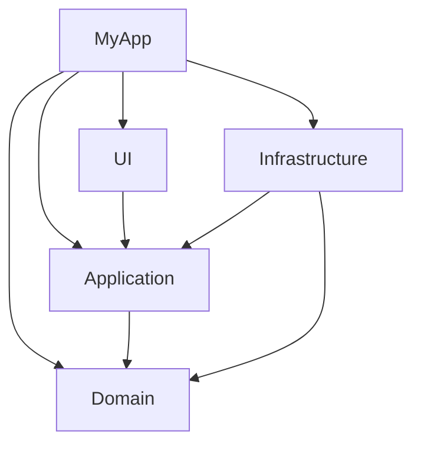

# 第17章：サイト用「共通リソース集」🧰🌸

この章は、教材のどの章から来ても迷子にならないための「辞書📖＋テンプレ📦＋AIプロンプト集🤖」です✨
必要なところだけコピペして使ってね😊

---

## 17-1. 開発環境まとめ🪟🛠️

### まずは“いまの最新版”だけ押さえる🎯

* **.NET（最新LTS）**：**.NET 10.0（最新リリース 10.0.1 / 2025-12-09）** ([Microsoft][1])
* **C#（最新）**：**C# 14（.NET 10でサポート）** ([Microsoft Learn][2])
* **Visual Studio 2022（安定運用枠）**：**Current 17.14.23（2025-12-16）** ([Microsoft Learn][3])
* （試したい人向け）**Visual Studio 2026 Insiders**：.NET 10向けの“次世代VS”を先取りできる枠 ([Visual Studio][4])

### バージョン確認コマンド🔎（困ったらまずコレ）

```powershell
dotnet --info
```

### Copilot（Visual Studio内）関連の“覚えておくと強い”ポイント🤖✨

* Visual Studio では **Copilot Chat** が IDE に統合されていて、チャット／インライン両方で使い分けできるよ💬✍️ ([Microsoft Learn][5])
* Visual Studio 右上に **Copilotの状態アイコン**（有効/無効/未インストール等）が出るので、迷ったらそこを見る👀 ([Microsoft Learn][6])
* VS 2026 Insiders では **Copilotで単体テストを生成＆実行**みたいな機能も案内されてる🧪 ([Microsoft Learn][7])

---

## 17-2. 用語集📖✨（この教材で使うやつだけ）

“ふわっと”でOK👌 でも、**言葉が揃うと設計が一気に楽**になるよ😊

* **関心（Concern）**：そのコードが気にしていること（例：表示、割引ルール、DB保存…）
* **SoC（関心の分離）**：関心を混ぜない🧁➡️🍱（混ぜると修正が爆発する💥）
* **責務（Responsibility）**：そのクラスが「何を担当するか」
* **変更理由**：そのコードが変わる理由（責務を見つける最強ヒント🔦）
* **境界（Boundary）**：ここから先は別世界！の線引き（UI ↔ 業務 ↔ DB/外部）🧱
* **依存（Dependency）**：「AがBを知ってる/使ってる」状態
* **依存の向き**：守りたい中心（業務）に、外側（DB/UI）を持ち込まない向き🧲
* **DIP**：依存の向きを整える考え方（“抽象に依存”がキーワード）
* **DI**：依存を `new` で作らず外から渡す💉（差し替えしやすい！）
* **I/O（入出力）**：DB、ファイル、HTTP、時計、乱数など“外界”要素🌍
* **Entity**：業務ルールの中心にいるデータ（状態とルールを持てる）
* **DTO**：外に出す/外から来るための入れ物📦（API/DB/ファイル等）
* **ViewModel**：画面都合の入れ物🖥️（表示用の形）
* **Repository**：保存/取得の窓口🚪（業務からDB都合を隠す）
* **UseCase（Application）**：画面から呼ばれる“やりたいこと”の手順書🧠🗺️
* **Mapper（Mapping）**：DTO/Entity/ViewModel を詰め替える係🔄
* **単体テスト**：小さい単位で正しさを確認🧪
* **AAA**：Arrange（準備）→ Act（実行）→ Assert（確認）✅

---

## 17-3. テンプレ集📦✨（コピペして使えるやつ）


### 17-3-1. フォルダ構成例（最小で“4分離”）🗂️

「分ける＝正義」じゃなくて、**迷わない最小セット**が大事😊

```text
/MyApp
  /src
    /MyApp.UI              ← 画面（WinForms/WPF）
    /MyApp.Application     ← UseCase（手順）
    /MyApp.Domain          ← ルール（Entityなど）
    /MyApp.Infrastructure  ← DB/HTTP/ファイルなど
  /tests
    /MyApp.Application.Tests
    /MyApp.Domain.Tests
```



---

### 17-3-2. 命名テンプレ（迷ったらこの型）🏷️

* interface：`I〇〇Repository` / `I〇〇Client` / `I〇〇Gateway`
* 実装：`Sql〇〇Repository` / `Http〇〇Client` / `File〇〇Store`
* 手順（UseCase）：`〇〇UseCase`（例：`RegisterOrderUseCase`）
* 画面用：`〇〇ViewModel`
* 変換：`〇〇Mapper` もしくは `〇〇MappingExtensions`

---

### 17-3-3. Repository 最小形（“保存係”を外に出す）🗄️🚪

```csharp
// Domain/Application 側（＝中心側）
public interface ICustomerRepository
{
    Task<Customer?> FindByIdAsync(CustomerId id, CancellationToken ct);
    Task SaveAsync(Customer customer, CancellationToken ct);
}
```

```csharp
// Infrastructure 側（＝外側）
public sealed class SqlCustomerRepository : ICustomerRepository
{
    public Task<Customer?> FindByIdAsync(CustomerId id, CancellationToken ct)
    {
        // ここにSQL/ORMの都合を閉じ込める🧱
        throw new NotImplementedException();
    }

    public Task SaveAsync(Customer customer, CancellationToken ct)
    {
        throw new NotImplementedException();
    }
}
```

---

### 17-3-4. UseCase 雛形（UIは“これを呼ぶだけ”にする）📨✨

```csharp
public sealed class RegisterCustomerUseCase
{
    private readonly ICustomerRepository _repo;

    public RegisterCustomerUseCase(ICustomerRepository repo)
    {
        _repo = repo;
    }

    public async Task ExecuteAsync(RegisterCustomerRequest request, CancellationToken ct)
    {
        // 1) 入力チェック（必要最低限）
        if (string.IsNullOrWhiteSpace(request.Name))
            throw new ArgumentException("Name is required.");

        // 2) ルール（Domain）へ寄せる
        var customer = Customer.Register(request.Name);

        // 3) 保存（I/Oはrepoに丸投げ）
        await _repo.SaveAsync(customer, ct);
    }
}

public sealed record RegisterCustomerRequest(string Name);
```

---

### 17-3-5. DTO / Entity / ViewModel の詰め替えテンプレ🔄📦

「めんどいけど保険」＝混ざらない未来を買う感じ😊

```csharp
public sealed record CustomerDto(string Id, string Name);

public static class CustomerMappingExtensions
{
    public static CustomerDto ToDto(this Customer entity)
        => new(entity.Id.Value, entity.Name.Value);

    public static Customer ToEntity(this CustomerDto dto)
        => new(new CustomerId(dto.Id), new CustomerName(dto.Name));
}
```

---

### 17-3-6. テスト雛形（AAA：Arrange-Act-Assert）🧪✅

```csharp
using Xunit;

public sealed class DiscountCalculatorTests
{
    [Fact]
    public void Gold_gets_10_percent_off()
    {
        // Arrange
        var calc = new DiscountCalculator();

        // Act
        var actual = calc.Apply(1000m, MemberRank.Gold);

        // Assert
        Assert.Equal(900m, actual);
    }
}

public enum MemberRank { Normal, Gold }

public sealed class DiscountCalculator
{
    public decimal Apply(decimal price, MemberRank rank)
        => rank == MemberRank.Gold ? price * 0.9m : price;
}
```

---

## 17-4. AIプロンプト集🤖✨（章をまたいで使える“共通呪文”）

### 17-4-1. “分離ポイント発見”プロンプト🔍🧠

* 「このクラスの関心（UI/業務/I/O）を仕分けして、混ざってる箇所に印をつけて」
* 「このメソッドの責務を1文で。変更理由を3つ挙げて」
* 「SoC的に分けるなら、最初の1手（安全な小リファクタ）を3案ください」

### 17-4-2. “一気に直さない”プロンプト（段階プラン）🪜🌱

* 「動作を変えずに、①メソッド抽出→②クラス抽出→③interface化 の順で、手順を書いて」
* 「まずテストが書ける状態にしたい。I/O境界を外に追い出す作戦を提案して」

### 17-4-3. “小さな差分で出して”プロンプト✂️📌

* 「変更は最小で。差分（before/after）だけ提示して」
* 「UIイベントハンドラを痩せさせたい。`UseCase` 呼び出しだけ残して」

### 17-4-4. テスト生成（/tests など）🧪🤖

Copilot Chat には **スラッシュコマンド**があって、例えば **`/tests`** で既存コードのテストを書かせる系の流れがあるよ✨ ([GitHub Docs][8])

* 「`/tests` このクラスの主要分岐をカバーするテストを書いて（例外ケースも）」
* 「テストが落ちた理由を説明して、修正案を“最小差分”で出して」

### 17-4-5. Visual Studio の Copilot Chat を賢くする小技💬🧠

* チャット／インラインの使い分け（“コードを直接直したい”ならインラインが便利） ([Microsoft Learn][5])
* **カスタム指示（Custom instructions）** で、チームの方針や前提を自動で付与できる系の説明もあるよ📎 ([Microsoft Learn][9])

### 17-4-6. Codex（OpenAI）を使う時の“お願いテンプレ”🧑‍🍳🤖

* 「目的：〇〇。制約：破壊的変更NG。段階：小さく。最終的にPR説明文も作って」
* 「変更は3コミットに分けて：①テスト追加 ②リファクタ ③整理（命名/コメント）」

Codex の位置づけやアップデート情報は OpenAI 公式の案内を参照できるよ📌 ([OpenAI][10])

---

## 17-5. よくある詰まりQ&A😵‍💫➡️😄

### Q1. 「分けすぎた…クラス増えすぎた…」📦📦📦

A. あるある！😂
まずは **“UI / UseCase / I/O” の3分離**まで戻してOK。
「DTO/Mapperまで毎回作る」みたいなやりすぎは、外部連携が増えてからでも大丈夫😊

### Q2. 「DTOとEntityがほぼ同じで意味ある？」🪞

A. **今は同じでもOK**だよ👍
でも将来「画面に項目追加」「DB都合が増える」ってなった時、**混ざってない**のが効いてくる✨

### Q3. 「Repositoryのメソッドが増殖する」🧟‍♀️

A. そのときは

* “用途ごと”にRepositoryを分ける（読み取り専用/書き込み専用）
* “検索条件”をオブジェクト化する（例：`CustomerQuery`）
  みたいな整理が効くよ🧹✨

### Q4. 「テストが面倒で進まない」🧪💦

A. 最初は **“純粋ロジックだけ”** でOK！
割引、状態遷移、入力チェック…みたいに **I/Oが絡まない中心**から書くと気持ちいい😊

### Q5. 「Copilotの提案がデカすぎて怖い」😇

A. プロンプトをこう変えると安定するよ👇

* 「**変更は最小**」「**差分だけ**」「**3ステップで**」
* 「まずは **テスト追加だけ**」
* 「例外処理やログは触らないで」

---

## 17-6. コピペ用：SoCチェックリスト✅🧱✨

* UIイベント内に **SQL/HTTP/ファイル** が出てきてない？🗄️🌐
* UIイベント内に **業務ルール（割引/状態遷移/制約）** が直書きされてない？🧠
* UseCaseが **UIの型（TextBox等）** を触ってない？🖥️
* Domainが **DB/ORM/JSON/HTTP** を参照してない？🚫
* テストしたいロジックが **I/O無しで呼べる形** になってる？🧪

---


[1]: https://dotnet.microsoft.com/en-us/download/dotnet "Browse all .NET versions to download | .NET"
[2]: https://learn.microsoft.com/en-us/dotnet/csharp/whats-new/csharp-14?utm_source=chatgpt.com "What's new in C# 14"
[3]: https://learn.microsoft.com/ja-jp/visualstudio/releases/2022/release-history "Visual Studio 2022 リリース履歴 | Microsoft Learn"
[4]: https://visualstudio.microsoft.com/insiders/?utm_source=chatgpt.com "Visual Studio 2026 Insiders - Faster, smarter IDE - Microsoft"
[5]: https://learn.microsoft.com/ja-jp/visualstudio/ide/visual-studio-github-copilot-chat?view=vs-2022&utm_source=chatgpt.com "Visual Studio での GitHub Copilot チャットについて"
[6]: https://learn.microsoft.com/ja-jp/visualstudio/ide/visual-studio-github-copilot-install-and-states?view=visualstudio&utm_source=chatgpt.com "GitHub Copilot のインストールと状態の管理 - Visual Studio ..."
[7]: https://learn.microsoft.com/ja-jp/visualstudio/test/unit-testing-with-github-copilot-test-dotnet?view=visualstudio&utm_source=chatgpt.com "GitHub Copilot テストを使用して単体テストを生成して実行する"
[8]: https://docs.github.com/ja/copilot/how-tos/chat-with-copilot/get-started-with-chat?utm_source=chatgpt.com "GitHub Copilot Chat のプロンプトの概要"
[9]: https://learn.microsoft.com/ja-jp/visualstudio/ide/copilot-chat-context?view=visualstudio&utm_source=chatgpt.com "チャット応答をカスタマイズする - Visual Studio (Windows)"
[10]: https://openai.com/index/introducing-codex/?utm_source=chatgpt.com "Introducing Codex"
