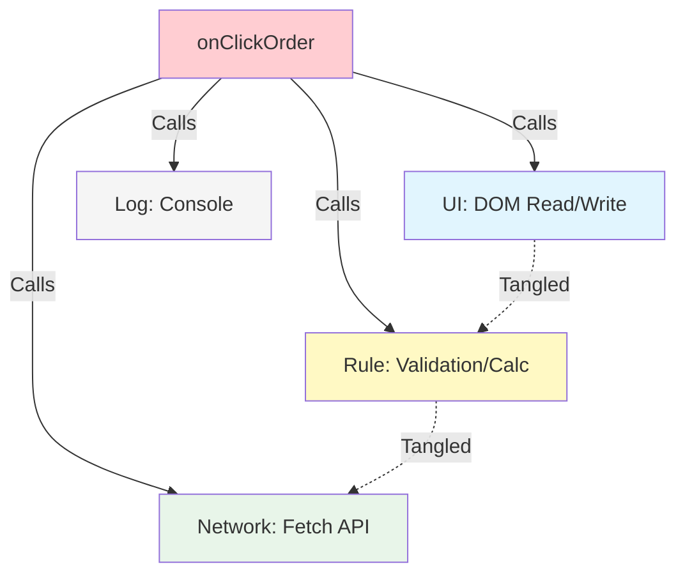

# 第01章：SoCってなに？30秒でつかむ超入門🎀

## この章でできるようになること（ゴール）✅🌸

この章が終わるころには、こんな状態になれます😊✨

* 「このコード、いろいろ混ざってない？😇」を“感覚じゃなくて理由つき”で言える
* SoC（関心の分離）を **ひとことで説明** できる（超大事！）
* コードを見て「UI」「ルール」「通信」などの“関心”を **ざっくり仕分け** できる
* AI（Copilot/Codex系）に **分離案を出させる** ときの聞き方がわかる🤖💬✨

---

## 1. SoCってなに？いきなり結論🍓

SoC（Separation of Concerns / 関心の分離）は、超ざっくり言うと👇

**「変更理由が違うものは、同じ場所に混ぜない」** 🧁✨
（＝“別々に直せるように分けておく”ってこと！）

「関心の分離」自体が、ソフトウェアを“いくつかの側面に分けて扱えるようにする”考え方として説明されています。 ([ウィキペディア][1])

---

## 2. 「関心（Concern）」ってなに？🧺💡


“関心”って言われると難しそうだけど、実はめちゃ身近です😊

### 関心＝「気にする理由」「やりたいことの種類」📌


たとえばアプリで言うと…

* **見た目・画面**（ボタン、表示、入力）🖥️🎀
* **業務ルール**（割引、在庫チェック、ポイント付与）📏🧠
* **通信**（API呼び出し、リトライ、エラー処理）🌐📡
* **ログ**（調査のための記録）📝
* **保存**（localStorage/DB/ファイル）🗄️✨

こういう“種類の違い”が「関心」です🌸

---

## 3. “混ぜると事故る”ってどういうこと？😵‍💫💥（直感でOK）

### ありがちな事故シーン🎬

「ボタン押したら注文する」だけのはずが、1つの関数に全部入ってると…👇

* デザイン変更（UI）したいだけなのに、割引ロジック（ルール）を壊す😇
* APIの仕様が変わった（通信）だけなのに、画面表示（UI）にバグが出る😇
* どこを直せばいいか分からなくて、修正が怖くなる😇

これが **“修正が怖いコード”** の入り口です🚪💥

---

## 4. まずは「ごちゃ混ぜ例」を見てみよ〜😇🍝


「こういうの、見たことある！」ってなるはず😂

```ts
// 例：注文ボタンのクリック処理（ごちゃ混ぜ🍝）
async function onClickOrder() {
  // UI: 入力を読む
  const name = (document.querySelector("#name") as HTMLInputElement).value;
  const coupon = (document.querySelector("#coupon") as HTMLInputElement).value;

  // ルール: バリデーション
  if (!name) {
    alert("名前を入力してね！");
    return;
  }

  // ルール: 割引計算
  const basePrice = 1200;
  const discount = coupon === "HAPPY" ? 200 : 0;
  const total = basePrice - discount;

  // 通信: APIに送信
  const res = await fetch("/api/orders", {
    method: "POST",
    headers: { "Content-Type": "application/json" },
    body: JSON.stringify({ name, total }),
  });

  // UI: 結果表示
  if (res.ok) {
    document.querySelector("#result")!.textContent = `注文OK！合計 ${total}円`;
  } else {
    document.querySelector("#result")!.textContent = "注文失敗…";
  }

  // ログ: 記録
  console.log("[order]", { name, total, ok: res.ok });
}
```

### 何が問題？（責めないでね😂）

この関数の中に…

* UI 🖥️（DOM読む/表示する）
* ルール 📏（バリデーション/割引計算）
* 通信 🌐（fetch）
* ログ 📝（console.log）

が **ぜーんぶ一緒** に入ってます🍝💥
だから、どれか1つ変えるだけでも、他が巻き添えになりやすいんです😇



---

## 5. SoCの最初の一歩：「分ける」はこうやる✂️✨

いきなり“完璧な設計”はしません🙆‍♀️
まずは **分けやすいところから** でOKです🌸

### 5.1 いちばん分けやすいのは「純粋な処理」🧼✨


**純粋な処理**＝入力が同じなら出力が同じ（外の世界に触らない）💎
例：割引計算、合計計算、判定、変換…など

```ts
// ルール（純粋✨）：割引計算
export function calcTotal(basePrice: number, coupon: string): number {
  const discount = coupon === "HAPPY" ? 200 : 0;
  return basePrice - discount;
}
```

これ、めっちゃテストしやすいです🧪✨
UIも通信も関係ないから、壊れにくい中心（コア）になれます🛡️

---

### 5.2 “外の世界”は副作用ゾーン⚡🌐

**副作用**＝通信・表示・保存・時刻・乱数…みたいに外に触るもの。

```ts
// 通信（副作用🌐）：API送信だけ担当
export async function postOrder(data: { name: string; total: number }) {
  return fetch("/api/orders", {
    method: "POST",
    headers: { "Content-Type": "application/json" },
    body: JSON.stringify(data),
  });
}
```

---

### 5.3 最後に「つなぐ役」を作る🧩（ここが気持ちいい✨）


UIはUI、ルールはルール、通信は通信。
**最後に“組み立てる役”** が「じゃあ順番に呼ぶね😊」を担当します。

```ts
import { calcTotal } from "./calcTotal";
import { postOrder } from "./postOrder";

export async function onClickOrderSeparated() {
  const name = (document.querySelector("#name") as HTMLInputElement).value;
  const coupon = (document.querySelector("#coupon") as HTMLInputElement).value;

  if (!name) {
    alert("名前を入力してね！");
    return;
  }

  const total = calcTotal(1200, coupon);      // ルール🧼
  const res = await postOrder({ name, total }); // 通信🌐

  document.querySelector("#result")!.textContent =
    res.ok ? `注文OK！合計 ${total}円` : "注文失敗…";
}
```

**同じ機能なのに、見通しが急に良くなる😍✨**
これがSoCの気持ちよさです🎀

---

## 6. SoCができると何がうれしいの？🎁✨

### うれしさ①：変更が怖くなくなる😌🔧

UI変えるならUIだけ、割引変えるなら計算だけ。
影響範囲が小さい＝事故が減る🚑✨

### うれしさ②：テストがラクになる🧪🌸

純粋関数（ルール）だけなら、UIも通信も不要！
「入力→出力」を見るだけでOKになります😊

### うれしさ③：AIが当てやすくなる🤖🎯

ごちゃ混ぜだとAIも「どこ直すのが正解？」で迷います😇
分かれてると、AIは **狙い撃ち** できるようになります✨

---

## 7. ミニ練習：この処理、どの関心？仕分けゲーム🎮✨


次の項目を、（A）UI /（B）ルール /（C）通信 /（D）保存 /（E）ログ に分けてみてね😊💕

1. 入力フォームの値を読む
2. クーポンが有効かチェックする
3. APIに注文内容をPOSTする
4. 注文成功メッセージを表示する
5. 失敗したときの原因をconsoleに出す
6. 注文履歴をlocalStorageに保存する

**コツ**👉「それ、何が変わったら直す？」で考えると当たりやすいです🎯
（表示が変わる→UI、ルールが変わる→ルール、API仕様→通信…みたいに✨）

---

## 8. AIに手伝わせるコツ（超重要🤖💬✨）

SoCは、AIと相性めちゃ良いです💞
ただし、**聞き方**がポイント！

### 8.1 分離案を出してもらうプロンプト例🎁

（そのままコピペでOKだよ😊）

* 「この関数の中の“関心”を列挙して、UI/ルール/通信/保存/ログに分類して」
* 「“変更理由が違うもの”が混ざっている箇所を指摘して、分割案を3つ出して」
* 「純粋関数にできる部分だけ抜き出して、関数名も提案して」
* 「副作用（fetch/DOM/localStorage）を隔離する案にして」

### 8.2 1つだけ注意⚠️

AIの分割はたまに「分けすぎ」「名前がふわふわ」になりがちです😂
そのときは👇を追加すると安定します✨

* 「**今はファイル数を増やしすぎないで**。まずは2〜3個の関心に分けて」
* 「命名は“何をするか”じゃなく“何の関心か”が伝わる名前で」

---

## 9. コラム：いまどきTypeScriptの小ネタ（知ってると得💎）🧠✨

* 現時点での TypeScript の最新版は **5.9 系**（npm上の “Latest” が 5.9.3 として表示）です。 ([NPM][2])
* TypeScript 5.9 では `tsc --init` の初期設定が“ミニマル寄り”に更新されて、最初の迷子が減る方向になっています🧭✨ ([Microsoft for Developers][3])
* VS CodeはTypeScriptの言語サービスを内蔵していて、必要ならワークスペース側のTypeScriptに切り替えて使えます🔄（チームで揃えたいとき便利！） ([Visual Studio Code][4])

（この教材では、設計が主役なので“必要なときだけ”使っていくよ😊）

---

## 10. まとめ🎀✨（今日の合言葉）

* SoC＝**変更理由が違うものは混ぜない** 🧁
* まずは「**純粋な処理（ルール）**」と「**副作用（UI/通信/保存）**」を分ける🧼⚡
* 分けたら最後に「**つなぐ役**」を置く🧩
* AIは“関心の分類”が得意！聞き方で強くなる🤖✨

---

## 次章の予告📚🌸

次は **「なぜ混ぜるとツラいの？」** を、もっとリアルな修正事故で体験します😵‍💫💥
「修正が怖いコード」の正体、いっしょに暴きにいこ〜っ🔍✨

[1]: https://en.wikipedia.org/wiki/Separation_of_concerns?utm_source=chatgpt.com "Separation of concerns"
[2]: https://www.npmjs.com/package/typescript?utm_source=chatgpt.com "TypeScript"
[3]: https://devblogs.microsoft.com/typescript/announcing-typescript-5-9/?utm_source=chatgpt.com "Announcing TypeScript 5.9"
[4]: https://code.visualstudio.com/docs/typescript/typescript-compiling?utm_source=chatgpt.com "Compiling TypeScript"
