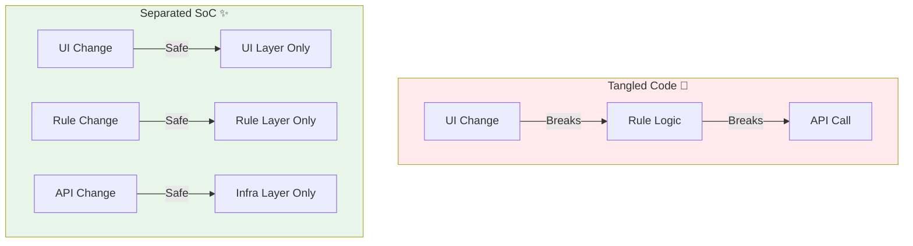

# 第02章：なぜ混ぜるとツラいの？“修正が怖いコード”の正体😵‍💫💥

## この章でできるようになること🎯✨

* 「ちょっと直しただけなのに、なぜか全部こわれる…😭」の理由が説明できる
* どこにバグがいるのか迷子になるパターンを見抜ける🔍
* 影響範囲（blast radius）を小さくする“考え方”がつかめる💡
* 実コードで「関心」を色分けできるようになる🖍️🌈

---

## 1) まず“混ぜる”って何が起きてるの？🍲💦

**混ぜる＝1つの場所（ファイル/関数/クラス）に、性格の違う仕事が同居してる状態**だよ〜😇

たとえば👇

* 画面の表示（UI）🖥️
* 入力チェック（Validation）✅
* 料金計算・割引（業務ルール）📏
* API通信（fetch）🌐
* 失敗時の表示やログ📈
* 保存（localStorageなど）🗄️

これが1つに固まってると…
**「変更の理由が違うのに、同じコードを触る」**ことになるのが地獄の入口😵‍💫

---

## 2) “修正が怖い”の正体：変更が連鎖する3パターン🌊💥

ここが超重要！よくある変更はこの3つ👇

### A. 仕様変更（ルール変更）📏🔁

「学生割引を10%→12%にしてね！」
「手数料の計算式が変わった！」
→ ルールのはずなのに、UIや通信のコードも一緒に触ることになりがち😇

### B. UI変更（見た目/入力の変更）🎀🖥️

「入力欄を分けたい！」
「エラーメッセージの出し方を変えたい！」
→ UIの変更なのに、計算ロジックやAPIの形までいじって事故る💥

### C. API変更（通信・DTOの変更）🌐📦

「APIが返すフィールド名が変わった！」
「単位が円→銭になった！」
→ 通信の話なのに、画面の表示やルールまでズタズタに😵‍💫



---

## 3) 例：カフェ注文ボタンが“全部入り”だったら…☕🍰

「注文する」ボタン1つなのに、全部やってるコードの例👇（わざと悪い例だよ！😇）

```ts
type OrderDto = { itemId: string; price: number; coupon?: string };

export async function onClickOrder(form: HTMLFormElement) {
  // 1) UI: フォーム読み取り🖥️
  const itemId = (form.querySelector("#item") as HTMLSelectElement).value;
  const coupon = (form.querySelector("#coupon") as HTMLInputElement).value;

  // 2) Validation: 入力チェック✅
  if (!itemId) {
    alert("商品を選んでね！"); // UI
    return;
  }

  // 3) Domain-ish: 価格ルール📏
  let price = Number((form.querySelector("#price") as HTMLInputElement).value);
  if (Number.isNaN(price)) price = 0;

  // クーポンで10%引き（ルール）
  if (coupon) price = Math.floor(price * 0.9);

  // 4) I/O: 保存🗄️
  localStorage.setItem("lastCoupon", coupon);

  // 5) API: 送信🌐
  const dto: OrderDto = { itemId, price, coupon: coupon || undefined };
  const res = await fetch("/api/orders", {
    method: "POST",
    headers: { "Content-Type": "application/json" },
    body: JSON.stringify(dto),
  });

  // 6) UI: 結果表示🎀
  if (!res.ok) {
    const msg = await res.text();
    alert("失敗: " + msg);
    return;
  }
  alert("注文できたよ〜！🎉");
}
```

### ここで変更が来ると…どうなる？😵‍💫

#### 変更① UI変更：「alertじゃなくて画面下にエラー表示にして」🎀

→ UIだけ直したいのに、この関数の中には **ルールもAPIも保存も**いる…
→ 触る範囲が広くて、つい何か壊す💥

#### 変更② 仕様変更：「割引は“クーポン種類”で変える」📏

→ ルールだけ直したいのに、UIの読み取り方式・保存・API dtoまで絡んでる…
→ 「どこまでがルール？」が分からなくなる🔍💦

#### 変更③ API変更：「priceは cents（銭）で送って」🌐

→ 通信の都合なのに、画面の表示・ルール計算・バリデーションまで巻き込む…
→ “直したはずなのに別の場所が壊れる”の典型😭

---

## 4) 「バグの居場所が分からない」問題🔍😇

混ぜると、バグがこうなる👇

* **症状はUIに出る**（表示が変、エラーが出る）🖥️
* **原因は別の層**（計算・変換・通信・保存）にある📦🌐
* しかも同じ関数内で行ったり来たりして、追跡がめっちゃ大変😵‍💫

よくある “迷子バグ” の香り🧪

* 型が合ってるのに値の意味が違う（円と銭）💰
* UIの文字列がそのままルールに流れ込む（"10,000" とか）🧵
* エラー処理が全部 `alert` で隠れて、何が起きたか分からない🙈

---

## 5) 影響範囲（blast radius）を小さくする考え方💣➡️🫧


イメージとしてはね👇
**「変更の爆発半径を小さくする」＝“必要な場所だけ”変えられる設計にする**✨

そのための合言葉はこれ🪄

### 「変更理由が同じものを近くに置く」📌

* UI変更 → UIの場所だけ触る
* ルール変更 → ルールの場所だけ触る
* API変更 → 通信の場所だけ触る

これができると、修正が怖くなくなる💪🌸

---

## 6) “修正が怖いコード”あるあるサイン10🚨😵‍💫

チェックしてみて〜✅（3つ当てはまったら黄色信号🟡、5つで赤信号🔴）

1. 1つの関数が長い（40行〜）📜
2. `if` が増殖してて読むのがつらい🌿
3. UIの要素取得と計算が同じ関数にいる🖥️➕📏
4. `fetch` があちこちに直書きされてる🌐
5. `localStorage` や日時がいきなり出てくる🗄️🕒
6. エラーハンドリングがUIと混ざってる😭
7. “ついでにここも”修正が増える（雪だるま式）⛄
8. 変数名があいまい（`data`, `result`, `tmp` が多い）😇
9. APIの形（DTO）がそのまま画面に直行してる📦➡️🖥️
10. 変更すると毎回「どこまで影響ある？」って不安になる😵‍💫💦

---

## 7) ミニ演習：関心を“色分け”して分けてみよう🖍️🌈✨（20分）

### ステップ1️⃣：さっきのコードを4色でマーキングしよう

* 🖥️ UI
* ✅ Validation
* 📏 ルール
* 🌐🗄️ I/O（通信・保存など）

### ステップ2️⃣：変更要求を3つ読んで「触るべき色」を答える

1. 「エラー表示をトーストにしたい」🍞
2. 「割引ルールを変えたい」🎫
3. 「APIのprice単位が変わった」💰

**理想の答え**はこう👇

* 1. 🖥️だけ
* 2. 📏だけ
* 3. 🌐（＋境界の変換）だけ

でも混ざってると…現実は全部触る羽目になる😇💥

---

## 8) AI活用：怖いコードの“関心分解”を一瞬で出してもらう🤖✨

Copilot/Codex系に、こう頼むとめっちゃ便利だよ🎁

* 「この関数の関心をUI/Validation/Domain/APIに分類して、根拠も書いて」🧠
* 「“UI変更”が来たときに本来触るべき場所だけにする分割案を3つ出して」🧩
* 「blast radiusが小さくなるように、依存の向きも意識して分けて」🧲

あと、アップグレード系でもAIが手伝う流れが増えてるよ〜（Copilotを使ったJS/TSのモダナイズ支援の話も出てる）。([Microsoft Developer][1])
でもね、**AIがコードを動くようにしても、“混ざり”そのものは残りやすい**から、最後は人間が「変更理由で分ける」を握るのが大事😊🫶

---

## 📌 最新情報ちょいメモ（2026年1月時点）🧠⚡

* TypeScriptは **5.9** が現行ラインとして案内されていて、リリース告知も出てるよ。([Microsoft for Developers][2])
* さらに **TypeScript 6.0（橋渡し）→ 7.0（ネイティブ移植）** という大きい流れが公式ブログで説明されてる！([Microsoft for Developers][3])
* ネイティブ版のプレビューは npm で試せる形でも提供されてるよ。([NPM][4])

※ただし！コンパイルが速くなっても、**関心ごちゃ混ぜは“修正が怖い”まま**になりやすいから、SoCはずっと大事だよ〜😇✨

---

## まとめ🌸✨

* 混ぜると「UI/ルール/API」の変更が連鎖して、修正が怖くなる😵‍💫
* バグの居場所が分からなくなる（症状と原因が遠い）🔍
* 目標は「変更の爆発半径を小さくする」🫧
* まずはコードを“関心で色分け”できれば勝ち🏆🖍️

---

次の第3章では、SoCとSOLID（特にSRP）を「なるほど〜！」ってつながる感じでやさしく整理していくよ🧩💖

[1]: https://developer.microsoft.com/blog/jsts-modernizer-preview?utm_source=chatgpt.com "Announcing the JavaScript/TypeScript Modernizer for VS ..."
[2]: https://devblogs.microsoft.com/typescript/announcing-typescript-5-9/?utm_source=chatgpt.com "Announcing TypeScript 5.9"
[3]: https://devblogs.microsoft.com/typescript/progress-on-typescript-7-december-2025/?utm_source=chatgpt.com "Progress on TypeScript 7 - December 2025"
[4]: https://www.npmjs.com/package/%40typescript/native-preview?utm_source=chatgpt.com "typescript/native-preview"
