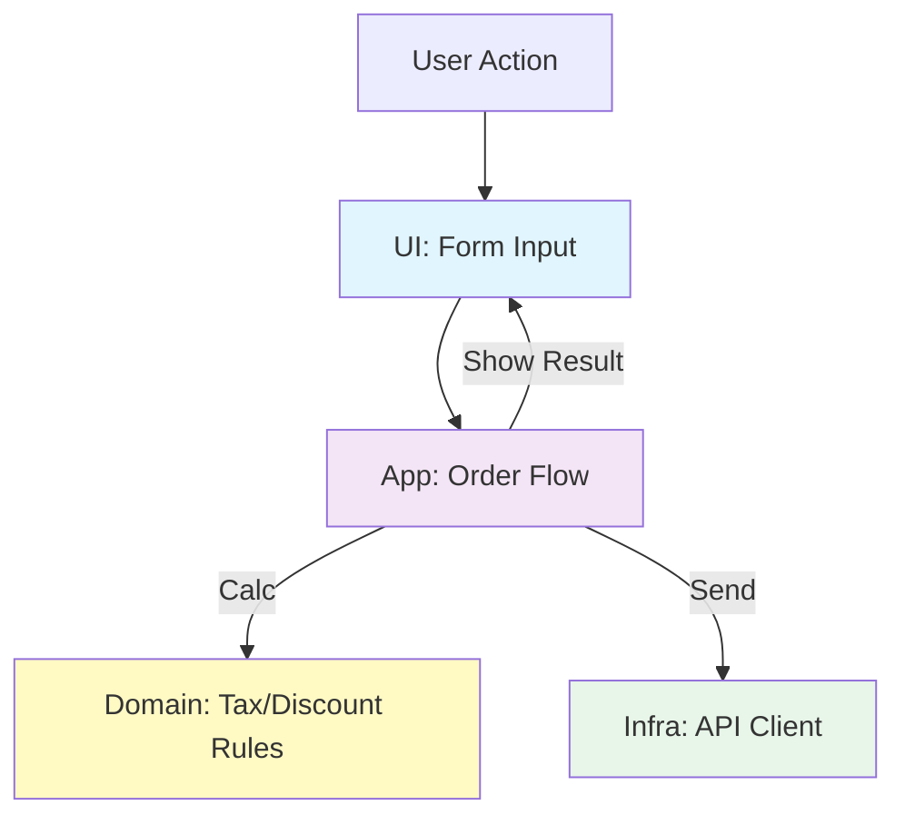

# 第03章：SoCとSOLID（特にSRP）をやさしくつなぐ🧩💖
（ここ、**SoCの「判断基準」をゲットする章**だよ〜！✨）

---

## 3-0. この章でできるようになること🎯✨

この章が終わったら、こんなことができるようになります👇😊

* 「SoCで分けたい…けど、**何を基準に分ければいいの？**」が分かる🧠💡
* **SRP（単一責任の原則）＝“変更理由”**の感覚がつかめる📌
* コードを見て「**これ、何個の理由で変更されそう？**」って当てられる🔮✨
* 仕分け練習で、SoCの“現場力”がちょっと上がる💪🌸

---

## 3-1. まずSOLIDってなに？ざっくりでOK🙆‍♀️✨

SOLIDは「**壊れにくくて、直しやすい設計**」のための有名な考え方セットだよ🧱✨
（名前がゴツいけど、やることはシンプル寄り😇）

* **S**：Single Responsibility（単一責任）📌 ← 今日の主役👑
* **O**：Open/Closed（拡張に開いて修正に閉じる）🚪
* **L**：Liskov Substitution（置き換えても壊れない）🔁
* **I**：Interface Segregation（肥大インターフェースやめよ）🍱
* **D**：Dependency Inversion（依存の向きを整える）🧲

SOLIDの基本原則はRobert C. Martinが紹介し、**SOLIDという略語はMichael Feathersが作った**と言われています。([ウィキペディア][1])

---

## 3-2. SRPってなに？「責務」＝「変更理由」だよ📌✨


SRPはよく「1つのクラスは1つのことだけやれ」って説明されがちなんだけど、**それだと誤解が起きやすい**の🥺💦
大事なのはこっち👇

### ✅ SRPの超重要フレーズ（超採用✨）

* **“1つのモジュールは、1つの理由で変更されるべき”**
* つまり **責務（responsibility）＝変更理由（reason to change）** 💡

この定義はUncle Bob（Robert C. Martin）本人も繰り返し説明しています。([blog.cleancoder.com][2])
さらに分かりやすい言い換えも有名👇

> **同じ理由で変わるものは集める。違う理由で変わるものは分ける。**
> ([blog.cleancoder.com][3])

そして最近（2025年末）でも「SRPの誤解されやすさ」は日本語でも整理されていて、学び直しにすごく良い流れになってます。([Zenn][4])

---

## 3-3. SoCとSRPの関係🧩✨（ここが核心だよ〜！）

### SoC（関心の分離）🧠

* 「関心（concern）」ごとに分けようね、っていう考え方🌱
* 例：UI、業務ルール、通信、保存、ログ…を混ぜない🙅‍♀️

SoCは昔からある設計原則で、**“問題の側面ごとに分けて扱えるようにする”**のがポイント。([ウィキペディア][5])

### SRP（単一責任）📌

* SoCをやるときの **“分け方の採点基準”** みたいなもの💯✨
* 「それ、**変更理由が同じ？違う？**」で判断できる🔍

### ✅ まとめると…

* **SoC＝分ける行為（現場のやり方）**
* **SRP＝分ける基準（何を一緒にしてよいかのルール）**

この2つがつながると、SoCが「なんとなく分ける」から
**「理由で切る」**に進化するよ〜〜〜🧠✨

---

## 3-4. 例で体感！「学園カフェ注文」☕🎓（混ぜるとツラいやつ）

### 😇 Before：ぜんぶ混ぜ（あるある）

「注文ボタン押したら、1つの関数が全部やる」

* 入力チェック（必須・数値）🧾
* 合計金額の計算（割引・税）🧮
* API送信🌐
* 画面表示（成功/失敗メッセージ）🖥️
* ログ出力📈

これ、変更理由がバラバラすぎるのがポイント💥
たとえば…

* 税率変わる → 計算が変わる🧮
* 画面の文言変わる → UIが変わる🖥️
* APIのURL変わる → 通信が変わる🌐

**全部別の理由**だよね？😵‍💫
つまりSRP的に「同居させない方が安全」ってこと！

---

## 3-5. ✅ After：SRPで“変更理由”ごとに分ける✨

「変更理由」で分けると、だいたいこうなるよ👇😊

* **入力の解釈/UI**：フォームから値を取り出す🖥️
* **業務ルール**：合計金額を計算する（税・割引）🧮
* **アプリの流れ**：計算→送信→結果で分岐🧭
* **外部とのやりとり**：API呼び出し🌐
* **通知**：成功/失敗メッセージ表示💬



### ミニコード（雰囲気だけつかもう✨）

（※ここは“完成品”より「分け方の匂い」を吸う場所だよ〜🌸）

```ts
// ✅ 業務ルール（Domain寄り）：計算だけ（変更理由：価格ルールが変わる時）
export function calcTotalYen(items: { priceYen: number; qty: number }[], taxRate: number) {
  const subtotal = items.reduce((sum, it) => sum + it.priceYen * it.qty, 0);
  return Math.floor(subtotal * (1 + taxRate));
}

// ✅ 外部I/O（Infra寄り）：送信だけ（変更理由：API仕様が変わる時）
export async function postOrder(payload: unknown) {
  const res = await fetch("/api/orders", {
    method: "POST",
    headers: { "content-type": "application/json" },
    body: JSON.stringify(payload),
  });
  if (!res.ok) throw new Error("Order failed");
  return res.json();
}

// ✅ アプリの流れ（Application寄り）：つなぐだけ（変更理由：手順が変わる時）
export async function submitOrderFlow(input: {
  items: { priceYen: number; qty: number }[];
  taxRate: number;
}) {
  const totalYen = calcTotalYen(input.items, input.taxRate);
  return postOrder({ ...input, totalYen });
}
```

この分け方の気持ちよさは👇✨

* 税率変更 → `calcTotalYen`だけ見ればいい🧮
* API変更 → `postOrder`だけ直せばいい🌐
* 手順変更 → `submitOrderFlow`だけ直せばいい🧭

**変更の爆発が止まる**のが最大のご褒美だよ🎁✨

---

## 3-6. ミニ練習①：「変更理由」あてクイズ🔍🎮

次の変更が来たとき、どの関心（責務）が変わる？仕分けしてみてね😊✨

1. 「送信先のAPIが `/api/orders` → `/v2/orders` に変わった」🌐
2. 「“注文成功！”の表示を、トーストUIにしたい」🖥️
3. 「学割で合計から10%引き」🎓🧮
4. 「ログに注文IDも出したい」📈
5. 「注文前に確認ダイアログを挟みたい」✅

### ✅ こたえ（目安）

1. 通信（Infra）🌐
2. UI🖥️
3. 業務ルール（Domain）🧮
4. ログ（横断的関心）📈
5. アプリの流れ（Application）🧭

「**変更理由が違う＝置き場所を分ける**」って感覚、ちょっときた？😆✨

---

## 3-7. ミニ練習②：SRPチェックの“魔法の質問”🪄💬

コードを見たら、これを自分に聞いてね👇😊

### ✅ 魔法の質問

* **「このコードが変更される理由、何個ある？」**

  * 2個以上あるなら、分離候補✨

さらに強い版👇

* **「誰（どの立場/役割）が変更を要求する？」**

  * 役割（actor）で割る発想はSRPの大事な解釈として語られます。([ウィキペディア][6])

例：

* 経理「税の計算変えて」🧾
* デザイナー「表示変えて」🎨
* バックエンド「API変えた」🛠️

→ それぞれ**別のactor**だから、同じ場所にいると揉めやすい😇💥

---

## 3-8. AI（Copilot/Codex系）に手伝ってもらうコツ🤖✨

AIは、SoC/SRPの練習相手としてかなり優秀だよ🎮✨
ポイントは「**変更理由で分解して**」って頼むこと！

### 使えるプロンプト例🎁

* 「この関数の“変更理由”を3つ挙げて、責務ごとに分割案を出して」🧠
* 「UI/業務ルール/通信/ログに分けるなら、ファイル構成も提案して」📁
* 「今の設計がSRP違反か、違反なら理由とリファクタ手順を短く」✂️

### 注意（AIあるある回避）⚠️😇

* 分割しすぎて“細切れ地獄”になることがある → **変更理由が同じなら分けない**でOK🙆‍♀️
* まずは「2〜3ブロック」に分けるだけで勝ち🏆✨

---

## 3-9. 今日のまとめ🌸✨

* **SoC**は「混ぜない」ための考え方🧠
* **SRP**は「どう切る？」の採点基準📌（責務＝変更理由）([blog.cleancoder.com][2])
* コードを見たら

  * 「変更理由は何個？」
  * 「誰が変更を要求する？」
    で分離ポイントが見える🔍✨

ちなみに本日時点のTypeScriptは **npm上のLatestが 5.9.3** です。([NPM][7])
そしてTypeScript 6/7に向けた大きめの動きも進行中だよ〜（性能面などの話題）。([Microsoft for Developers][8])

---

次の第4章は「TypeScriptの世界の“関心”を棚卸し」🧺✨
ここまでの“変更理由で切る感覚”があると、棚卸しが一気にラクになるよ😊💖

[1]: https://en.wikipedia.org/wiki/SOLID?utm_source=chatgpt.com "SOLID"
[2]: https://blog.cleancoder.com/uncle-bob/2014/05/08/SingleReponsibilityPrinciple.html?utm_source=chatgpt.com "The Single Responsibility Principle - Clean Coder Blog"
[3]: https://blog.cleancoder.com/uncle-bob/2020/10/18/Solid-Relevance.html?utm_source=chatgpt.com "Solid Relevance - Clean Coder Blog - Uncle Bob"
[4]: https://zenn.dev/philomagi/articles/restudy_single_responsibility_principle?utm_source=chatgpt.com "今更学ぶ単一責任原則 - 定義の変遷とその使い分け"
[5]: https://en.wikipedia.org/wiki/Separation_of_concerns?utm_source=chatgpt.com "Separation of concerns"
[6]: https://en.wikipedia.org/wiki/Single-responsibility_principle?utm_source=chatgpt.com "Single-responsibility principle"
[7]: https://www.npmjs.com/package/typescript?utm_source=chatgpt.com "TypeScript"
[8]: https://devblogs.microsoft.com/typescript/progress-on-typescript-7-december-2025/?utm_source=chatgpt.com "Progress on TypeScript 7 - December 2025"
