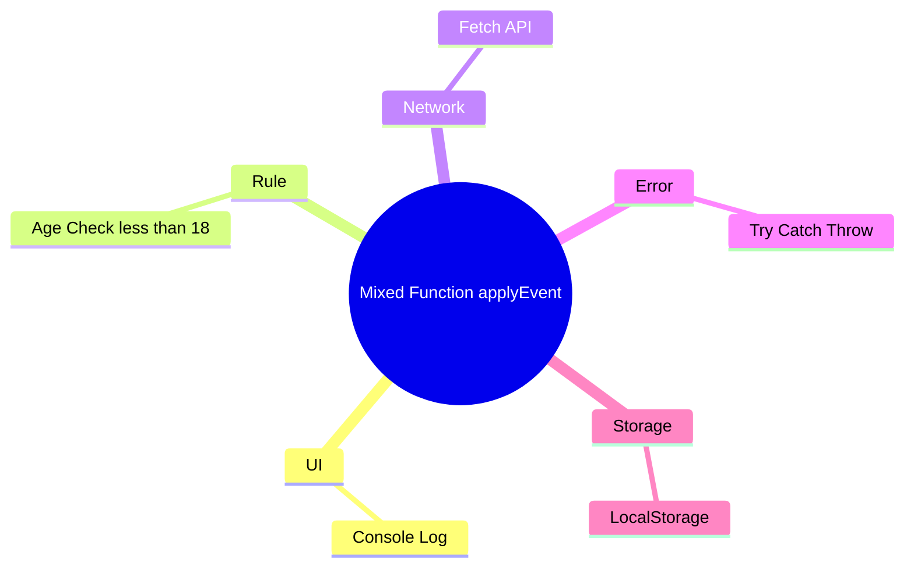

# 第04章：TypeScriptの世界の“関心”を棚卸ししよう🧺✨

この章は「分ける前に、まず“何が混ざってるのか”を見える化しよ〜！」の回だよ😊🩷
SoC（関心の分離）は、**分け方の前に“関心の種類”を把握する**のがめちゃ大事！🧠✨

---

### 4-1. まず「関心」ってなに？🎀（超かんたん）

**関心 = そのコードが “何のために存在してるか”** だよ📌
もっと実用的に言うと…

> **関心 = “変更理由（変わる理由）”** 🌀

* UIの見た目が変わる → UIの関心🎨
* バリデーションルールが変わる → 業務ルールの関心📏
* APIのURLやレスポンスが変わる → 通信の関心🌐
* ログの形式や送信先が変わる → ログ/監視の関心📈

ここが混ざると「え、どこ直せばいいの…😭」が起きるやつ！

---

### 4-2. TypeScript開発でよく出る“関心カタログ”🗂️✨


ここからが本題！
TypeScriptの世界で頻出の関心を、**棚卸し用のリスト**として覚えちゃおう😊🫶

#### A. UI（表示・入力）🖥️🎨

* 画面レイアウト、見た目、コンポーネント分割
* 入力フォーム、エラーメッセージ表示
* クリック/キーボードなどイベント

※Reactは19系が安定版として提供され、19.2のように継続的に更新されてるよ🧩✨ ([react.dev][1])

#### B. 状態（State）🧠🔁

状態はさらに分けると超スッキリ！

* **UI状態（Client state）**：モーダル開いてる？タブどれ？入力途中？🪄
* **サーバー状態（Server state）**：APIから取ってきた一覧、キャッシュ、再取得タイミング🌐

サーバー状態は、今どきは「サーバー状態の管理ライブラリ」を使う考え方が一般化してて、TanStack Queryみたいに **取得・キャッシュ・更新**をまとめて扱えるよ📦✨ ([tanstack.com][2])

#### C. 業務ルール（Domain rules）📏🛡️

* 「申込期限は当日18:00まで」
* 「未成年は保護者同意が必要」
* 「割引は条件A+Bのときだけ」
  こういう **仕様のコア**👑

#### D. アプリの流れ（UseCase / Application）🧭✨

* 「申込ボタン押す」→「入力チェック」→「API送信」→「結果表示」
  みたいな **手順・流れ**の部分。
  ルールそのものではなく、**段取り**！

#### E. 通信（API / Fetch / SDK）🌐📡

* エンドポイント、認証ヘッダ、リトライ、タイムアウト
* DTO（APIの形）を受け取るところ

#### F. 永続化（保存）🗄️💾

* フロント：localStorage / IndexedDB / Cookie
* バック：DB、ファイル、キャッシュ（Redis等）
* 「どこに、どの形式で保存するか」って関心

#### G. 認証・認可（AuthN / AuthZ）🔐🪪

* ログイン状態
* その人が “できること” の制限（管理者だけ編集OK等）

#### H. ログ・監視・エラーレポート📈🚨

* console/log出力
* 監視ツールへの送信
* 例外の集約・通知

#### I. 例外処理（Error handling）🧯😵‍💫

* どこで握りつぶす？どこで画面に出す？
* リトライする？ユーザーに再実行を促す？

#### J. 設定（Config / Env）⚙️🧩

* APIベースURL、機能フラグ、環境ごとの差
* 「設定ファイルや環境変数で変わる部分」

#### K. 日時・乱数・外部依存（副作用）🕒🎲🌪️

* 現在時刻、UUID、OS情報など
* テストしにくくなる元凶なので、後で分離しやすいように“関心”として意識しとくのが大事！

#### L. ビルド/実行（Tooling）🛠️🚀

ここ、2026の空気感として大事だから入れるね！✨
最近は **Node.jsがTypeScriptを“ネイティブ実行”できる流れ**が進んでて、条件が合えば `.ts` をそのまま実行できる説明が公式にあるよ🧠⚡ ([Node.js][3])
さらにTypeScript自体も、パフォーマンス改善のために大きな変化が進んでて、TypeScript 6は「橋渡し」、TypeScript 7はネイティブ化の方向が公式に語られてるよ🚄✨ ([Microsoft for Developers][4])
（※だからこそ、**「ビルド事情」も関心として棚卸し**すると事故らない！）

---

### 4-3. “フロントでもバックでも共通”の分け方🙆‍♀️🧩

同じTypeScriptでも、場所が違うだけで関心はほぼ同じだよ😊

* フロント：UI🖥️ / UI状態🧠 / 通信🌐 / 保存🗄️ / ルール📏
* バック：HTTP受け口🌐 / DB保存🗄️ / ルール📏 / ログ📈 / 認可🔐

**違うのは「UIがあるか」くらい**で、考え方は共通✨

---

### 4-4. ミニケース：学園イベント申込🎓📝（関心をラベル付けしてみよ！）

たとえば、こんな処理があるとするね👇

```ts
// ❌ ぜんぶ混ざってる例（この章では“分けない”。まず棚卸し！）
async function applyEvent(form: { name: string; age: number }) {
  // UI表示（本来はUIの関心）
  console.log("送信中...");

  // 業務ルール（年齢チェック）
  if (form.age < 18) {
    throw new Error("未成年は申込できません");
  }

  // 通信
  const res = await fetch("/api/apply", {
    method: "POST",
    body: JSON.stringify(form),
  });

  // エラーハンドリング
  if (!res.ok) throw new Error("申込失敗");

  // 永続化（例：申込済みフラグ）
  localStorage.setItem("applied", "true");

  // ログ
  console.log("申込完了！");
}
```

このコードの“関心”を棚卸しすると、こうなるよ👇😊✨

* UI🖥️：`console.log("送信中...")`, `console.log("申込完了！")`
* 業務ルール📏：`age < 18` の判定
* 通信🌐：`fetch("/api/apply"...)`
* エラーハンドリング🧯：`!res.ok` と例外
* 永続化🗄️：`localStorage.setItem(...)`
* （ついでに）DTOっぽい入力📦：`form` の形（UI入力の形とAPIの形が同じとは限らない）

✅ 今日は「分ける」じゃなくて、**混ざり方を言語化できたら勝ち**だよ〜！🥳🎉



---

### 4-5. ワーク📝：「関心リスト」を作ろう（テンプレ付き）🎁✨

自分の機能（小さめでOK）を1つ選んで、これを埋めてみてね😊🩷
（メモ帳でもVS CodeでもOK！）

```txt
【機能名】例：イベント申込

1) UI（表示・入力）
- 

2) UI状態（モーダル、入力中など）
- 

3) サーバー状態（取得したデータ、キャッシュなど）
- 

4) 業務ルール（仕様のコア）
- 

5) アプリの流れ（手順・ユースケース）
- 

6) 通信（API/SDK）
- 

7) 永続化（localStorage/DB/キャッシュ）
- 

8) 認証・認可
- 

9) ログ・監視
- 

10) エラーハンドリング
- 

11) 設定（環境差・フラグ）
- 

12) 時刻・乱数などの副作用
- 
```

💡コツ：
「それ、誰が変える？」を考えると仕分けやすいよ😆

* デザイナー/フロント都合 → UI🎨
* 仕様担当/業務都合 → ルール📏
* インフラ/API都合 → 通信🌐

---

### 4-6. AI（Copilot/Codex）に手伝ってもらうプロンプト例🤖✨

そのまま貼って使えるやつ🎀（短くて強い！）

#### プロンプト1：関心の棚卸し

「この関数に混ざっている関心を列挙して。UI/状態/ルール/通信/永続化/ログ/エラー/設定/副作用の観点で分類して」

#### プロンプト2：境界案を3つ

「この機能をSoCするための“分割案”を3パターン出して。それぞれのメリット/デメリットも」

#### プロンプト3：命名の改善

「この処理を関心ごとに分ける前提で、関数名・ファイル名・型名の候補を提案して」

AIに“答え”を出させるというより、**見落とし防止の相棒**にする感じがちょうどいいよ😊🫶

---

### 4-7. ミニクイズ🎮✨（関心の仕分け練習）

次のうち「業務ルール📏」はどれ？（複数OK）

1. ボタンを押したらローディング表示にする
2. 申込は当日18:00まで
3. `/api/apply` にPOSTする
4. 申込完了をログに送る
5. 未成年は保護者同意が必要

✅答え：**2 と 5** 🎉
（1はUI、3は通信、4はログ📈）

---

### 4-8. まとめ🧺✨（この章のゴール達成！）

* SoCは「分け方」より先に、**関心の棚卸し**が超大事😊
* TypeScriptの現場でよくある関心を“カタログ化”したよ🗂️
* 次にやるのは、棚卸しした関心が迷子にならないように「置き場所（構成）」を作ること📁🏗️


[1]: https://react.dev/blog/2024/12/05/react-19?utm_source=chatgpt.com "React v19"
[2]: https://tanstack.com/query?utm_source=chatgpt.com "TanStack Query"
[3]: https://nodejs.org/en/learn/typescript/run-natively?utm_source=chatgpt.com "Running TypeScript Natively"
[4]: https://devblogs.microsoft.com/typescript/progress-on-typescript-7-december-2025/?utm_source=chatgpt.com "Progress on TypeScript 7 - December 2025"
