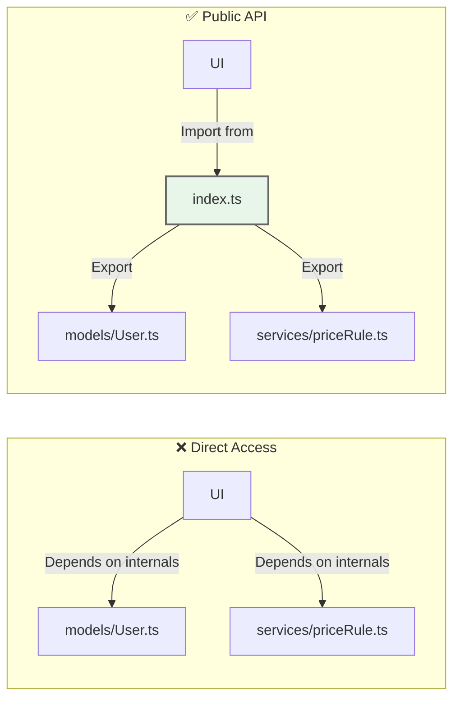

# 第06章：プロジェクトの最小フォルダ設計（サイトの骨格）📁🏗️

この章はね、「SoCを守れる“置き場”を先に作っちゃう」回だよ〜！🥳
置き場があると、コードが散らかりにくいし、AIにお願いする時もめちゃ指示しやすいの🧠🤖✨

---

## 6-0. まず“骨格”ってなに？🦴✨


骨格＝「この関心はここに置く」って決めた**最小の住所**だよ📮💖
SoCの最初の勝ち筋はこれ👇

* **ルール（業務・計算）**は奥にしまう🛡️
* **画面（UI）**は手前で受け取る🖥️
* **通信・保存**は外側に押し出す🌐🗄️
* 依存は「外 → 内」だけにする（内側は純粋に✨）

---

## 6-1. まずは3〜4フォルダでOK🍰📁


いきなり大規模構成にしないよ〜！初心者の最適解はこれ👇

### ✅ “ライト4兄弟”フォルダ（超おすすめ）✨

* `ui/`：画面・入力・表示 🖥️🎀
* `app/`：アプリの流れ（ユースケース）🧭✨
* `domain/`：業務ルール・計算（心臓）🫀🛡️
* `infra/`：通信・保存・外部API（外の世界）🌐🗄️

必要ならあとで `shared/` を足すくらいでOK（最初は無理しない）🧺🌸

---

## 6-2. “最小骨格”のサンプル（ツリー）🌳✨


イメージしやすいように、まずはこう👇

```text
my-app/
  src/
    ui/
      pages/
      components/
      index.ts
    app/
      usecases/
      index.ts
    domain/
      models/
      services/
      index.ts
    infra/
      api/
      storage/
      index.ts
    index.ts
```

### ✅ ポイント💡

* **各フォルダに `index.ts` を置く**（あとで説明する「公開API」ね🚪✨）
* `domain/` は **フレームワーク・fetch・localStorage**とかを知らない顔で生きる😌🫶

---

## 6-3. それぞれの役割を“1行で”言えるようにしよ📝✨


迷ったら、この1行に戻ればOKだよ〜！🥰

* `ui`：**見せる・入力を受ける**（表示の都合で変わる）🖥️
* `app`：**何をどの順でやるか**（手順で変わる）🧭
* `domain`：**何が正しいか**（ルールで変わる）📏🛡️
* `infra`：**外部とどう話すか**（APIや保存先で変わる）🌐🗄️

この「変わる理由」が違う＝SoCの勝ち！🏆✨

---

## 6-4. “公開API（exportのルール）”を決める🚪✨


ここが超重要〜！🥹💖
**フォルダの中身を全部見せると、依存がぐちゃぐちゃになりやすい**の。

### ✅ ルール：外からは `index.ts` だけ触ってね🙂

* 外部（他フォルダ）からの import は、基本 **そのフォルダの `index.ts` 経由**にする
* `domain/models/user` みたいな“奥まで直参照”は原則やめる🙅‍♀️

#### 例：`domain/index.ts`（公開API）

```ts
export * from "./models/User";
export * from "./services/priceRule";
```

#### 例：外からはこう使う

```ts
import { User, calcPrice } from "../domain";
```

### 💥 これで何が嬉しいの？

* 依存が「入口」で揃う＝設計が崩れにくい✨
* 依存が「入口」で揃う＝設計が崩れにくい✨
* 後で中身の移動・分割をしても、外側の修正が減る✂️💕



※ただし `index.ts` を増やしすぎると循環参照が起きやすいので、次で“事故回避”もやるよ🌀😇

---

## 6-5. 依存の向きを固定する（事故が減る）➡️🛡️


これを守ると一気に楽になるよ〜！🥳

✅ **依存OKの向き（おすすめ）**
`ui → app → domain`
`ui → app → (ports) ← infra`（※後の章でやるDIPに繋がる✨）

❌ **やりがちNG**

* `domain` が `infra` を import（心臓が外界に依存しちゃう😭）
* `app` が `ui` を import（手順が表示都合に引っ張られる😇）

---

## 6-6. 循環参照（ぐるぐる地獄）を起こさないコツ🌀🙅‍♀️


循環参照って、ざっくり言うと
「AがBを読み、BがAを読む」みたいな**ぐるぐる依存**だよ🌀😵‍💫

### ✅ まず“配置”で防ぐ3つのコツ🍀

1. **内側（domain）は外側を知らない**
2. `shared/`（便利箱）を乱用しない（すぐ泥沼📦💥）
3. `index.ts` を“なんでも詰め込み口”にしない（必要最小限に）🚪⚠️

### ✅ ツールでも検知しよう（早期発見が正義）🕵️‍♀️✨

ESLint の `import/no-cycle` は「循環があるよ！」を検知できるルールだよ🔍 ([GitHub][1])

例（設定イメージ）：

```js
// eslint config の一例（プロジェクトに合わせて調整してね）
rules: {
  "import/no-cycle": "error",
}
```

---

## 6-7. ミニ実習①：「置き場」を決めるワーク🧺📝✨


題材はカンタンでOK！たとえば「カフェ注文」☕🍰

次の処理を、どのフォルダに置く？仕分けしてみて〜！🎀

1. 注文合計金額を計算する（割引あり）
2. 画面で数量を入力する
3. 注文ボタンを押したら送信する
4. APIからメニュー一覧を取る
5. 「割引は1000円以上で10%」のルールを変更

✅ 目安の答え：

* 1 → `domain`（計算＝ルール寄り）🛡️
* 2 → `ui` 🖥️
* 3 → `app`（流れ）🧭
* 4 → `infra`（通信）🌐
* 5 → `domain`（ルール変更）📏

---

## 6-8. ミニ実習②：「公開API」を作ってみる🚪✨

やることはこれだけ👇

* `domain/` に `index.ts` 作る
* 外から触っていい型・関数だけ export する
* `ui` や `app` からは `domain` の `index.ts` 経由で import する

これだけで、コードの見通しが一気に良くなるよ〜！🌸✨

---

## 6-9. AI（Copilot/Codex）に頼むときのコツ🤖🎁✨

AIは「雑にお願い」すると、雑な構成を返しがち😇
**“フォルダの責務”を渡してからお願い**すると強いよ💪💖

そのまま使えるプロンプト例👇

```text
次の4フォルダ構成でTypeScriptプロジェクトの骨格を提案して：
ui（表示/入力）, app（ユースケース）, domain（業務ルール）, infra（通信/保存）
ルール：
- domainはfetchやlocalStorage等の副作用を直接使わない
- ui→app→domain の依存だけ許可
- 各フォルダに公開APIとして index.ts を置く
この前提で、ファイル配置案と各フォルダのindex.tsのexport方針を出して
```

---

## 6-10. “最新版”メモ（この章の前提になるところだけ）🧠✨

* TypeScript は **5.9.3 が最新扱い**になってるよ（GitHub releases の Latest） ([GitHub][2])
* Node.js は **v24.12.0 が Latest LTS**として案内されてるよ ([Node.js][3])
* Vite は v7 系の移行ガイドが整備されてて、ブラウザターゲット方針も更新されてる（2026-01-01基準の話あり） ([vitejs][4])
* TypeScript 5.9 のリリースノートには `--module node20` みたいな“安定オプション”の話も出てるよ（環境に合わせて選びやすくなってる） ([typescriptlang.org][5])

---

## 6-11. まとめ：この章のチェックリスト✅💖

* [ ] `ui / app / domain / infra` の4つに分けた📁
* [ ] `domain` は副作用（通信/保存/時刻）を知らない🧼✨
* [ ] 各フォルダに `index.ts` を作って公開APIを絞った🚪
* [ ] 依存の向きが「外→内」になってる➡️🛡️
* [ ] 循環参照を“配置 + ルール”で避ける意識がある🌀🙅‍♀️

---

次の第7章で、この骨格が一気に効いてくるよ〜！
「純粋な処理」と「副作用」を分けると、`domain` が“神パーツ化”する🧼⚡✨

[1]: https://github.com/import-js/eslint-plugin-import/blob/main/docs/rules/no-cycle.md?utm_source=chatgpt.com "eslint-plugin-import/docs/rules/no-cycle.md at main"
[2]: https://github.com/microsoft/typescript/releases "Releases · microsoft/TypeScript · GitHub"
[3]: https://nodejs.org/en/blog/release/v24.12.0?utm_source=chatgpt.com "Node.js 24.12.0 (LTS)"
[4]: https://ja.vite.dev/guide/migration?utm_source=chatgpt.com "v7 からの移行"
[5]: https://www.typescriptlang.org/docs/handbook/release-notes/typescript-5-9.html?utm_source=chatgpt.com "Documentation - TypeScript 5.9"
