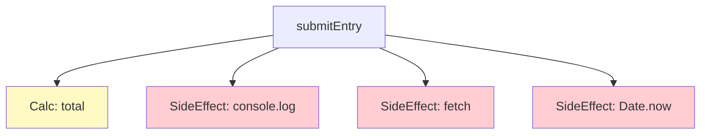

# 第07章：最強の第一歩！「純粋な処理」と「副作用」を分ける🧼⚡

この章は、SoCの“いちばん効く”最初の一歩だよ〜！🫶
**計算（=純粋）**と**I/O（=副作用）**を分けるだけで、コードが急に読みやすく＆直しやすくなる✨

---

## 7-1. 今日のゴール🎯✨

できるようになりたいこと👇

* 「ここは計算」「ここは副作用」って**見分けられる**👀🔍
* 1つの関数を **計算パート** と **I/Oパート** に **切り分けられる**✂️
* 計算パートをテストして「安心して変更できる」状態にできる🧪🌸

---

## 7-2. まず「副作用」ってなに？🌪️🧨

ざっくり言うと…

> **返り値以外に、外の世界に影響を与えること** or **外の世界に依存すること** 🌍⚡

代表例👇（全部“副作用”だよ！）

* 通信（fetch / API）🌐
* DB・ファイル・localStorage 読み書き🗄️
* 時刻（Date.now）🕒
* 乱数（Math.random）🎲
* 画面表示・DOM操作🖥️
* ログ出力（console.log）📣

副作用があると「順番」と「環境」に左右されやすくなるのがポイント😵‍💫
（＝テストしにくい、バグが再現しにくい）
“副作用”という概念自体の説明はこのへんが分かりやすいよ。([ウィキペディア][1])

---

## 7-3. 「純粋な処理（純粋関数）」ってなに？🫧✨

純粋関数は、超シンプルに言うと👇

* **同じ入力 → 必ず同じ出力**（ブレない）🎯
* **外の世界を変えない**（副作用なし）🧼

この2つが揃うと、「置き換えても意味が変わらない」＝**参照透過**みたいな嬉しさも出るよ✨
定義としてはこのあたりが王道。([ウィキペディア][2])

---

## 7-4. “混ぜると事故る”あるあるコード😇💥

例えば「学園イベントの参加費を計算して、保存して、ついでに通知する」みたいな処理。

```ts
// ❌ ぜんぶ混ぜ（計算＋保存＋通知＋ログ）
type Entry = { userId: string; grade: 1 | 2 | 3 | 4; wantsAfterParty: boolean };

export async function submitEntry(entry: Entry) {

  const base = 1200;
  const gradeDiscount = entry.grade >= 3 ? 200 : 0;
  const afterPartyFee = entry.wantsAfterParty ? 800 : 0;

  const total = base - gradeDiscount + afterPartyFee;

  console.log("total =", total); // 副作用📣

  // 副作用🌐
  await fetch("https://example.com/api/entries", {
    method: "POST",
    headers: { "content-type": "application/json" },
    body: JSON.stringify({ ...entry, total, submittedAt: Date.now() }), // Date.now も副作用🕒
  });

  return total;
}
```



このコードのツラさ👇😵‍💫

* 計算ミスを直したいだけなのに、通信や時刻やログが絡む🌪️
* テストするときに fetch をどうする？Date.now は？ってなる🧪💦
* 変更したら壊れそうで怖い（影響範囲が読めない）😇

---

## 7-5. 分け方の黄金パターン🥇「機能の芯」と「外側」


合言葉はこれ👇💕

### ✅ Functional Core / Imperative Shell（ざっくり）

* **Core（芯）**：純粋な計算・判定・変換だけ🧼✨
* **Shell（殻）**：通信・保存・時刻・ログなど副作用だけ⚡🌐

イメージとしては「芯は洗える」「殻は濡れる」みたいな感じ🧽🤣

---

## 7-6. ミニ演習：1つの関数を「計算」と「I/O」に分割しよう✂️🧪✨

### Step 1：計算だけを抜き出す🧼

```ts
// ✅ 純粋：計算だけ
export type Entry = { grade: 1 | 2 | 3 | 4; wantsAfterParty: boolean };

export function calcEntryTotal(entry: Entry): number {
  const base = 1200;
  const gradeDiscount = entry.grade >= 3 ? 200 : 0;
  const afterPartyFee = entry.wantsAfterParty ? 800 : 0;

  return base - gradeDiscount + afterPartyFee;
}
```

ここは **外部に触ってない**ので純粋！🫧✨

---

### Step 2：副作用（I/O）を“外側”に押し出す🌐🗄️

```ts
import { calcEntryTotal, type Entry } from "./calc.js";

export type EntryRecord = {
  userId: string;
  grade: 1 | 2 | 3 | 4;
  wantsAfterParty: boolean;
  total: number;
  submittedAt: number; // “いつ”は副作用側で作る🕒
};

export type EntryApi = {
  postEntry: (record: EntryRecord) => Promise<void>;
};

export type Clock = {
  now: () => number;
};

export async function submitEntry(
  api: EntryApi,
  clock: Clock,
  entry: { userId: string } & Entry
): Promise<number> {
  const total = calcEntryTotal(entry);

  const record: EntryRecord = {
    userId: entry.userId,
    grade: entry.grade,
    wantsAfterParty: entry.wantsAfterParty,
    total,
    submittedAt: clock.now(),
  };

  await api.postEntry(record); // 副作用はここだけ🌐

  return total;
}
```

ポイント💡

* **Date.now()を直で呼ばない** → `clock.now()` にする🕒✨
* **fetchを直で呼ばない** → `api.postEntry()` にする🌐✨
  （この“渡して差し替える”感じが、後のDI/DIPにつながるよ〜！🔄）

---

### Step 3：本番用のI/O実装（fetch）を書く🌐

```ts
import type { EntryApi, Clock } from "./app.js";

export function createHttpEntryApi(): EntryApi {
  return {
    async postEntry(record) {
      await fetch("https://example.com/api/entries", {
        method: "POST",
        headers: { "content-type": "application/json" },
        body: JSON.stringify(record),
      });
    },
  };
}

export const systemClock: Clock = {
  now: () => Date.now(),
};
```

---

## 7-7. テストしやすさが爆上がりする🧪🌸（Vitestで体感）

いま分けたおかげで、**計算（純粋）**は秒でテストできる✨
テスト基盤として Vitest は「Vite連携＆Jest互換の思想で速いよ」って位置づけ。([Vitest][3])

### 純粋関数のテスト例✅

```ts
import { describe, it, expect } from "vitest";
import { calcEntryTotal } from "./calc.js";

describe("calcEntryTotal", () => {
  it("3年生以上は割引される🎓", () => {
    expect(calcEntryTotal({ grade: 3, wantsAfterParty: false })).toBe(1000);
  });

  it("懇親会ありだと加算される🍕", () => {
    expect(calcEntryTotal({ grade: 1, wantsAfterParty: true })).toBe(2000);
  });
});
```

### I/O側（submitEntry）は“差し替え”でテストできる🧸✨

```ts
import { describe, it, expect, vi } from "vitest";
import { submitEntry } from "./app.js";

describe("submitEntry", () => {
  it("APIに正しいrecordを送る📮", async () => {
    const postEntry = vi.fn(async () => {});
    const api = { postEntry };
    const clock = { now: () => 1234567890 };

    const total = await submitEntry(api, clock, {
      userId: "u1",
      grade: 4,
      wantsAfterParty: true,
    });

    expect(total).toBe(1800);
    expect(postEntry).toHaveBeenCalledWith({
      userId: "u1",
      grade: 4,
      wantsAfterParty: true,
      total: 1800,
      submittedAt: 1234567890,
    });
  });
});
```

「通信してないのに、通信したことにできる」＝**安心**🧪🌈

---

## 7-8. 純粋っぽいのに純粋じゃない罠集😈⚠️

### 罠1：入力をこっそり変更しちゃう（ミューテーション）🧟‍♀️

```ts
// ❌ 入力をいじるのは純粋じゃないことが多い
function addTag(tags: string[], tag: string) {
  tags.push(tag);
  return tags;
}
```

✅こうする（新しい配列を返す）✨

```ts
function addTag(tags: readonly string[], tag: string) {
  return [...tags, tag];
}
```

---

### 罠2：Date.now / Math.random を直で使う🕒🎲

対策は「値 or 関数を外から渡す」だけでOK👌✨
（さっきの `clock.now()` がそれ！）

---

### 罠3：モジュール読み込み時に副作用が走る😵‍💫

最近のTSだと「import時の副作用」も意識ポイントになってきたよ。
TypeScript 5.9 では `import defer` が入って、**副作用が重いモジュールを“遅延評価”**みたいに扱える流れもある。([typescriptlang.org][4])
（まずは「トップレベルで勝手に通信しない」「初期化は関数で呼ぶ」だけでも超えらい👏）

---

## 7-9. 今日のまとめ✅💖

* **計算（純粋）**と**I/O（副作用）**を分けると、SoCが一気に進む🧼⚡
* 純粋関数は **テストしやすい神パーツ**🧪✨
* 副作用は「外側」に集めて、差し替えできる形にすると強い🔄🛡️

---

## 7-10. 小テスト（3分）📝💗

次のうち「副作用」なのはどれ？（複数OK）👀

1. `price * 1.1`
2. `Date.now()`
3. `arr.map(x => x + 1)`
4. `localStorage.setItem(...)`
5. `console.log(...)`

答え：**2, 4, 5** 🎉
（2は“外の世界（時刻）に依存”、4・5は“外の世界に影響”）([ウィキペディア][1])

---

## 7-11. Copilot/Codexに頼むときの魔法の指示文🪄🤖✨

そのまま貼れるやつ置いとくね👇💕

* 「この関数を**純粋関数（計算）**と**副作用（I/O）**に分割して。副作用は `api` と `clock` を引数で受け取る形にして」🧼⚡
* 「`Date.now()` と `fetch` を直接呼ばないようにして、**テストしやすい構造**にして」🧪
* 「`calcXxx()`（純粋）と `doXxx()`（副作用）に名前を分けて、ファイルも分ける案を3つ出して」📁✨

---

## 次章予告🏠📦✨（第8章へ）

次は **ファイル境界（モジュール分割）**でSoCを作るよ〜！
「どの責務を、どのファイルに置く？」がスッキリ決まっていく感じ、気持ちいいよ😆🩷

（ちなみに2026/01/11時点の最新寄り情報として：Nodeは v24.12.0 がLTSリリースとして案内されてるよ。([Node.js][5])　TypeScriptは 5.9 のリリースノートが現行ラインとして公開されてる。([typescriptlang.org][4])）

[1]: https://en.wikipedia.org/wiki/Side_effect_%28computer_science%29?utm_source=chatgpt.com "Side effect (computer science)"
[2]: https://en.wikipedia.org/wiki/Pure_function?utm_source=chatgpt.com "Pure function"
[3]: https://vitest.dev/?utm_source=chatgpt.com "Vitest | Next Generation testing framework"
[4]: https://www.typescriptlang.org/docs/handbook/release-notes/typescript-5-9.html?utm_source=chatgpt.com "Documentation - TypeScript 5.9"
[5]: https://nodejs.org/en/blog/release/v24.12.0?utm_source=chatgpt.com "Node.js 24.12.0 (LTS)"
