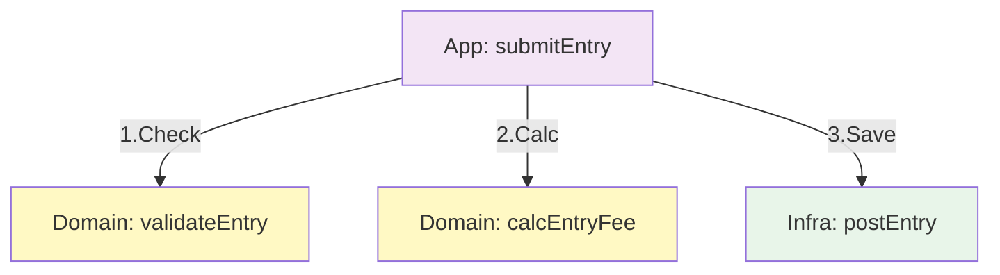

# 第08章：モジュール分割（ファイル境界）でSoCを作る🏠📦

ここからは「どこでファイルを切る？」を、気持ちよく決められるようになる章だよ〜😊💖
SoCって「考え方」だけだとフワッとしがちだけど、**ファイル境界（＝モジュール境界）**を作れるようになると一気に“設計っぽく”なるの✨

---

## 8-1. そもそも「モジュール」って何？📦

TypeScriptは、**トップレベルに `import` / `export` があるファイルを“モジュール”として扱う**よ〜📦✨ ([typescriptlang.org][1])
つまり…**ファイルを分ける＝モジュールを分ける**ってこと！

モジュール分割で得られるうれしさはこれ👇

* 変更の影響が小さくなる（事故りにくい）🛡️
* 名前で「ここに何があるか」分かる🔍
* テストが書きやすい🧪✨
* AIに頼みやすい（境界があると提案が当たりやすい）🤖💕

---

## 8-2. “1ファイル1責務”の感覚をつかもう🎯✨

合言葉はこれ👇
**「このファイル、何のためのファイル？」が1文で言える？🗣️**

### ✅ 良い例（1文で言える）

* `price.ts`：金額の計算と丸めだけ💰
* `userId.ts`：UserId型の生成と検証だけ🪪
* `fetchClient.ts`：通信（fetch）の薄いラッパーだけ🌐

### ❌ つらい例（1文で言えない）

* `utils.ts`：なんか色々入ってる箱📦💥
  （日付、文字列、金額、API、localStorage…全部入り😇）

---

## 8-3. util地獄を避ける！「便利箱」の罠📦💥


`utils.ts` が悪いわけじゃないんだけど、**雑に増えると設計が壊れる**の😵‍💫
なぜなら util はこうなるから👇

* 何でも入れる → 何でも依存する → 何でも壊れる🌪️
* 使い方が揃わない → バグが増える🐛
* 後から “関心” が見えなくなる🫥

### 🌸 解決法：”用途で名前をつける”

「便利」じゃなくて「目的」で分けよ〜😊

* `money/formatMoney.ts`
* `date/parseDate.ts`
* `string/normalizeKana.ts`
* `domain/user/userId.ts`（←ドメイン寄りならここ！）

「何が入ってる？」が **ファイル名で分かる** のが勝ち🏆✨

---

## 8-4. 分割の基本パターン3つ🍰📁✨


### パターンA：関心ごとで分ける（SoC直球）🎯

* `ui/`（画面・表示）🖥️
* `domain/`（ルール・型・計算）🛡️
* `infra/`（通信・保存・外部I/O）🌐🗄️

### パターンB：機能（feature）でまとめる（現場で強い）💪

* `features/event/`
* `features/cart/`
* `features/auth/`

featureの中に `ui / domain / infra` を小さく置くのもアリだよ🍩✨

### パターンC：小さいうちは“まず3分割”だけでもOK🍰

* `domain/`（純粋ロジック）
* `adapters/`（I/O）
* `app/`（つなぐ）

迷ったら、まずこれで十分🙆‍♀️💖

---

## 8-5. `index.ts` で“表の顔”を作る🙂✨（でも慎重に！）

フォルダに `index.ts` を置くと、そこが「入口」になるよ🚪✨
いわゆる **barrel（バレル）**ってやつ！

たとえば `domain/user/` の中身を外に見せたいとき👇

```ts
// src/domain/user/index.ts
export { UserId, makeUserId } from "./userId";
export { User, makeUser } from "./user";
```

呼ぶ側はこう👇

```ts
import { UserId, makeUser } from "../domain/user";
```

### ✅ バレルが向いてる場面

* フォルダを「公開API」として扱いたい（入口を固定したい）🚪
* 外から見せる物を絞りたい（勝手に内部を触らせない）🛡️

### ⚠️ でも“やりすぎバレル”は危ない

巨大な `index.ts` が「全部再export」みたいになると、**ビルドやバンドルに悪影響が出る**ことがあるよ〜😵‍💫
特にライブラリ作者向けには「バレルは慎重に」って注意もあるよ。 ([DEV Community][2])

なのでおすすめルール👇

* `index.ts` は **境界の場所にだけ置く**（domainの入口、featureの入口）🙂
* “何でも再export” はしない（公開する物だけ）🔒✨
* `index.ts` を通さないと触れない内部ファイルは、内部として守る🛡️

---

## 8-6. 循環参照（circular dependency）を起こさないコツ🌀🙅‍♀️

「AがBをimport、BがAをimport」みたいな状態ね🌀
これが増えると…

* どっちを直すべきか分からない😇
* 初期化順で `undefined` が出たりする（JSの実行順こわい）😱
* リファクタが地雷原になる💣

### ✅ 循環参照を避ける“よく効く技”5つ💡

1. **依存の向きを決める**（内側→外側に依存しない）🧭
2. “共通だから”で混ぜない（共通化しすぎは逆に毒）☠️
3. `types.ts` を分ける（型だけ別ファイル）🧠
4. **型だけのimport**にする（実行時依存を消す）✨
   TypeScriptには `import type` / `export type` があるよ〜！ ([typescriptlang.org][3])
5. “つなぐ役”を作る（application側で組み立てる）🧩

---

## 8-7. 「副作用があるモジュール」を入口に置かない🧼⚡🚫

第7章でやった「純粋処理 vs 副作用」ね✨
ここで超大事なのは👇

> **importしただけで通信したり、localStorage触ったりしない**🙅‍♀️

「勝手に動くファイル」があると、モジュールの境界が壊れるし、テストも地獄になる😵‍💫

### ✅ ルール（やさしめ）

* `domain/` は **importしても何も起きない**（計算だけ）🧼
* `infra/` はI/Oするけど、**関数を呼ばれた時だけ動く**🌐
* “入口（index.ts）” は **exportだけ**に寄せる🙂

---

## 8-8. ちょい最新TS事情：import/解決ルールも意識しよ📌✨

最近のTypeScriptはモジュールまわりがどんどん整ってるよ〜！

* TypeScript 5.9系が公開されていて、5.9.3 が “Latest” として出てるよ。 ([GitHub][4])
* 5.9 では `import defer` みたいに「遅延評価」も入ってきて、**副作用の扱い**がより意識される流れだよ〜⚡ ([typescriptlang.org][5])
* `moduleResolution` の `bundler` は、`imports/exports` を扱いつつ、相対パスで拡張子必須にならない等の特徴があるよ。 ([typescriptlang.org][6])

ここは第5章・第6章で整えた設定が効いてくるところ😊✨
（この章では「ファイル境界の考え方」が主役だから、設定沼には行かないよ🏝️）

---

## 8-9. ミニ演習：ごちゃ混ぜ1ファイルを“3モジュール”に分ける✂️📦✨

### 🎬 お題：文化祭の参加費を計算する（学割あり）🎓💰

Before（全部いっしょ😇）：

```ts
// src/app.ts
export function submit(name: string, age: number, isStudent: boolean) {
  if (!name.trim()) throw new Error("name required");

  let fee = 1000;
  if (age < 18) fee = 500;
  if (isStudent) fee = Math.floor(fee * 0.8);

  console.log("POST /entry", { name, age, isStudent, fee }); // 通信のつもり
  return { ok: true, fee };
}
```

---

### ✅ Step1：純粋ロジックを `domain/` に出す🧼✨

```ts
// src/domain/fee/calcEntryFee.ts
export function calcEntryFee(age: number, isStudent: boolean): number {
  let fee = 1000;
  if (age < 18) fee = 500;
  if (isStudent) fee = Math.floor(fee * 0.8);
  return fee;
}
```

---

### ✅ Step2：入力チェックを `domain/` に寄せる🛡️✨

```ts
// src/domain/entry/validateEntry.ts
export function validateEntry(name: string): void {
  if (!name.trim()) throw new Error("name required");
}
```

---

### ✅ Step3：I/Oっぽいのを `infra/` に隔離する🌐🗄️

```ts
// src/infra/entryApi.ts
export async function postEntry(payload: unknown): Promise<void> {
  // ここは本物の fetch に置き換わる想定
  console.log("POST /entry", payload);
}
```

---

### ✅ Step4：“つなぐ”のは `app/`（application）でやる🧩✨

```ts
// src/app/submitEntry.ts
import { calcEntryFee } from "../domain/fee/calcEntryFee";
import { validateEntry } from "../domain/entry/validateEntry";
import { postEntry } from "../infra/entryApi";

export async function submitEntry(name: string, age: number, isStudent: boolean) {
  validateEntry(name);

  const fee = calcEntryFee(age, isStudent);

  await postEntry({ name, age, isStudent, fee });

  return { ok: true, fee };
}
```



🎉 できたー！
これだけで「UI変更」「ルール変更」「通信変更」が分かれるから、SoCが“形”になってきたよ😊💖


---

## 8-10. AI活用：モジュール境界を出してもらうプロンプト🎁🤖✨

### ① 分割案を3つ出させる

* 「このファイルをSoCで分割して。**案を3つ**、それぞれのメリット/デメリットも。フォルダ構成も出して。」

### ② “公開API（index.ts）” を絞らせる

* 「このフォルダを外から使う人向けに、**公開するexportだけ**を選んで `index.ts` を作って。」

### ③ 循環参照チェック目線をもらう

* 「循環参照が起きそうなimport関係を指摘して。**依存の向き**が一方向になる改善案も。」

AIは「境界」があると急に賢くなるよ〜🤖✨（ほんとに！）

---

## 8-11. 仕上げチェックリスト✅💖

* [ ] 各ファイルの役割が1文で言える🙂
* [ ] `domain/` は importしても何も起きない🧼
* [ ] `infra/` は“呼ばれたときだけ”I/Oする🌐
* [ ] `index.ts` は export中心で、公開物が絞れてる🚪
* [ ] `utils.ts` が便利箱になってない📦💥
* [ ] importの矢印がぐるぐるしてない🌀🙅‍♀️

---

## 8-12. 次章へのつながり🍰✨

第8章で「ファイル境界」が作れたら、次は **“層（UI / Application / Domain）”**として整理できるようになるよ〜！
第9章の3層設計は、ここまでの分割ができてると超スムーズに入れる😊🧁✨

[1]: https://www.typescriptlang.org/docs/handbook/2/modules.html?utm_source=chatgpt.com "Documentation - Modules"
[2]: https://dev.to/thepassle/a-practical-guide-against-barrel-files-for-library-authors-118c?utm_source=chatgpt.com "A practical guide against barrel files for library authors"
[3]: https://www.typescriptlang.org/docs/handbook/modules/reference.html?utm_source=chatgpt.com "Documentation - Modules - Reference"
[4]: https://github.com/microsoft/typescript/releases "Releases · microsoft/TypeScript · GitHub"
[5]: https://www.typescriptlang.org/docs/handbook/release-notes/typescript-5-9.html "TypeScript: Documentation - TypeScript 5.9"
[6]: https://www.typescriptlang.org/tsconfig/moduleResolution.html?utm_source=chatgpt.com "TSConfig Option: moduleResolution"
