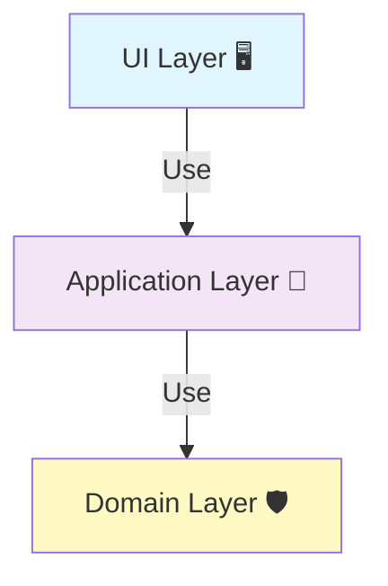

# 第09章：ライトな3層設計（UI / Application / Domain）🍰✨

> **2026/01/11 時点メモ📝**
>
> * npm の TypeScript 最新安定版は **5.9.3**（2025/09/30 公開）です。 ([npm][1])
> * TypeScript チームは **TypeScript 6.0 を「最後のJavaScript実装のメジャー」**、**5.9 ↔ 7.0 をつなぐ“ブリッジ”**と説明しています。 ([Microsoft for Developers][2])
> * VS Code の直近リリースは **1.108（2026/01/08）** です。 ([Visual Studio Code][3])
> * Node.js は **v24 が Active LTS**（サイト上の “Latest LTS” 表記も v24.12.0）です。 ([Node.js][4])

---

### 9-1. 3層ってなに？ざっくり一発で掴む🌟


3層（ライト版）は、こう分けます👇

* **UI層**：表示・入力・イベントだけ 🖥️⌨️
* **Application層**：やりたいことの流れ（ユースケース）🧭
* **Domain層**：ルールの中心（変更に強い核）🛡️💎



イメージはこれっ👇

```txt
[ UI ]  画面/入力/クリック/HTTP/CLI
   ↓   呼び出す
[ Application ]  ユースケース（申込する・注文する・支払う）
   ↓   ルールを使う
[ Domain ]  ルール（割引、上限、状態遷移、検証、計算）
```

この分け方が効く理由はシンプルで、

* **UIはUIの都合で変わる**（見た目・入力・画面遷移）🖼️
* **アプリは流れが変わる**（手順・ユースケース・承認フロー）🧭
* **ドメインはルールが変わる**（計算・制約・状態）📏

👉 **変わる理由が違うものは混ぜない**＝SoCの超実践形です🧁✨

---

### 9-2. まず「置き場迷子」をなくす！3層の責務まとめ✅

#### UI層🖥️


やること：

* 入力を集める（フォーム、ボタン、CLIの引数）⌨️
* 表示する（画面描画、ログ、レスポンス）📣
* 変換する（文字列→数値 みたいな“浅い変換”）🔁

やらないこと：

* 「学生なら10%引き」みたいな**業務ルール**❌
* 「申込は先着100名まで」みたいな**制約**❌
* 「申込処理の手順（保存→通知→…）」をゴリゴリ書く❌

#### Application層🧭


やること：

* ユースケースの順番を管理（例：申込 → 料金計算 → 保存 → 通知）🧩
* Domainを呼び出して、結果をまとめる🍱
* 依存（DB/通信など）は **“ここから外に出さない”**意識（詳細は後章で強化）🚪

やらないこと：

* 料金計算の中身（式）をここにベタ書き❌
  → それはDomainの仕事🛡️

#### Domain層🛡️


やること：

* **ルール**（計算、検証、状態遷移）📏
* **安全な型**（第10章につながる💖）
* できれば **純粋関数中心**（第7章の「副作用と分ける」をここで活かす✨）

やらないこと：

* fetch/DB/ファイル/日時取得を直で叩く❌（副作用は外へ）⚡

---

### 9-3. “ライト”ってどれくらいライト？😌🍰

ここでの3層は、ガチなクリーンアーキテクチャをいきなりやる話じゃないです🙅‍♀️💦
目標はこれ👇

* **フォルダ3つに分けるだけで「混ざり」を減らす**
* **import の向きを固定して、事故を減らす**
* **後からDIP/DIに進める“形”を先に作る**

---

### 9-4. 例題：学園イベント申込🎓🌸（この章の主役）


#### 仕様（かわいめ＆リアル寄り）✨

* イベント参加費：通常 **2,000円** 💰
* 学生は **20%割引** 🎀
* 定員は **100名** 🧑‍🤝‍🧑
* すでに満員なら申込できない 😵‍💫

---

### 9-5. フォルダ構成（最小）📁✨


```txt
src/
  ui/
    main.ts            // 入口（CLIでもWebでもここがUI）
  application/
    applyForEvent.ts   // ユースケース
  domain/
    pricing.ts         // 料金計算ルール
    capacity.ts        // 定員ルール
    types.ts           // ドメイン型（軽く）
```

#### import のルール（超大事）🚦

* UI → Application / Domain を呼んでOK✅
* Application → Domain を呼んでOK✅
* Domain → ほかに依存しない（基本）✅

これだけで「ごちゃ混ぜ」が一気に減ります😳✨

---

### 9-6. 実装してみよっ✨（コードは小さく、でも分離はハッキリ）

#### Domain：料金計算ルール🛡️💰

```ts
// src/domain/types.ts
export type Yen = number;

export type Applicant = {
  isStudent: boolean;
};

export type PricingRule = {
  baseFee: Yen;
  studentDiscountRate: number; // 0.2 = 20%
};
```

```ts
// src/domain/pricing.ts
import type { Applicant, PricingRule, Yen } from "./types";

export function calculateFee(applicant: Applicant, rule: PricingRule): Yen {
  const fee = rule.baseFee;
  if (!applicant.isStudent) return fee;

  const discounted = fee * (1 - rule.studentDiscountRate);
  // 端数は四捨五入（例として）
  return Math.round(discounted);
}
```

👉 ここは **UIもDBも知らない**、ただのルールの世界🌍🛡️

#### Domain：定員ルール🛡️🧑‍🤝‍🧑

```ts
// src/domain/capacity.ts
export function ensureCapacity(currentCount: number, limit: number): void {
  if (currentCount >= limit) {
    throw new Error("満員のため申込できません");
  }
}
```

---

#### Application：申込ユースケース🧭✨

```ts
// src/application/applyForEvent.ts
import { calculateFee } from "../domain/pricing";
import { ensureCapacity } from "../domain/capacity";
import type { Applicant, PricingRule, Yen } from "../domain/types";

export type ApplyInput = {
  applicant: Applicant;
};

export type ApplyResult = {
  fee: Yen;
  message: string;
};

export type EventState = {
  currentCount: number;
  limit: number;
};

export function applyForEvent(
  input: ApplyInput,
  state: EventState,
  rule: PricingRule
): ApplyResult {
  // 1) 定員チェック
  ensureCapacity(state.currentCount, state.limit);

  // 2) 料金計算
  const fee = calculateFee(input.applicant, rule);

  // 3) 本当はここで保存/通知など（第12〜14章で強化するよ💖）
  // 今回は「成功したことにする」だけ
  return {
    fee,
    message: `申込OK！参加費は ${fee} 円です✨`,
  };
}
```

👉 Applicationは **手順の司令塔**。
ルールの中身はDomainに任せて、ここは“流れ”に集中🧭✨

---

#### UI：入口（CLIっぽく簡単に）🖥️🎀

```ts
// src/ui/main.ts
import { applyForEvent } from "../application/applyForEvent";

function parseIsStudent(arg: string | undefined): boolean {
  return arg === "student";
}

function main(): void {
  // 例: node dist/ui/main.js student
  const isStudent = parseIsStudent(process.argv[2]);

  const result = applyForEvent(
    { applicant: { isStudent } },
    { currentCount: 99, limit: 100 },
    { baseFee: 2000, studentDiscountRate: 0.2 }
  );

  console.log(result.message);
}

main();
```

UIがやってるのは「入力→呼ぶ→表示」だけ🎯
これが気持ちいい分離です〜！🥰✨

---

### 9-7. 「どこに置く？」迷ったときの判定表✅🧭

* 「画面の文言・表示形式を変えたい」→ **UI** 🖥️
* 「申込の手順が変わる（事前確認→申込→決済、みたいな）」→ **Application** 🧭
* 「学生割引率が変わる」「定員ルールが変わる」→ **Domain** 🛡️
* 「DBに保存したい」「APIを叩きたい」→ いったん **Application側の端っこ**（詳細は後章で“境界”を作るよ）🚪✨

---

### 9-8. AI活用のコツ🤖💖（Copilot/Codexが強い場面）

#### ① 分離案を3つ出させる🎁

プロンプト例：

* 「この機能を UI / Application / Domain に分けて、責務とファイル案を3パターン出して」
* 「Domainに置くべきルール候補を箇条書きにして」

👉 3案出させると、**“置き場迷子”が激減**します😳✨

#### ② Applicationの“手順”だけ書かせる🧭

プロンプト例：

* 「applyForEvent のユースケース手順だけ擬似コードで（Domain呼び出し前提で）」

#### ③ Domainは“純粋関数”縛りで生成させる🧼✨

プロンプト例：

* 「副作用なし、引数と戻り値だけの関数で料金計算を書いて」

---

### 9-9. ミニ演習🎮✨（5〜10分）


#### お題🎓

「早割」ルールを追加したい！⏰✨

* イベントの7日前までの申込なら **10%引き**
* 学生割引と併用OK（順番は「学生→早割」でも「早割→学生」でもOK、今回は合計割引率でOKにしよ）

✅ 質問：この変更、どの層に入れる？どのファイル？

**答え**：基本は **Domain**（料金計算ルール）🛡️💰
理由：割引の中身は“業務ルール”だから📏✨

ヒント実装イメージ：

* Domainの `calculateFee` に `appliedAt` と `eventDate` を渡す
* もしくは「割引判定関数」を分ける（読みやすさUP）📚

---

### 9-10. よくある失敗あるある😇💥（先に潰そ）

* **Domainにconsole.logが入る** → UIの関心が混ざってる🥲
* **Applicationに計算式がベタ書き** → ルール変更で地獄😵‍💫
* **UIが“例外の文言”まで全部作る** → ルールの意味がUIに漏れる😇
* **とりあえずutilに入れる** → “便利箱”が爆発する📦💥（第8章の罠！）

---

### 9-11. まとめ🍰✨（ここだけ覚えて！）

* 3層は **「変わる理由」で分ける** 🧁
* UI＝入出力、Application＝手順、Domain＝ルール🖥️🧭🛡️
* importの向きを固定すると、SoCが“維持”できる🚦✨
* 次章（第10章）で **型を使って境界をもっと硬くする**よ〜！🧠🛡️💖

[1]: https://www.npmjs.com/package/typescript?utm_source=chatgpt.com "TypeScript"
[2]: https://devblogs.microsoft.com/typescript/progress-on-typescript-7-december-2025/ "Progress on TypeScript 7 - December 2025 - TypeScript"
[3]: https://code.visualstudio.com/updates "December 2025 (version 1.108)"
[4]: https://nodejs.org/en/about/previous-releases "Node.js — Node.js Releases"
