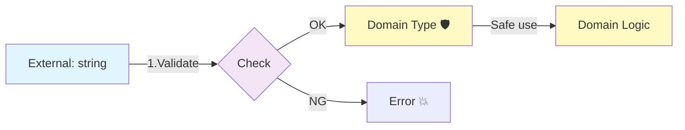

# 第10章：型で境界を守る（ドメイン型の作り方）🧠🛡️

### 0. この章でできるようになること🎯💖

* `string` や `number` の **乱用事故**（ID取り違え・金額取り違え・日付の地獄）を **型で止める**💥🧯
* 「入力（外側）」→「検証」→「ドメイン型（内側）」の **変換パイプライン**を作れる🔄✨
* TypeScriptの **構造的型付け**のクセを理解して、必要なところにだけ“名前っぽさ”を足せる🐣➡️🦉 ([typescriptlang.org][1])
* `satisfies` を使って「境界の設定オブジェクト」を安全に保てる✅🧩 ([typescriptlang.org][2])

---

## 1. まず「string乱用」って何がヤバいの？😇💥


### ありがちな事故（全部コンパイル通っちゃうやつ）🫠

* `userId: string` と `eventId: string` を取り違える
* `price: number`（円）と `point: number`（ポイント）を混ぜる
* `date: string` に `"2026/13/40"` みたいなのが混ざる
* APIから来たデータ（DTO）をそのままドメインで使って、あとで泣く😭

TypeScriptは **構造（shape）が同じならOK**って判定しがちだから、意味が違っても `string` は `string` なんだよね…🌀 ([typescriptlang.org][1])

---

## 2. ドメイン型ってなに？🛡️（境界の“通行証”🎫✨）


**ドメイン型 = 「内側（Domain）で使っていいと保証された形」**だよ✨
外側（UI入力・API・DB）から来たデータは、だいたい信用できない😇
だから境界でこうする👇

1. 外側の値（たいてい `string`）を受け取る📥
2. ルールで検証する🔍
3. OKなら「ドメイン型」に変換して内側へ渡す🚪➡️🛡️

**検証（境界の関心）** と **業務ルール（ドメインの関心）** を混ぜにくくなるよ🧼✨



---

## 3. 作り方その①：Branded Types（疑似“名前的型”）🏷️✨


TypeScriptは基本 **構造的型付け**だけど、
「同じ `string` でも意味が違う」問題には **ブランド（タグ）**を付けて区別するのが定番👍
（TypeScript公式のPlaygroundでも “Nominal Typing” 例があるよ） ([typescriptlang.org][3])

### 3-1. 最小セットの Brand ヘルパー🧰

```ts
// domain/brand.ts
declare const brandSymbol: unique symbol;

export type Brand<T, TBrand extends string> = T & { readonly [brandSymbol]: TBrand };
```

### 3-2. IDを「取り違え不可能」にする🆔🛡️

```ts
// domain/ids.ts
import { Brand } from "./brand";

export type UserId  = Brand<string, "UserId">;
export type EventId = Brand<string, "EventId">;

// “作れるのはここだけ” にするのがコツ✨
export function parseUserId(input: string): UserId | null {
  const s = input.trim();
  if (!/^u_[a-z0-9]{8}$/i.test(s)) return null;
  return s as UserId;
}

export function parseEventId(input: string): EventId | null {
  const s = input.trim();
  if (!/^e_[a-z0-9]{8}$/i.test(s)) return null;
  return s as EventId;
}
```

### 3-3. 事故が“型で”止まる💥✋

```ts
import { UserId, EventId } from "./domain/ids";

function joinEvent(userId: UserId, eventId: EventId) {
  // ...
}

const uid = "u_12ab34cd";   // 外側
const eid = "e_98fe76dc";   // 外側

// joinEvent(uid, eid); // ❌ まだ外側のstringなので渡せない

// まず境界で変換✨
```

---

## 4. 作り方その②：Value Object（小さなクラスで“ルールごと”包む）📦💖


ブランド型は軽い！最高！✨
でも「値に振る舞い（計算・表示・比較）が欲しい」ときは Value Object が便利🍰

### 例：金額（円）を “ただの number” から卒業💸🎓

```ts
// domain/money.ts
export class Yen {
  private constructor(private readonly value: number) {}

  static parse(input: number): Yen | null {
    if (!Number.isInteger(input)) return null;
    if (input < 0) return null;
    return new Yen(input);
  }

  toNumber(): number {
    return this.value;
  }

  add(other: Yen): Yen {
    return new Yen(this.value + other.value);
  }
}
```

✅ これで「負の金額」や「小数の円」が内側に入るのを止められる👏✨

---

## 5. 作り方その③：Union（状態を “ありえる形” だけに絞る）🧩✨


「状態」は Union がすごく強い💪
たとえば申込み結果：

```ts
export type ApplyResult =
  | { type: "accepted" }
  | { type: "rejected"; reason: "sold_out" | "age_limit" | "invalid_email" };
```

こうすると `reason` を出し忘れたり、変な文字列を入れたりしにくい🙆‍♀️✨

---

## 6. 作り方その④：Template Literal Types（フォーマットを型で縛る）🧵🪡

「文字列の形」をある程度しばれるのがテンプレートリテラル型✨ ([typescriptlang.org][4])

```ts
// 例：ISOっぽい形（※これだけで日付の妥当性100%は保証できないよ！）
export type IsoDateString = `${number}-${number}-${number}`;
```

⚠️ 大事：**型だけで完全な妥当性チェックは無理**なことが多い！
だから「型 + 解析（runtime検証）」のセットがいちばん安定🧸✨

---

## 7. “境界で変換” の基本形（Result型でやさしく失敗を扱う）🌸

### 7-1. Result型（超よく使う！）📦


```ts
export type Result<T, E> =
  | { ok: true; value: T }
  | { ok: false; error: E };

export const ok = <T>(value: T): Result<T, never> => ({ ok: true, value });
export const err = <E>(error: E): Result<never, E> => ({ ok: false, error });
```

### 7-2. 入力 → 検証 → ドメイン型 変換の例✍️➡️🛡️

```ts
import { Brand } from "./brand";
import { Result, ok, err } from "./result";

export type Email = Brand<string, "Email">;

export function parseEmail(input: string): Result<Email, "invalid_email"> {
  const s = input.trim();
  // 超ゆるい例（本番は要件に合わせてね）
  if (!s.includes("@")) return err("invalid_email");
  return ok(s as Email);
}
```

---

## 8. `satisfies` で “境界の設定” を壊れにくくする🧷✨


`satisfies` は **「この形を満たしてる？」をチェックしつつ、推論結果は潰さない**のが強み💖 ([typescriptlang.org][2])

たとえば、エラー表示の辞書を作るとき👇

```ts
type ErrorCode = "invalid_email" | "sold_out";

const messages = {
  invalid_email: "メールの形が変かも…🥺",
  sold_out: "ごめんね、満席だった…💦",
  // typo: "soldout": "..." みたいなミスを防げる！
} satisfies Record<ErrorCode, string>;
```

---

## 9. ミニ演習：イベント申込み（入力→検証→ドメインへ）🎓📮✨

### お題📝

フォームから来る入力はこう👇（外側）

* `studentId: string`
* `email: string`
* `ticketCount: string`（数値っぽいけど文字列）

これを境界で変換して、ドメイン関数に渡してね💪🌸

### 9-1. ドメイン型（例）🧠

* `StudentId`（Brand）
* `Email`（Brand）
* `TicketCount`（Value Object or Brand）

### 9-2. ドメイン関数は「生のstring禁止」🚫🧻

```ts
type StudentId = import("./ids").UserId; // 例：実際は StudentId を別に作ってね
type Email = import("./email").Email;

export function canApply(args: { studentId: StudentId; email: Email; count: number }): boolean {
  // 例：2枚まで
  return args.count >= 1 && args.count <= 2;
}
```

### 9-3. 境界（Application/UI側）で変換してから呼ぶ🔄

* `parseStudentId`
* `parseEmail`
* `parseTicketCount`

ここを作れたら勝ち🏆✨

---

## 10. テスト（境界の変換はテストしやすい！）🧪🌸

変換系は **純粋処理に寄せやすい**から、テストのコスパが最強💪✨
例：Nodeの `node:test` でサクッと

```ts
// test/email.test.ts
import test from "node:test";
import assert from "node:assert/strict";
import { parseEmail } from "../src/domain/email";

test("parseEmail: OK", () => {
  const r = parseEmail("a@b.com");
  assert.equal(r.ok, true);
});

test("parseEmail: NG", () => {
  const r = parseEmail("not-an-email");
  assert.equal(r.ok, false);
});
```

---

## 11. AI活用ミニコーナー🤖🎁（めっちゃ相性いい！）

### 使えるプロンプト例✨

* 「`string` 乱用になってる場所を洗い出して、**ドメイン型候補を10個**出して」🔍
* 「`UserId` / `EventId` の **brand型 + parse関数** を作って。バリデーションは正規表現で」🧩
* 「この `parseTicketCount` の **境界値テストケース**を列挙して」🧪
* 「DTO→Domain変換の責務が混ざってないかレビューして、改善案を3つ」🧼

---

## 12. よくある落とし穴（ここだけ避けて！）🚧😵‍💫


* **ドメイン型を作ったのに、結局 `as` でねじ込む**（最悪の抜け道🥲）
  → `as` は “境界の中だけ” に閉じ込めよう🔒
* **型だけあって runtime検証がない**
  → 外側は信用しない！入力は必ずチェック🔍
* **作りすぎてしんどい**
  → まずは事故が多いところ（ID・金額・日付・メール）からでOK🍰

---

## 13. 理解チェッククイズ🎀（答えは下にあるよ👇）

1. `string` をドメインでそのまま使うと何が起きやすい？😇
2. ドメイン型への変換はどこに置くのが気持ちいい？🚪
3. `satisfies` の嬉しいポイントは？✨
4. Template Literal Types だけで日付の妥当性は保証できる？📅

### こたえ✅

1. 取り違え事故（ID/金額/日付）や、DTOの都合がドメインに侵入しやすい💥
2. 境界（UI/API/DBに近い層）で「検証→変換」してから内側へ🛡️
3. 形のチェックをしつつ、推論された型を潰しにくいところ✨ ([typescriptlang.org][2])
4. できないことが多い！型 + runtime検証がセット🧸✨ ([typescriptlang.org][4])

---

## 14. ちょい最新トピック（おまけ）📰✨

最近のTypeScriptは、開発体験やモジュール周りの改善も進んでるよ（例：TypeScript 5.9 のリリース）📈 ([Microsoft for Developers][5])
※この章の主役は「ドメイン型」だけど、TypeScript自体も進化中〜！🚀

---

### この章のまとめ🎉💖

* **外側は `string` / `number` でもOK、内側は “ドメイン型だけ”** が最強ルール🛡️
* Brand / Value Object / Union / Template Literal Types を使い分ける🍱✨
* 境界で「検証→変換」を固定すると、SoCが保ちやすくなる🧼✅

次章（第11章）では、DTOとDomainを混ぜない「変換の設計」に突入するよ〜！📦🔁

[1]: https://www.typescriptlang.org/docs/handbook/type-compatibility.html?utm_source=chatgpt.com "Documentation - Type Compatibility"
[2]: https://www.typescriptlang.org/docs/handbook/release-notes/typescript-4-9.html?utm_source=chatgpt.com "Documentation - TypeScript 4.9"
[3]: https://www.typescriptlang.org/play/typescript/language-extensions/nominal-typing.ts.html?utm_source=chatgpt.com "Playground Example - Nominal Typing"
[4]: https://www.typescriptlang.org/docs/handbook/2/template-literal-types.html?utm_source=chatgpt.com "Documentation - Template Literal Types"
[5]: https://devblogs.microsoft.com/typescript/announcing-typescript-5-9/?utm_source=chatgpt.com "Announcing TypeScript 5.9"
