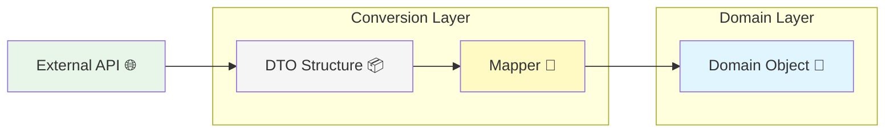

# 第11章：DTOとドメインを混ぜない（変換の設計）📦🔁

この章はひとことで言うと…
**「APIでもらった形（DTO）を、そのままアプリの中核（ドメイン）に入れないでね！」**って話だよ〜☺️💖

---

### 1. 今日のゴール🎯✨

最後までやると、こんな力がつくよ〜！💪🌸

* DTO（通信の都合のデータ）と、Domain（業務の都合のデータ）を区別できる🧠✨
* **変換（mapping）を“境界”に置く**理由が腹落ちする🚪🔁
* 欠損・命名違い・単位違いを「変換レイヤーで吸収」できる🧽✨
* 外部データを **unknown → 検証 → 変換 → ドメイン** の流れで安全に扱える🛡️🌈

---

### 2. まず結論：DTOとドメインは“別物でOK”🙆‍♀️💖

* **DTO**：外から来たデータの「箱」📦（通信・保存の都合が最優先）
* **Domain**：アプリが守りたい「意味」🧠✨（業務ルール・型・安全が最優先）

DTOの定義として、Martin Fowlerは「プロセス間でデータを運ぶためのオブジェクト」って説明してるよ📦🚚（ざっくり：遠くとやり取りするための入れ物！） ([martinfowler.com][1])
さらに「ローカルな文脈ではDTOは不要どころか害になりうる」って趣旨も書いてる（＝混ぜるとツラくなる方向に行きがち）😇💥 ([martinfowler.com][2])

---

### 3. “混ぜると事故る”あるある😵‍💫💥

#### あるある①：APIの都合がドメインに侵入する🌀

* APIの `snake_case` がドメインにも広がる🐍
* `null` が混ざって、あちこちで `?.` 地獄になる😇
* 数値が文字列で来て、計算がどこかで壊れる💥

#### あるある②：仕様変更が直撃する⚡

APIがちょっと変わっただけで
**ドメイン層やアプリ層のあちこちが同時に壊れる** → 修正が怖い😱

#### あるある③：テストがつらい🧪💦

「この関数、DTO前提？ドメイン前提？どっち…？」ってなる😵‍💫

---

### 4. 正しい置き場所：変換（mapping）は“境界”🚪🔁✨


ここが超重要だよ〜！📌💖

* **外側**（通信・永続化・UI） → 形がコロコロ変わりがち🌪️
* **内側**（ドメイン） → 変えたくない。守りたい🛡️

だから、**境界で一回 “整形” してから中に入れる**のが最強✨

イメージ👇😊

* 🌐 外部（API/DB）
  → 📦 DTO
  → 🚪 Mapper（変換）
  → 🧠 Domain（安定）



---

### 5. 実践の型：unknown → 検証 → 変換 → Domain 🛡️🔁

外部から来るデータって、TypeScript的にはほんとは **信用できない**んだよね🥺
だから流れを固定しちゃうのがオススメ✨

1. APIレスポンスを **unknown** として受ける🫧
2. **スキーマで検証**（形・型・必須チェック）✅
3. **DTO → Domain に変換**（命名・単位・欠損吸収）🧽
4. Domainだけをアプリ中核で使う🧠🛡️

スキーマ検証ライブラリは、たとえば **Zod**（TS-first validation）や **Valibot**（モジュラーで型安全なスキーマ）みたいなのがよく使われるよ〜✨ ([Zod][3])
Zodは「Zod 4 stable」みたいに継続的に進化してるのもポイントだよ📈 ([Zod][4])

（ちなみに TypeScript の最新は現在 5.9 と案内されてるよ🧡） ([typescriptlang.org][5])

---

## 6. ミニケース：カフェ注文☕🍰（DTO → Domain 変換してみよう！）

### 6-1. 例：APIが返すDTO（通信の都合）📦🌐

APIはこんなJSONを返してくるとするね👇

```ts
// APIレスポンス例（DTO）
{
  "order_id": "ord_1001",
  "total_price": "1200",        // 文字列で来る😇
  "created_at": "2026-01-10T12:34:56Z",
  "items": [
    { "product_id": "cake_01", "qty": 2, "unit_price": 400 },
    { "product_id": "coffee_02", "qty": 1, "unit_price": 400 }
  ],
  "status": "PAID"
}
```

DTOはこういう「向こう都合の形」でOK🙆‍♀️（むしろそうなる！）

---

### 6-2. こっちが欲しいDomain（業務の都合）🧠🛡️

ドメイン側では、こういう形で使いたいよね✨
（命名はcamelCase、値は信用できる型、意味が伝わる！）

```ts
// Domain（アプリ中核で使いたい形）
type OrderId = string & { readonly __brand: "OrderId" };
type Yen = number & { readonly __brand: "Yen" };

type OrderStatus = "paid" | "unpaid" | "cancelled";

type OrderItem = Readonly<{
  productId: string;
  qty: number;
  unitPrice: Yen;
}>;

type Order = Readonly<{
  id: OrderId;
  totalPrice: Yen;
  createdAt: Date;
  items: readonly OrderItem[];
  status: OrderStatus;
}>;
```

---

### 6-3. Zodで「DTOの形」を検証する✅✨

ここでの主役は **DTOスキーマ**！📦✅
“外から来たもの”を一回ここで確定させるよ〜🛡️

```ts
import { z } from "zod";

const OrderDtoSchema = z.object({
  order_id: z.string(),
  total_price: z.coerce.number(), // "1200" → 1200 にしてくれる✨
  created_at: z.string().datetime(),
  items: z.array(
    z.object({
      product_id: z.string(),
      qty: z.number().int().positive(),
      unit_price: z.number().int().nonnegative(),
    })
  ),
  status: z.enum(["PAID", "UNPAID", "CANCELLED"]),
});

type OrderDto = z.infer<typeof OrderDtoSchema>;
```

---

### 6-4. DTO → Domain の変換（Mapper）🚪🔁✨

命名違い、型違い、単位違い…ぜんぶここで吸収しよう🧽💖

```ts
function asOrderId(value: string): OrderId {
  // 本当はフォーマットチェックしてもOK✨
  return value as OrderId;
}

function asYen(value: number): Yen {
  // 例：負数禁止など、ドメイン条件をここで守る🛡️
  if (!Number.isFinite(value) || value < 0) {
    throw new Error("Invalid Yen value");
  }
  return value as Yen;
}

function mapStatus(dto: OrderDto["status"]): OrderStatus {
  switch (dto) {
    case "PAID":
      return "paid";
    case "UNPAID":
      return "unpaid";
    case "CANCELLED":
      return "cancelled";
  }
}

export function mapOrderDtoToDomain(dto: OrderDto): Order {
  return {
    id: asOrderId(dto.order_id),
    totalPrice: asYen(dto.total_price),
    createdAt: new Date(dto.created_at),
    status: mapStatus(dto.status),
    items: dto.items.map((it) => ({
      productId: it.product_id,
      qty: it.qty,
      unitPrice: asYen(it.unit_price),
    })),
  };
}
```

**これで完成！**🎉
以降、アプリの中核では **OrderDto を触らない**ようにできるよ〜🧡

---

### 6-5. まとめて使う（Fetch → Parse → Map）🌐✅🔁

```ts
export async function fetchOrder(orderId: string): Promise<Order> {
  const res = await fetch(`/api/orders/${orderId}`);
  const json: unknown = await res.json();

  const dto = OrderDtoSchema.parse(json);     // ✅ 形を確定
  return mapOrderDtoToDomain(dto);            // ✅ 意味の形に変換
}
```

---

## 7. 変換で吸収する“よくある差”リスト🧽✨

Mapperに置くと気持ちよく吸収できる差👇😍

* 命名違い：`order_id` ↔ `id` 🐍➡️🐫
* 型違い：`"1200"` ↔ `1200` 🔁
* 欠損：`items` が空 / `null` が来る 😇
* 単位違い：`price_cents` ↔ `yen` 💱
* enum違い：`PAID` ↔ `"paid"` 🔤
* 日付：ISO文字列 ↔ `Date` 🕒

---

## 8. “境界で止める”チェックリスト✅🚪

実装レビューでこのへん見れると強いよ〜💪✨

* DTOの型が **Domain/Application** に流れてない？（importされてない？）🧼
* fetch直後のデータを `any` で握りつぶしてない？🙅‍♀️
* unknown → スキーマ → Domain になってる？🛡️
* mapperは「変換だけ」になってる？（業務ロジックを増やしすぎてない？）🍰
* 例外時の扱いが決まってる？（throw / Result / エラー表示）🚨

---

## 9. テストの最短セット🧪🌸（Mapperは超テストしやすい！）

Mapperは純粋関数っぽくできるからテスト向き💖

```ts
import { describe, it, expect } from "vitest";
import { mapOrderDtoToDomain } from "./orderMapper";

describe("mapOrderDtoToDomain", () => {
  it("DTOをDomainに変換できる", () => {
    const dto = {
      order_id: "ord_1001",
      total_price: 1200,
      created_at: "2026-01-10T12:34:56Z",
      status: "PAID",
      items: [{ product_id: "cake_01", qty: 2, unit_price: 400 }],
    } as const;

    const order = mapOrderDtoToDomain(dto);

    expect(order.id).toBe("ord_1001");
    expect(order.totalPrice).toBe(1200);
    expect(order.status).toBe("paid");
    expect(order.items[0]?.productId).toBe("cake_01");
  });
});
```

---

## 10. AI活用コツ🤖🎁（DTO→Domain変換はAIが得意！）

AIに投げるときは、**材料をちゃんと渡す**のが勝ち✨

### そのまま使える指示例（コピペOK）📝💖

* 「このJSON例がAPI DTOです。Zodスキーマと、Domain型（brand付き）と、DTO→Domain mapperを作って。欠損・型違い（文字列数値）も考慮して。vitestでテストも3本書いて（正常/欠損/異常値）。」

### 注意ポイント⚠️😇

* AIは平気で `as any` を混ぜることがある → **禁止**って先に言う🙅‍♀️
* “どこまで変換するか”を指定しないと、変換が散る🌀
  → 「境界（fetch直後）でだけ変換」って明記すると良いよ🚪✨

---

## 11. ミニ演習🎀✍️（15〜30分）

### 演習A：命名違いを吸収しよう🐍➡️🐫

* `user_name` を `userName` にする
* `created_at` を `Date` にする

### 演習B：単位違いを吸収しよう💱

* API：`price_cents: 399`
* Domain：`yen: 399`（or 3.99ドル→円…みたいに変換ルールを決めてもOK）

### 演習C：欠損に強くしよう🧽

* `items` が無いときは `[]` 扱いにする
* `status` が未知の値ならエラーにする（or `"unpaid"` に寄せる）

---

## 12. この章のまとめ🎉💖

* DTOとDomainは**別でOK**。むしろ分けたほうが強い📦🧠
* 変換（mapping）は **境界（外→内の入口）** に置く🚪🔁
* unknown → 検証 → 変換 → Domain の流れを固定すると事故が減る🛡️✨
* Mapperはテストしやすいから、安心して育てられる🧪🌸

---

次の章（第12章）では、ここで作った「境界」をさらに強くするために、**依存の向き（DIPの入口）**をSoCとして体験していくよ〜🧲🌟

[1]: https://martinfowler.com/eaaCatalog/dataTransferObject.html?utm_source=chatgpt.com "Data Transfer Object"
[2]: https://martinfowler.com/bliki/LocalDTO.html?utm_source=chatgpt.com "Local D T O"
[3]: https://zod.dev/?utm_source=chatgpt.com "Zod: Intro"
[4]: https://zod.dev/v4?utm_source=chatgpt.com "Release notes"
[5]: https://www.typescriptlang.org/download/?utm_source=chatgpt.com "How to set up TypeScript"
