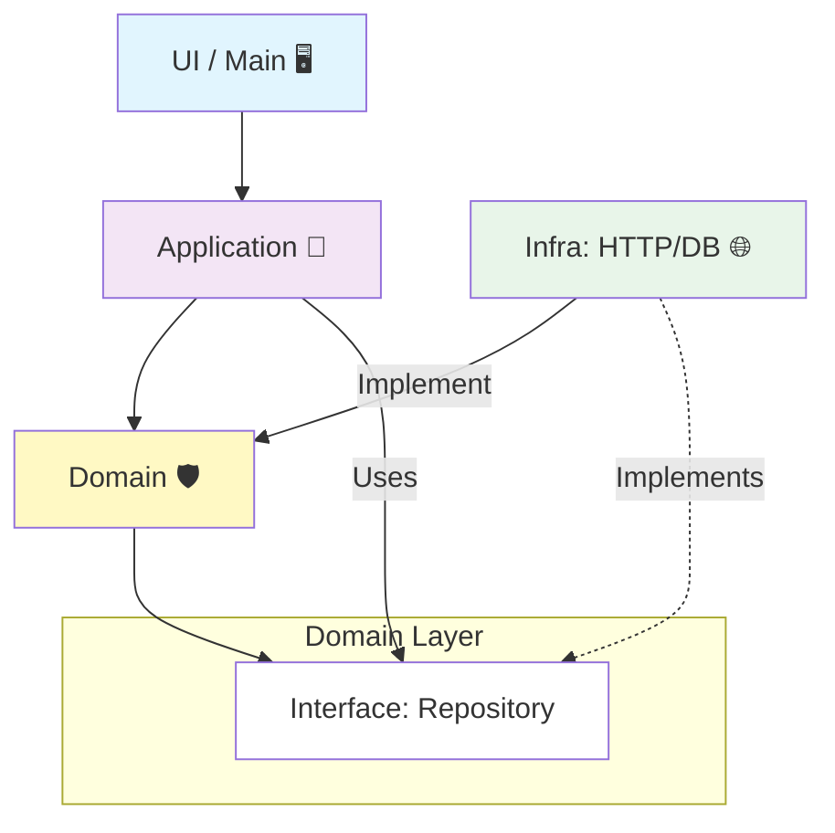

# 第12章：依存の向き（DIPの入口）をSoCで体験🧲🌟

この章はね、「**関心を分ける（SoC）**」を一段レベルアップして、**“依存の矢印の向き”**までコントロールできるようになる回だよ〜！🎀✨
ここができると、**業務ルール（内側）が、ライブラリ都合（外側）に振り回されなくなる**の🥹🛡️

---

## 1) 今日のゴール🎯✨

できるようになったら勝ち👇💖

* ✅ **業務ルール（ドメイン）**が、`fetch` や `localStorage` や UI の事情を知らない状態にできる🧼
* ✅ 「外側（DB/API/ブラウザ）」を差し替えても、**内側（ルール）がほぼ無傷**でいられる🔁✨
* ✅ テストやリファクタが一気にラクになる🧪🌸

---

## 2) 「依存」ってなに？どの向きがヤバいの？🧠💥

たとえばドメインの中でこんなのを書いちゃうと…👇

```ts
// ❌ domain が fetch に依存しちゃってる例（やりがち）
export async function registerUser(userName: string) {
  const res = await fetch("/api/register", {
    method: "POST",
    body: JSON.stringify({ userName }),
  });

  if (!res.ok) throw new Error("登録失敗😭");
}
```

これ、パッと見は動くけど…😇
**ドメイン（内側）が通信（外側）に引っ張られてる**のが問題！

* APIのURL変わった🌪️ → ドメイン修正
* fetchをaxiosに変えたい🔁 → ドメイン修正
* ブラウザじゃなくNodeで動かしたい🧊 → ドメイン修正

つまり、**変更の波🌊がドメインに直撃**するの…🥺💥

---

## 3) DIPの超やさしい言い方🧲💖

DIP（依存性逆転の原則）は、難しい言葉に見えるけど、超ざっくり言うと👇

> **内側（業務ルール）は外側（技術詳細）に依存しない**
> 代わりに、**内側が“こういう機能が欲しい”という口（インターフェース）を用意して**、
> 外側がそれを実装する

この「口」が **Port（ポート）** だよ〜🔌✨
そして外側の実装が **Adapter（アダプタ）** 🎛️✨
（この考え方は Ports & Adapters / Hexagonal Architecture として有名だよ📦🧠 ([alistair.cockburn.us][1])）

---

## 4) ミニ図でつかむ：矢印を“内側に向ける”🧭✨


イメージはこれ👇

* ✅ **ドメイン**：ルール（いちばん守りたい💎）
* ✅ **アプリ層**：手順（ユースケースの流れ🧭）
* ✅ **外側**：通信・保存・UI（交換可能な部品🔁）

ポイントは「**依存の矢印**」🧲
**外側 → 内側**に寄せると強い💪✨



---

## 5) ハンズオン：学園イベント申込で“依存の向き”を体験🎓💌

### お題📌

「イベントに申し込む」

* 入力チェック（名前必須、文字数など）📝
* 申込データを保存（最初はメモリ、あとでAPIに差し替え）🔁

---

### Step 1：ドメインは“純粋なルール”だけ🧼✨

```ts
// src/domain/registration.ts
export type Registration = Readonly<{
  id: string;
  eventId: string;
  userName: string;
  createdAtISO: string;
}>;

export function validateUserName(userName: string): string[] {
  const errors: string[] = [];
  const trimmed = userName.trim();

  if (trimmed.length === 0) errors.push("名前は必須だよ🥺");
  if (trimmed.length > 20) errors.push("名前は20文字までだよ✂️");

  return errors;
}
```

ここには `fetch` も `localStorage` も出てこないのが正解🙆‍♀️💖
**ドメインは世界一ピュア**でいてOK🧼✨

---

### Step 2：ドメイン側に「欲しい機能の口（Port）」を置く🔌✨

```ts
// src/domain/ports.ts
import type { Registration } from "./registration";

export interface RegistrationRepository {
  save(reg: Registration): Promise<void>;
}
```

ここ大事！
**interface（口）は内側（ドメイン）に置く**のがコツ🧠🛡️
こうすると、外側が勝手に実装を差し替えできる🔁✨

---

### Step 3：アプリ層（手順）に“流れ”を書く🧭✨

```ts
// src/application/registerForEvent.ts
import { validateUserName, type Registration } from "../domain/registration";
import type { RegistrationRepository } from "../domain/ports";

export async function registerForEvent(
  repo: RegistrationRepository,
  input: { eventId: string; userName: string },
  deps: { now: () => Date; newId: () => string },
): Promise<{ ok: true } | { ok: false; errors: string[] }> {
  const errors = validateUserName(input.userName);
  if (errors.length) return { ok: false, errors };

  const reg: Registration = {
    id: deps.newId(),
    eventId: input.eventId,
    userName: input.userName.trim(),
    createdAtISO: deps.now().toISOString(),
  };

  await repo.save(reg);
  return { ok: true };
}
```

見て〜🥹💖
ここにも `fetch` がいない！
**repoは“口”で受け取るだけ**。これがDIPの入口🧲✨

---

## 6) Step 4：外側でAdapterを実装する（メモリ版）🧠📦

```ts
// src/infra/memoryRegistrationRepo.ts
import type { RegistrationRepository } from "../domain/ports";
import type { Registration } from "../domain/registration";

export function createMemoryRegistrationRepo(): RegistrationRepository {
  const data: Registration[] = [];

  return {
    async save(reg) {
      data.push(reg);
      console.log("保存したよ💾✨", reg);
    },
  };
}
```

これが **Adapter** 🎛️✨
でも依存の向きは **infra → domain** だよ（内側を参照してる）🧲💖

---

## 7) Step 5：外側でAdapterを実装する（HTTP版）🌐📨

```ts
// src/infra/httpRegistrationRepo.ts
import type { RegistrationRepository } from "../domain/ports";
import type { Registration } from "../domain/registration";

export function createHttpRegistrationRepo(baseUrl: string): RegistrationRepository {
  return {
    async save(reg: Registration) {
      const res = await fetch(`${baseUrl}/registrations`, {
        method: "POST",
        headers: { "content-type": "application/json" },
        body: JSON.stringify(reg),
      });

      if (!res.ok) throw new Error("通信に失敗したよ😭");
    },
  };
}
```

ドメインは無傷！🛡️✨
**差し替えは外側だけで完了**できるのが最高ポイント🔁💖

---

## 8) 最後に“組み立てる場所”（Composition）で配線する🔌🧩

```ts
// src/ui/main.ts
import { registerForEvent } from "../application/registerForEvent";
import { createMemoryRegistrationRepo } from "../infra/memoryRegistrationRepo";
// import { createHttpRegistrationRepo } from "../infra/httpRegistrationRepo";

const repo = createMemoryRegistrationRepo();
// const repo = createHttpRegistrationRepo("https://example.com/api");

const result = await registerForEvent(
  repo,
  { eventId: "E-2026-OPEN", userName: "ボビー" },
  {
    now: () => new Date(),
    newId: () => crypto.randomUUID(),
  },
);

console.log(result.ok ? "申込完了🎉" : result.errors.join("\n"));
```

ここ（UIやmain）は**いちばん外側**だから、
`memory` → `http` に切り替えてもOK🙆‍♀️✨

---

## 9) “SoC×DIP”が効いてるチェックリスト✅💖

### 内側（ドメイン/アプリ層）に入ってたらアウトな単語😇💥

* `fetch` / `axios`
* `localStorage`
* `document` / `window`
* DBクライアント名（Prismaとか）🗄️
* フレームワーク固有のimport（Reactのhooksとか）⚛️

### 逆に、内側に置いてOKなもの🙆‍♀️✨

* `interface`（Port）🔌
* ルール・検証・計算🧮
* ユースケースの流れ🧭

---

## 10) AIに手伝ってもらう魔法の頼み方🪄🤖✨

Copilot/Codexに投げるなら、こういう指示が強いよ👇💖

* 「このコードの依存を逆転して、**ドメインからfetchを消して**。port interface を domain に置いて、adapter を infra に作って」🔌🧲
* 「Ports & Adapters の形で、**差し替え可能なRepository**にして。最初は in-memory、次に HTTP 実装も」🔁🌐
* 「“内側が外側を知らない”状態になってるか、チェックリストも出して」✅👀

---

## 11) ちょい最新ネタ：副作用（side effects）を遅らせる仕組みも増えてるよ⏳✨

TypeScript 5.9 では `import defer` っていう **“モジュールの実行（副作用）を、使う瞬間まで遅らせる”**書き方が入ってるよ🧠⚡
「副作用をコントロールする」って意味で、SoCの感覚と相性いい👍✨
ただし、TypeScriptが変換してくれるわけじゃなく、対応ランタイムやツールが必要だよ〜（`--module` など制約あり）📌 ([typescriptlang.org][2])

---

## 12) この章のまとめ🎀✨

* SoCは「分ける」🧺
* DIPは「矢印の向きを内側にする」🧲
* 口（Port）を内側に置いて、外側（Adapter）で実装すると…

  * ✅ 差し替えが簡単🔁
  * ✅ ルールが守れる🛡️
  * ✅ テストしやすい🧪

そして次の第13章で、ここでやった「渡すだけ」配線を **DIとして整理**していくよ〜💉😊

---

必要なら、この章のハンズオンを「小さい課題セット（3問くらい）🎯」にして、**提出→レビュー用の採点基準✅**まで作って渡せるよ〜！😆💖

[1]: https://alistair.cockburn.us/hexagonal-architecture "hexagonal-architecture"
[2]: https://www.typescriptlang.org/docs/handbook/release-notes/typescript-5-9.html "TypeScript: Documentation - TypeScript 5.9"
