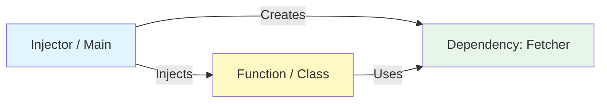

# 第13章：DIの基本（まずは「渡すだけDI」でOK）💉😊

## この章でできるようになること🎯✨

* 「DIって何？」を**超かんたんに説明**できるようになる😊
* `new` や `fetch()` みたいな“外部とのつながり”を、**外から渡して差し替え**できるようになる🔁
* **関数引数DI** と **コンストラクタDI** を、最小の型と最小のルールで使えるようになる🧠✨
* テストや将来の変更（API差し替え・ログ差し替え）が**怖くなくなる**🧪🌸

---

## 13.1 DIってなに？30秒でつかむ💡💉


DI（Dependency Injection）は、すっごく雑に言うと…

> **「必要な道具（依存）を、中で勝手に作らずに、外から受け取る」** だけ！🧰➡️🤲

たとえば、料理でいうと…🍳

* ❌ 料理するたびに、キッチンの中で“包丁”を作り始める（やばい）😇
* ✅ 包丁は外から借りてきて、料理だけに集中する（DI）🔪✨

コードでも同じで、関数やクラスがやるべきは「手順・ルール」なのに、
中で勝手に `fetch` や `logger` を作り始めると、ごちゃつきやすいんだよね😵‍💫



---

## 13.2 SoC / DIP と DIの関係🧩🛡️

前章（DIP）でやったのは、ざっくり言うと

* **内側（ルール）を守る**
* **外側（通信・DB・ライブラリ）の都合で、内側が振り回されない**

ってやつ🛡️✨

で、DIはそれを“実際のコード”に落とし込むための超カンタンな技法！💉😊

* 「依存の向き」は設計の話（DIP）
* 「じゃあ実装どうする？」を助けるのがDI（渡すだけでOK）✅

---

## 13.3 まずは関数引数DI（いちばんラク）🧁✨

### ❌ DIなし：関数の中で勝手に依存を使う（固定される）😇

```ts
// studentService.ts
export async function loadStudentName(studentId: string): Promise<string> {
  const res = await fetch(`https://api.example.com/students/${studentId}`);
  const data = await res.json();

  console.log("loaded:", data.name);
  return data.name;
}
```

この子の問題はここ👇

* `fetch` が固定（通信を差し替えできない）🌐
* `console.log` が固定（ログ方針を差し替えできない）🪵
* テストで「通信しないで試す」がやりにくい🧪💦

---

### ✅ DIあり：必要な道具を引数でもらう（差し替え自由）🔁✨

ポイントはこれだけ👇

* `fetcher`（通信する人）を引数でもらう
* `logger`（ログ出す人）を引数でもらう

```ts
// types.ts
export type Fetcher = (url: string) => Promise<{
  ok: boolean;
  status: number;
  json: () => Promise<unknown>;
}>;

export type Logger = (message: string, extra?: unknown) => void;
```

```ts
// studentService.ts
import type { Fetcher, Logger } from "./types";

type StudentDto = { name: string };

function assertStudentDto(x: unknown): asserts x is StudentDto {
  if (typeof x !== "object" || x === null) throw new Error("Invalid DTO");
  if (!("name" in x) || typeof (x as any).name !== "string") throw new Error("Invalid DTO");
}

export async function loadStudentName(
  studentId: string,
  deps: { fetcher: Fetcher; logger: Logger },
): Promise<string> {
  const res = await deps.fetcher(`https://api.example.com/students/${studentId}`);
  if (!res.ok) throw new Error(`HTTP ${res.status}`);

  const raw = await res.json();
  assertStudentDto(raw);

  deps.logger("loaded", { studentId, name: raw.name });
  return raw.name;
}
```

🎉 これで何が嬉しいの？

* 本番：本物の `fetch` を渡せる🌐
* テスト：ニセの `fetch` を渡せる🧪
* ログ：`console.log` でも、専用ロガーでも差し替えOK🔁

---

## 13.4 “差し替え”の実感：ニセモノを渡して動かす🧪🌸


### ✅ ニセの fetcher（通信しない）を作る🐣

```ts
import type { Fetcher, Logger } from "./types";
import { loadStudentName } from "./studentService";

const fakeFetcher: Fetcher = async (url) => {
  return {
    ok: true,
    status: 200,
    json: async () => ({ name: "ミカ" }),
  };
};

const silentLogger: Logger = () => {};

const name = await loadStudentName("S-001", { fetcher: fakeFetcher, logger: silentLogger });
console.log(name); // "ミカ"
```

ここ、めっちゃ大事✨

* `loadStudentName` は **通信のやり方を知らない**
* ただ「fetcherお願いね」って頼んでるだけ🥺
* だから差し替えが超ラクになる🔁💕

---

## 13.5 コンストラクタDI（クラス版）🏫💉

関数DIで十分なことも多いけど、
「複数のメソッドで同じ依存を使う」ならクラスDIも便利だよ😊

```ts
import type { Fetcher, Logger } from "./types";

export class StudentClient {
  constructor(
    private readonly fetcher: Fetcher,
    private readonly logger: Logger,
  ) {}

  async loadName(studentId: string): Promise<string> {
    const res = await this.fetcher(`https://api.example.com/students/${studentId}`);
    if (!res.ok) throw new Error(`HTTP ${res.status}`);

    const data = (await res.json()) as { name: string };
    this.logger("loaded", { studentId, name: data.name });
    return data.name;
  }
}
```

使う側はこう👇

```ts
import { StudentClient } from "./StudentClient";
import type { Fetcher, Logger } from "./types";

const fetcher: Fetcher = async (url) => {
  const res = await fetch(url);
  return {
    ok: res.ok,
    status: res.status,
    json: () => res.json(),
  };
};

const logger: Logger = (m, e) => console.log(m, e);

const client = new StudentClient(fetcher, logger);
console.log(await client.loadName("S-001"));
```

---

## 13.6 「newしない」の本当の意味🧠✨（誤解しやすい！）

「DI＝newしない」って言われがちだけど、正確にはこうだよ👇

* ❌ **“絶対にnew禁止”** ではない😇
* ✅ **“重要な依存（差し替えたいもの）を、中で固定しない”** が本質💡

### 差し替えたい依存の例📌

* 通信（fetch / axios / APIクライアント）🌐
* 永続化（DB / localStorage / ファイル）🗄️
* 時刻（Date.now）🕒
* 乱数（Math.random）🎲
* ログ（console / ロガー）🪵
* 設定（環境変数 / config）⚙️

こういうのを中で固定すると、将来がしんどくなる率が上がるよ〜😵‍💫

---

## 13.7 ミニ演習：fetch部分を引数にして差し替え可能にする🔁✂️

### お題（Before）😇

```ts
export async function loadEventTitle(eventId: string): Promise<string> {
  const res = await fetch(`https://api.example.com/events/${eventId}`);
  const data = await res.json();
  return data.title;
}
```

### やること✅

1. `Fetcher` 型を作る（さっきのやつでOK）🧰
2. `fetch` を引数から受け取るようにする💉
3. ニセの `fetcher` を渡して動かす🧪

---

### 解答例（After）✨

```ts
export type Fetcher = (url: string) => Promise<{
  ok: boolean;
  status: number;
  json: () => Promise<unknown>;
}>;

type EventDto = { title: string };

function assertEventDto(x: unknown): asserts x is EventDto {
  if (typeof x !== "object" || x === null) throw new Error("Invalid DTO");
  if (!("title" in x) || typeof (x as any).title !== "string") throw new Error("Invalid DTO");
}

export async function loadEventTitle(
  eventId: string,
  fetcher: Fetcher,
): Promise<string> {
  const res = await fetcher(`https://api.example.com/events/${eventId}`);
  if (!res.ok) throw new Error(`HTTP ${res.status}`);

  const raw = await res.json();
  assertEventDto(raw);
  return raw.title;
}
```

### ニセのfetcherで確認🧪🌸

```ts
const fakeFetcher: Fetcher = async () => ({
  ok: true,
  status: 200,
  json: async () => ({ title: "学園祭ライブ🎤✨" }),
});

console.log(await loadEventTitle("E-999", fakeFetcher));
```

---

## 13.8 “隠れ依存”もDIできるよ（時刻の例）🕒💉

`Date.now()` を直接呼ぶと、テストで時間がブレる😵‍💫
だから「時計」も渡しちゃう✨

```ts
export type Clock = () => number;

export function isLate(clock: Clock, deadlineMs: number): boolean {
  return clock() > deadlineMs;
}

// 本番
const realClock: Clock = () => Date.now();

// テスト（時間固定）
const fixedClock: Clock = () => 1700000000000;
```

---

## 13.9 DIを“やりすぎない”コツ😵‍💫➡️😊

DIは便利だけど、やりすぎると逆に読みにくいこともあるよ〜💦

### ✅ ほどよいDIチェックリスト✅✨

* 差し替えたい？（テストで偽装したい？将来変えそう？）🔁
* 外部とつながる？（I/Oっぽい？）🌐🗄️
* 実行のたびに変わる？（時刻・乱数）🕒🎲

→ **YESが多いほどDIの価値が高い**💡

### ❌ DIが過剰になりがちなサイン🚨

* “ただの文字列”まで全部DIしてる（設定値を全部注入…）😇
* 依存が増えすぎて、引数が10個とかになってる😵‍💫
* どこで何が作られてるか分からなくなる（迷子）🌀

次章（第14章）で、このへんの整理（まとめ方）をやるよ🏗️✨

---

## 13.10 AI（Copilot/Codex等）に頼むと爆速になるプロンプト例🤖💖

そのまま貼って使えるやつ置いとくね🎁✨

### ① 「依存を見つけて、DIに変えて」🔍💉

* 「この関数の外部依存（fetch, Date.now, console等）を列挙して、引数DIにリファクタして。差し替え例も出して」

### ② 「テスト用のfakeを作って」🧪🐣

* 「このDI後の関数に対して、通信しないfake fetcherを作って、成功/失敗パターンの呼び出し例を出して」

### ③ 「引数が増えたらdepsにまとめて」📦✨

* 「引数が増えすぎないように deps オブジェクトにまとめて、型を付けて。読みやすさ優先で」

---

## 13.11 ちょい最新トピック：副作用を“遅らせる”発想🧠⏳

TypeScript 5.9 では `import defer` で「モジュールの評価（副作用）を遅らせる」提案に対応してるよ。([typescriptlang.org][1])
SoC的には「必要になるまで副作用を起こさない」方向と相性がよくて、考え方としてはDIの“副作用を外に寄せる”と近いところがある😊✨

（ちなみに、現時点でTypeScriptの最新安定版は 5.9.3 として案内されてるよ。([GitHub][2])）

---

## まとめ🎀✨

* DIはむずかしくない！**「外から渡す」だけ**💉😊
* 最初は **関数引数DI** が最強にラク🧁
* `fetch / log / time / random` みたいな“外部っぽいもの”はDIすると未来が楽になる🔁✨
* 次章では、依存が増えてきたときの **整理の仕方（Composition Root / Factoryっぽい考え）** をやるよ🏗️🌸

---

必要なら、この章の内容で「練習問題セット（5問＋解答＋レビュー観点）」も作るよ📝💕

[1]: https://www.typescriptlang.org/docs/handbook/release-notes/typescript-5-9.html "TypeScript: Documentation - TypeScript 5.9"
[2]: https://github.com/microsoft/typescript/releases "Releases · microsoft/TypeScript · GitHub"
