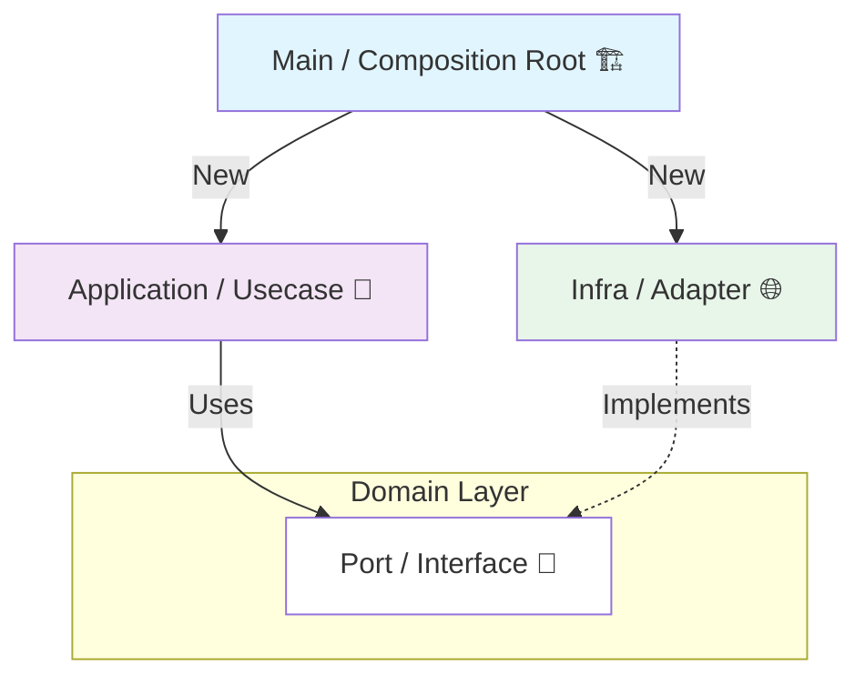

# 第14章：DIの実践（差し替え設計と境界の保ち方）🔄🧪

この章は「DIできるようになったけど…実際どう組み立てるの？🤔」をスッキリさせる回だよ〜！💖
ポイントは **“差し替えやすい形で、ちゃんと配線する（= Composition Root）”** こと！🧷✨

---

## 0. この章のゴール🎯✨

できるようになること👇

* ✅ **本番実装** と **テスト用実装** をラクに切り替えられる🔁
* ✅ DIが増えても迷子にならない **配線場所（Composition Root）** が作れる🏗️
* ✅ 依存が増えてきたときに **Factoryで整理** できる🧰
* ✅ 「DIやりすぎ😵‍💫」を見抜いて、ほどよく戻せる🧘‍♀️

---

## 1. 2026の前提（“今のTS/Node”の空気感）🌸🧠

* TypeScript は **5.9** のドキュメントが更新されてるよ（2026-01-07更新）([typescriptlang.org][1])
* Node.js は **v24 系がLTS（例：v24.12.0）**、Currentは **v25.2.1** になってるよ([Node.js][2])
* テストは **Vitest v4系** が主流の選択肢として強い（v4.0.16 表示）＆ **Browser ModeがStable** になってるのも大きい✨([Vitest][3])

> ここから先の例は「TS + Node + Vitest」想定で進めるね🧁

---

## 2. DI実践の全体像（ここが “配線の地図” 🗺️✨）


DIって、結局これ👇

* **内側（Domain / Application）**：

  * “やりたいこと”を書く🧠✨
  * 依存は **インターフェース（Port）** として受け取る🎁
* **外側（Infra）**：

  * DB/HTTP/時間/乱数/ファイル/外部API など “現実” を担当🌍
* **いちばん外（Composition Root）**：

  * 本番用の部品を **new して注入** 🏗️
  * テストでは **偽物（Fake/Mock）を注入** 🧪

「どこでnewするの？」→ **Composition Rootだけ** が基本だよ✅✨



---

## 3. 実践①：本番 vs テスト用を切り替える（最小の勝ちパターン）🔄🧪

例題：「ユーザー登録したらメール送る📩」

* 本番：メール送信サービス（外部）に送る
* テスト：送らずに “送ったことにする”

### 3-1. まず Port（インターフェース）を定義する🔌

```ts
// src/app/ports/Mailer.ts
export interface Mailer {
  sendWelcomeMail(to: string): Promise<void>;
}
```

### 3-2. Application（ユースケース）は Port だけを知ってる🧭

```ts
// src/app/usecases/RegisterUser.ts
import type { Mailer } from "../ports/Mailer";

export class RegisterUser {
  constructor(private readonly mailer: Mailer) {}

  async execute(input: { email: string }) {
    // ここに本来は「ユーザー作成」なども入る想定🍰
    await this.mailer.sendWelcomeMail(input.email);
    return { ok: true };
  }
}
```

### 3-3. 本番実装（Infra）を作る🌐

```ts
// src/infra/mailer/RealMailer.ts
import type { Mailer } from "../../app/ports/Mailer";

export class RealMailer implements Mailer {
  async sendWelcomeMail(to: string): Promise<void> {
    // 例：外部メールAPI呼び出し（ここは擬似）
    console.log(`Send mail to ${to}`);
  }
}
```

### 3-4. テスト用実装（Fake）を作る🧪✨

```ts
// test/fakes/FakeMailer.ts
import type { Mailer } from "../../src/app/ports/Mailer";

export class FakeMailer implements Mailer {
  public sent: string[] = [];

  async sendWelcomeMail(to: string): Promise<void> {
    this.sent.push(to);
  }
}
```

### 3-5. Composition Root（配線）を作る🏗️✨

```ts
// src/main.ts (Composition Root)
import { RegisterUser } from "./app/usecases/RegisterUser";
import { RealMailer } from "./infra/mailer/RealMailer";

const mailer = new RealMailer();
const registerUser = new RegisterUser(mailer);

await registerUser.execute({ email: "test@example.com" });
```

### 3-6. テストでは Fake を注入する🔄🧪

```ts
// test/RegisterUser.test.ts
import { describe, it, expect } from "vitest";
import { RegisterUser } from "../src/app/usecases/RegisterUser";
import { FakeMailer } from "./fakes/FakeMailer";

describe("RegisterUser", () => {
  it("welcomeメールを送る📩", async () => {
    const fakeMailer = new FakeMailer();
    const usecase = new RegisterUser(fakeMailer);

    await usecase.execute({ email: "a@school.jp" });

    expect(fakeMailer.sent).toEqual(["a@school.jp"]);
  });
});
```

✅ これが「差し替えDI」の一番シンプルで強い形だよ〜！🎀✨

---

## 4. 実践②：依存が増えてきた時の “束ね方” 🧺✨（引数地獄を防ぐ）


ユースケースが成長するとこうなる😇👇

* Mailer
* UserRepository
* Clock
* IdGenerator
* Logger
* …増える増える💦

### 4-1. パターンA：Deps（依存まとめオブジェクト）を使う🧺

```ts
// src/app/usecases/RegisterUser.ts
import type { Mailer } from "../ports/Mailer";

type Deps = {
  mailer: Mailer;
};

export class RegisterUser {
  constructor(private readonly deps: Deps) {}

  async execute(input: { email: string }) {
    await this.deps.mailer.sendWelcomeMail(input.email);
    return { ok: true };
  }
}
```

🧁メリット：引数が増えても見た目が安定
⚠️注意：Depsが “なんでも箱” になるとSoCが崩れるので、**ユースケース単位で必要最小限** にね✅

---

## 5. 実践③：Factoryで “組み立て手順” を分離する🏗️🧰✨

「main.ts に new がいっぱい…🤯」ってなったら Factory の出番！

### 5-1. ユースケース専用の Factory を作る🧁


```ts
// src/composition/registerUserFactory.ts
import { RegisterUser } from "../app/usecases/RegisterUser";
import { RealMailer } from "../infra/mailer/RealMailer";

export function createRegisterUser() {
  const mailer = new RealMailer();
  return new RegisterUser({ mailer });
}
```

### 5-2. main.ts は “起動” だけにする🚀

```ts
// src/main.ts
import { createRegisterUser } from "./composition/registerUserFactory";

const registerUser = createRegisterUser();
await registerUser.execute({ email: "test@example.com" });
```

🎉 main.ts がスッキリ！
「配線」＝関心が独立した！SoCできてる！🧠✨

---

## 6. 実践④：Composition Rootを1箇所に集める（迷子対策の最終兵器）🧭🏗️


規模が上がると「Factoryが増えすぎる」問題が出るよね😵‍💫
そこで **Composition Root（配線専用フォルダ）** を作る！

おすすめ例👇

* `src/app`（ユースケース・Port）
* `src/domain`（業務ルール）
* `src/infra`（外部I/O実装）
* `src/composition`（配線だけ🔥）
* `src/main.ts`（起動だけ🚀）

こうすると「どこを見れば配線かわかる」になるよ✅✨

---

## 7. “本番/テスト切り替え” の実務テク💡（やり方3選）

### 7-1. テストは “注入で差し替え” が基本🔄🧪

今回やった Fake 注入がいちばん安全✨

### 7-2. ちょい大きめ：`createApp(deps)` 方式🍰

App全体の依存をまとめて注入する（E2Eっぽいテストで便利）

```ts
// src/composition/createApp.ts
import type { Mailer } from "../app/ports/Mailer";
import { RegisterUser } from "../app/usecases/RegisterUser";

export type AppDeps = { mailer: Mailer };

export function createApp(deps: AppDeps) {
  return {
    registerUser: new RegisterUser({ mailer: deps.mailer }),
  };
}
```

### 7-3. “環境変数で分岐” は最小限に⚠️

`if (NODE_ENV === "test")` みたいなのを **内側に持ち込むとSoCが崩れやすい** ので、分岐はできるだけ Composition Root 側でね✅

---

## 8. DIやりすぎのサイン😵‍💫🚨（これ出たら減量タイム）


次のどれかが増えてきたら要注意だよ〜💦

* 🚨 インターフェースが「実装1個」しかないのに増殖してる
* 🚨 1ユースケースが “何でもDeps” を受け取ってる（Depsが神様👼）
* 🚨 テストが “全部Mock” で、何を保証してるのか分からない
* 🚨 配線が複雑すぎて、機能追加が「配線作業」になってる
* 🚨 依存を探すのにファイルを飛び回る（追跡コスト爆増）🔍💥
* 🚨 “とりあえずDI” が目的化してる

🎀コツ：**抽象化するのは「変わりやすい外側」から**

* HTTP / DB / 時刻 / 乱数 / 外部SDK など
* 逆に、純粋ロジックは抽象化しすぎない🧼✨

---

## 9. ミニ演習（15〜40分×3）🧪🌸

### 演習A：Clockを差し替えよう🕒🔄

* `Clock { now(): Date }` を作る
* 本番：`SystemClock`（Dateを返す）
* テスト：固定時刻の `FixedClock`

### 演習B：通知先を差し替えよう📩➡️📱

* `Notifier` を作って
* 本番：メール通知
* テスト：配列に溜めるFake

### 演習C：Factoryで配線を “1画面” にまとめよう🏗️✨

* `src/composition/` に集約
* main.ts を “起動だけ” にする

---

## 10. AI活用（Copilot/Codex向けの頼み方）🤖🎁✨

### 10-1. 「DIにしたいけど、どこをPortにすべき？」

お願い文例👇

* 「この機能で副作用（I/O）になってる部分を列挙して、Port案を3つ出して」
* 「このusecaseの依存を最小にするDeps設計を提案して」
* 「Composition Root を `src/composition` に作って配線コード例を出して」

### 10-2. 「Fake/Mock作って」

* 「このPortのFake実装を、テストで検証しやすい形（呼び出し履歴を保持）で作って」

### 10-3. 「DIやりすぎチェック」

* 「この依存関係を見て、抽象化が過剰な箇所と理由を箇条書きで」

AIに任せると速いけど、最後に人間が見るポイントはこれ👇🔍✨

* その抽象は **“変更理由”** が別？（SoC）
* テストは **“意味ある保証”** になってる？
* 配線場所が **1〜数箇所** にまとまってる？

---

## 11. まとめ🧁✨（第15章へつながる！）

* DIの実践は **差し替え** と **配線（Composition Root）** が命🏗️✨
* 依存が増えたら

  * ✅ Depsで束ねる
  * ✅ Factoryで組み立てを分離
  * ✅ 配線専用フォルダに集約
* そして…DIが効いてくると次章の **テスト戦略が急にラクになる** よ🧪🌸✨

次は第15章で「どこをどうテストするか🎯」を気持ちよく整理しよ〜！💖

[1]: https://www.typescriptlang.org/docs/handbook/release-notes/typescript-5-9.html "TypeScript: Documentation - TypeScript 5.9"
[2]: https://nodejs.org/en/download/current "Node.js — Download Node.js®"
[3]: https://vitest.dev/blog/vitest-4 "Vitest 4.0 is out! | Vitest"
