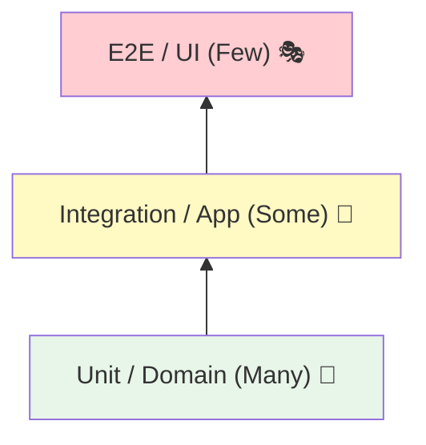

# 第15章：テスト戦略（SoCがあると楽になる）🧪🌸

この章は「テストのやり方」だけじゃなくて、**SoC（関心の分離）があると、テストが“めちゃ簡単になる”理由**を体感する回だよ〜！🥳💕

---

## 15.0 まずゴール確認🎯✨

この章を終えたら、こうなってたら勝ち✅

* 「ここはユニットテスト」「ここは結合テスト」「ここはE2E」って**迷わず仕分け**できる🧠✨
* **純粋ロジックは爆速でテスト**できる（しかも壊れにくい）⚡✅
* I/O（通信・DB・時刻…）は**薄く・必要最小限で守る**👌
* AI（Copilot/Codex）で**テストケースの穴を埋める**のが上手くなる🤖🧪

---

## 15.1 テストって何のため？（いちばん大事）💡💖

テストの目的は、ざっくりこれ👇

* **変更しても大丈夫って思える安心**🛡️
* **バグを早めに見つけるレーダー**📡
* **仕様のメモ（生きたドキュメント）**📘✨
* そして裏テーマ：**設計のフィードバック装置**🔧

  * テストしにくい＝責務が混ざってるサイン😇
  * テストしやすい＝分離できてるサイン💮

---

## 15.2 3種類だけ覚えよ！テストの基本セット🍱✨

### ① ユニットテスト（最優先🔥）✅

* 対象：**Domainの純粋ロジック**（計算・判定・ルール）🧠
* 特徴：速い・安定・壊れにくい⚡
* SoC的には：**副作用ゼロ**の場所が主戦場🧼✨

### ② 結合テスト（薄くでOK👌）🔗

* 対象：**Application + Adapter**のつなぎ目（Repository/HTTP/DBなど）🌐
* 特徴：遅くなる＆壊れやすいので**最小限**がコツ🥺

### ③ E2E（少数精鋭🏆）🎭

* 対象：ユーザー操作の“最重要ルート”だけ🧭
* 特徴：いちばん遅い＆フレーキーになりがち😵‍💫
* でも：最後の砦なので**ゼロは危険**⚠️

---

## 15.3 SoCがあると、テストの置き場が決まる📦✨


SoCの3層（UI / Application / Domain）に当てはめると、こんな感じ👇

| 層             | 何を守る？     | テストの主戦場             |
| ------------- | --------- | ------------------- |
| Domain🛡️     | ルール・不変条件  | **ユニットテスト大量✅**      |
| Application🧭 | 手順・ユースケース | ユニット＋軽い結合           |
| UI🖥️         | 表示と入力     | コンポーネントテスト or E2E少数 |



この表が頭に入ると、「どこまでテストする？」で迷いにくいよ〜！🥰

---

## 15.4 2026の“鉄板ツール構成”🧰✨（最新版ベース）

### ユニット〜軽い結合：Vitest 4 系が強い⚡🧪

* VitestはVite連携が強くて速い✨（Jest互換の書き味も意識されてる） ([Vitest][1])
* 2025後半〜2026にかけてVitest 4系の流れが目立つよ（リリースも継続） ([GitHub][2])

### 定番枠：Jest 30（安定・実績）🧪

* Jestは**30.0が安定版**として案内されてる ([jestjs.io][3])

### E2E：Playwright（TS相性よし）🎭✨

* `npm init playwright@latest` でTypeScript前提の導線が用意されてる ([Playwright][4])
* Playwrightは**1.57**のリリースノートが先頭にあり、テスト可視化（Speedboard）とかも進化してる ([Playwright][5])
* さらに**Playwright Test Agents**みたいに「LLMにテスト生成〜修復を誘導する仕組み」も入ってきてて、AI前提運用と相性◎ ([Playwright][5])

### 通信モック：MSW v2（実リクエストを横取り系）🕸️

* Vitest向けの案内もある（NodeテストでHTTPを横取り） ([mswjs.io][6])

---

## 15.5 まず“超小さい題材”で分離→テストしよ☕🧁

ここからミニ題材でいくよ〜！
「カフェの注文で割引計算」☕🍰（Domainが主役）

### ✅ Domain：純粋ロジック（副作用なし）

例：合計金額・割引・端数処理みたいなやつ✨

```ts
// src/domain/pricing.ts
export type Money = number;

export function calcTotal(price: Money, qty: number): Money {
  if (!Number.isInteger(qty) || qty <= 0) throw new Error("qty must be positive int");
  if (price < 0) throw new Error("price must be >= 0");
  return price * qty;
}

export function applyStudentDiscount(total: Money): Money {
  // 学割：1000円以上なら10%OFF（例）
  if (total < 0) throw new Error("total must be >= 0");
  return total >= 1000 ? Math.floor(total * 0.9) : total;
}
```

### ✅ ユニットテスト：ここが“爆速で気持ちいい”ゾーン⚡🧪

```ts
// src/domain/pricing.test.ts
import { describe, it, expect } from "vitest";
import { calcTotal, applyStudentDiscount } from "./pricing";

describe("pricing", () => {
  it("calcTotal: price * qty", () => {
    expect(calcTotal(300, 2)).toBe(600);
  });

  it("calcTotal: qtyが不正ならエラー", () => {
    expect(() => calcTotal(300, 0)).toThrow();
    expect(() => calcTotal(300, 1.2)).toThrow();
  });

  it("applyStudentDiscount: 1000未満はそのまま", () => {
    expect(applyStudentDiscount(999)).toBe(999);
  });

  it("applyStudentDiscount: 1000以上は10%OFFで切り捨て", () => {
    expect(applyStudentDiscount(1000)).toBe(900);
    expect(applyStudentDiscount(1111)).toBe(999);
  });
});
```

ここまで来たらもうSoCの恩恵出てるよ🥹💕
**UIも通信もDBも関係なく**、ルールが守れてるか一瞬で確認できる✅

---

## 15.6 Application：依存を“注入”すると、I/Oが怖くなくなる💉✨

次に「注文を保存する」みたいな流れ（ユースケース）を作るよ🧭
この層は **Repository（保存先）をインターフェース化**して、テストでは偽物に差し替えるのがコツ！

```ts
// src/application/placeOrder.ts
import { calcTotal, applyStudentDiscount } from "../domain/pricing";

export type Order = { itemId: string; price: number; qty: number; isStudent: boolean };

export interface OrderRepository {
  save(order: { itemId: string; qty: number; total: number }): Promise<void>;
}

export async function placeOrder(repo: OrderRepository, order: Order): Promise<number> {
  const base = calcTotal(order.price, order.qty);
  const total = order.isStudent ? applyStudentDiscount(base) : base;

  await repo.save({ itemId: order.itemId, qty: order.qty, total });
  return total;
}
```

### ✅ Applicationのテスト：Fake repoでOK🙆‍♀️✨

```ts
// src/application/placeOrder.test.ts
import { describe, it, expect } from "vitest";
import { placeOrder, type OrderRepository } from "./placeOrder";

describe("placeOrder", () => {
  it("学割なら割引後のtotalを保存する", async () => {
    const saved: any[] = [];
    const repo: OrderRepository = {
      async save(x) { saved.push(x); }
    };

    const total = await placeOrder(repo, { itemId: "coffee", price: 500, qty: 2, isStudent: true });

    expect(total).toBe(900);
    expect(saved).toEqual([{ itemId: "coffee", qty: 2, total: 900 }]);
  });
});
```

ここ大事ポイント📌

* **Domainは純粋だから速い**
* **Applicationは依存を注入するからテストしやすい**
* DBやHTTPが絡むのは、もっと外側（Adapter）に追い出す✨

---

## 15.7 I/O（通信）をテストするなら：MSWで“現実に近いモック”🕸️✨

「fetchをモックしたい…」ってとき、**MSW**はかなり便利寄り🧡
NodeテストでHTTPリクエストを横取りする導線が公式にあるよ ([mswjs.io][6])

使いどころのコツ👇

* Domain / Application：基本モック不要（注入で解決）✅
* Adapter（APIクライアント）：ここだけMSWで“薄く”結合テスト👌

---

## 15.8 E2Eは「最重要ルートだけ」Playwrightで守る🎭🏆

E2Eは増やしすぎると地獄になりやすい😇
だから方針はこれ👇

* ✅ “お金が動く”/“申し込みが完了する”/“ログインできる”
  **最重要ルートだけ**を少数精鋭で守る🏆

Playwrightはセットアップ導線も整ってるし ([Playwright][4])、
最近はテスト可視化（Speedboard）とかも強化されてるよ ([Playwright][5])

そしてAI前提ならここ超アツ🔥

* Playwright Test Agents（planner / generator / healer）が入ってきて、
  **テスト計画→生成→修復**をLLMに誘導できる設計になってる ([Playwright][5])

---

## 15.9 「どこまでテストする？」迷った時の3問クイズ🎯🧠

迷ったらこれを自問してね👇

1. **それ壊れたら痛い？**（お金・信用・作業ロス）💥
2. **仕様がよく変わる？**（UIは変わりやすい）🔁
3. **遅い/不安定になりそう？**（E2E増やしすぎ注意）🐢😵‍💫

### ざっくり結論🍬

* 壊れたら痛いルール → **Domainでユニットテスト厚め**✅
* I/Oや外部連携 → **結合テスト薄め**👌
* 最重要の体験 → **E2E少数**🏆

---

## 15.10 AI（Copilot/Codex）に頼むと強いプロンプト例🤖🪄

そのまま貼ってOK系だよ〜！💕

* 「この関数の**境界値/異常系**のテストケースを10個出して」🧪
* 「この処理がテストしにくい。**SoCを守る分割案を3案**出して」✂️
* 「RepositoryをDIできる形に直して。**差分最小**で」🔧
* 「Playwrightでこの画面の**最重要ルート**E2Eを1本だけ提案して」🎭
* 「失敗したE2Eログから、**原因候補と直し方を3つ**」🩹

---

## 15.11 章末ミッション（手を動かすやつ）🏁✨

### ミッションA（ユニット）🧼🧪

`applyStudentDiscount`に仕様追加👇

* 合計が **3000円以上なら 15%OFF**（それ以外は従来どおり）
  → テストを先に追加してから実装してね（テスト駆動ごっこ💖）

### ミッションB（Application）🧭🧪

`placeOrder`に「在庫チェック」を追加したい！

* `StockService`（interface）を新設して、`placeOrder`に注入✨
* テストではFakeを作って「在庫なしならエラー」を確認✅

### ミッションC（E2E）🎭🏆

画面がある想定で、

* 「注文して完了メッセージを見る」E2Eを**1本だけ**作る✨
  （1本でいい！増やさない！えらい！🥹）

---

## 15.12 今日のまとめ（これだけ覚えよ）💮✨

* SoCができてると、**Domainはユニットテストが超ラク**🧠✅
* I/Oは外側に寄せて、**薄い結合テスト**で守る🌐👌
* E2Eは**最重要ルートだけ**を少数精鋭で🎭🏆
* 2026は、Vitest 4系・Jest 30・Playwright 1.57あたりが軸になりやすい流れだよ ([Vitest][7])

---

次の第16章は、いよいよ **「ごちゃ混ぜ→分離してスッキリ」**の大型Before/Afterケーススタディだよ〜📚🔥
この第15章で作ったテスト戦略が、分離リファクタの安心材料になるから超大事！🧪🛡️

[1]: https://vitest.dev/?utm_source=chatgpt.com "Vitest | Next Generation testing framework"
[2]: https://github.com/vitest-dev/vitest/releases?utm_source=chatgpt.com "Releases · vitest-dev/vitest"
[3]: https://jestjs.io/versions?utm_source=chatgpt.com "Jest Versions"
[4]: https://playwright.dev/docs/intro?utm_source=chatgpt.com "Installation"
[5]: https://playwright.dev/docs/release-notes "Release notes | Playwright"
[6]: https://mswjs.io/docs/quick-start/?utm_source=chatgpt.com "Quick start"
[7]: https://vitest.dev/blog/vitest-4?utm_source=chatgpt.com "Vitest 4.0 is out!"
