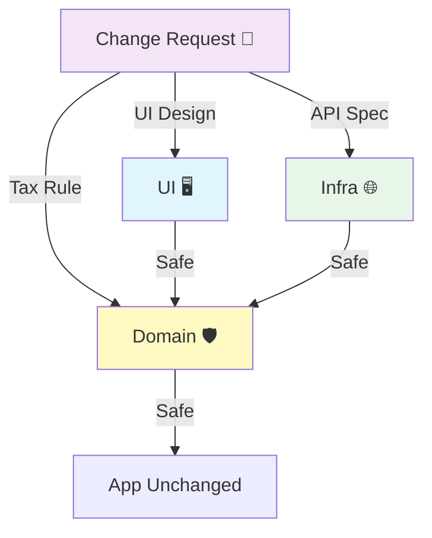

# 第16章：ケーススタディ（ごちゃ混ぜ→分離してスッキリ）📚🔥

**テーマ：カフェ注文アプリ ☕🧁（CLI版）**
「UIに全部😇」から「層＋境界＋型で整理✨」まで、**止めずに直す**手順でいくよ〜🧰🌱

---

## 0. この章でできるようになること 🎯✨

* 「ごちゃ混ぜコード」を見て、**どこが混ざってるか**言語化できる🧠🗂️
* **Domain（ルール）**を中心に、UIや通信を外へ追い出せる🚚💨
* DTO/外部I/Oの変更が来ても、**爆発範囲（blast radius）を小さく**できる💣➡️🫧
* リファクタを**段階的に**進める（止めない・壊さない）🛠️✅

---

## 1. 2026の“いま”のTypeScriptまわり小ネタ（超短く）🧡

* TypeScript 5.9 では `tsc --init` が「最小＋けっこう実用寄り」に更新されて、初手がラクになってるよ🧼✨ ([typescriptlang.org][1])
* 同じく TypeScript 5.9 で `import defer` が入って、**副作用の発生タイミング**を遅らせる方向の機能が増えてる（※実行環境/バンドラ依存）🕰️⚡ ([typescriptlang.org][1])
* Node.js は **v24 系が LTS**として配布ページでも「Latest LTS」として案内されてるよ🟢🧷 ([Node.js][2])
  （この章の内容は、TS/Nodeの細部が変わってもそのまま使える設計の話が中心だよ〜🙂）

---

## 2. まず“題材”の仕様（カフェ注文）☕🧾

ユーザーがメニューを選んで注文するだけの小さなアプリにするね🍰

* メニュー：`coffee(480)`, `latte(550)`, `cake(620)`
* ルール：

  * 小計＝合計
  * 消費税 10%（端数は四捨五入）
  * クーポン `STUDENT10` があれば **合計から10%引き**🎓✨
  * 最終金額は 1円以上（0円注文はダメ）🙅‍♀️
* 注文はAPIへ送る（`POST /orders` のイメージ）🌐

この題材がいい理由👇
UI（入力/表示）・業務ルール（税/割引）・通信（API）って、**関心がハッキリ違う**からね🧩✨

---

## 3. Before：UIに全部入ってる😇（1ファイル地獄）

「ありがち〜！」ってなるやつを、あえて作るよ😂

```ts
// src/order.ts（Before：全部盛り😇）

type MenuKey = "coffee" | "latte" | "cake";

const PRICES: Record<MenuKey, number> = {
  coffee: 480,
  latte: 550,
  cake: 620,
};

async function main() {
  // UI（入力）っぽい
  const menu: MenuKey = (process.argv[2] as MenuKey) ?? "coffee";
  const qty = Number(process.argv[3] ?? "1");
  const coupon = process.argv[4] ?? "";

  // Domain（業務ルール）っぽい
  if (!PRICES[menu]) throw new Error("メニュー不正");
  if (!Number.isFinite(qty) || qty <= 0) throw new Error("数量不正");

  const subtotal = PRICES[menu] * qty;
  const tax = Math.round(subtotal * 0.1);
  let total = subtotal + tax;

  if (coupon === "STUDENT10") total = Math.round(total * 0.9);
  if (total < 1) throw new Error("0円注文はだめ");

  // 通信（副作用）っぽい
  const res = await fetch("https://example.com/orders", {
    method: "POST",
    headers: { "content-type": "application/json" },
    body: JSON.stringify({
      item: menu,
      qty,
      coupon,
      subtotal,
      tax,
      total,
      createdAt: new Date().toISOString(),
    }),
  });

  if (!res.ok) {
    const text = await res.text();
    throw new Error("API失敗: " + text);
  }

  const json = await res.json();
  console.log("注文OK🎉 orderId=", json.orderId, " total=", total);
}

main().catch((e) => {
  console.error("注文NG💥", e);
  process.exit(1);
});
```

### どこがツラい？😵‍💫💥

* 税率が変わる→UIファイルを触る😇
* APIの仕様が変わる→計算ロジックまで触る😇
* テストしたい→`fetch` と `Date` と `process.argv` が邪魔😇
* 変更の理由が混ざりすぎて、修正が怖い🫠

---

## 4. Afterの完成形（先にゴールの地図）🗺️✨

この章のゴールはこの構造👇（第9章の3層を“実戦”でやるよ🍰）

```txt
src/
  domain/
    money.ts
    menu.ts
    pricing.ts
    order.ts
  app/
    placeOrder.ts
  infra/
    orderApiClient.ts
  ui/
    cli.ts
```

* **domain/**：税・割引・金額・注文のルール🛡️（純粋中心）
* **app/**：注文の流れ（入力→検証→計算→送信）🧭
* **infra/**：API通信など外界との接続🌐
* **ui/**：入出力（表示と入力だけ）🖥️⌨️

---

## 5. 段階リファクタ手順（止めずに直す）🔧🌱

ここからが本番！✨
いきなり全部移動しないで、**小さく安全に**いくよ🫶

### Step 1：まず“計算だけ”を抜き出す（最強の第一歩）🧼⚡

最初にやるのはコレ。
**副作用がない純粋関数**にすれば、テストが一気に簡単になるよ🧪🌸

```ts
// src/domain/pricing.ts
export type MenuKey = "coffee" | "latte" | "cake";

export const PRICES: Record<MenuKey, number> = {
  coffee: 480,
  latte: 550,
  cake: 620,
};

export type Coupon = "" | "STUDENT10";

export type PriceBreakdown = {
  subtotal: number;
  tax: number;
  total: number;
};

export function calcTotal(params: {
  item: MenuKey;
  qty: number;
  coupon: Coupon;
  taxRate: number; // 0.1
}): PriceBreakdown {
  const { item, qty, coupon, taxRate } = params;

  if (!PRICES[item]) throw new Error("メニュー不正");
  if (!Number.isFinite(qty) || qty <= 0) throw new Error("数量不正");

  const subtotal = PRICES[item] * qty;
  const tax = Math.round(subtotal * taxRate);
  let total = subtotal + tax;

  if (coupon === "STUDENT10") total = Math.round(total * 0.9);
  if (total < 1) throw new Error("0円注文はだめ");

  return { subtotal, tax, total };
}
```

👉 この時点で、Before側（1ファイル）から計算を呼ぶように差し替えれば、動作は変えずに前進できるよ🚶‍♀️✨

---

### Step 2：入力（UI）を“ただの入力”に戻す🧋

次に、`process.argv` を読むのはUIの仕事にするよ🙂
**UIは「集めて渡す」だけ**が理想🧺➡️📦

```ts
// src/ui/cli.ts
import { calcTotal, type Coupon, type MenuKey } from "../domain/pricing.js";
import { placeOrder } from "../app/placeOrder.js";
import { createOrderApiClient } from "../infra/orderApiClient.js";

function parseArgs(): { item: MenuKey; qty: number; coupon: Coupon } {
  const item = (process.argv[2] as MenuKey) ?? "coffee";
  const qty = Number(process.argv[3] ?? "1");
  const coupon = (process.argv[4] ?? "") as Coupon;
  return { item, qty, coupon };
}

async function main() {
  const input = parseArgs();

  // ここで依存を組み立てる（Composition Rootの超ミニ版🏗️）
  const api = createOrderApiClient("https://example.com");
  const result = await placeOrder({ input, taxRate: 0.1, api });

  console.log("注文OK🎉 orderId=", result.orderId, " total=", result.total);
}

main().catch((e) => {
  console.error("注文NG💥", e);
  process.exit(1);
});
```

---

### Step 3：Application（流れ）を作る🧭✨

「注文する」っていう**ユースケース**に“流れ”を寄せるよ🚰
ここが SoC の気持ちよさポイント🥰

```ts
// src/app/placeOrder.ts
import { calcTotal, type Coupon, type MenuKey } from "../domain/pricing.js";

export type PlaceOrderInput = {
  item: MenuKey;
  qty: number;
  coupon: Coupon;
};

export type PlaceOrderResult = {
  orderId: string;
  total: number;
};

export type OrderApi = {
  createOrder(dto: {
    item: string;
    qty: number;
    coupon: string;
    subtotal: number;
    tax: number;
    total: number;
    createdAt: string;
  }): Promise<{ orderId: string }>;
};

export async function placeOrder(params: {
  input: PlaceOrderInput;
  taxRate: number;
  api: OrderApi;
}): Promise<PlaceOrderResult> {
  const { input, taxRate, api } = params;

  // Domain計算は純粋関数に委譲🧼
  const breakdown = calcTotal({
    item: input.item,
    qty: input.qty,
    coupon: input.coupon,
    taxRate,
  });

  // 外部へ送る形（DTO）はここ（境界）で作る📦
  const dto = {
    item: input.item,
    qty: input.qty,
    coupon: input.coupon,
    subtotal: breakdown.subtotal,
    tax: breakdown.tax,
    total: breakdown.total,
    createdAt: new Date().toISOString(), // 副作用はApp側に寄せた🕒
  };

  const res = await api.createOrder(dto);

  return { orderId: res.orderId, total: breakdown.total };
}
```

ここが超大事💡

* **Domain**：計算とルールだけ
* **App**：それをどう使って注文を通すか（流れ）
* **UI**：入力/表示
* **Infra**：API叩く

---

### Step 4：通信（Infra）を分離する🌐🔌

`fetch` を隔離！
「APIが変わったらここだけ直せる」状態にするよ🧷✨

```ts
// src/infra/orderApiClient.ts
import type { OrderApi } from "../app/placeOrder.js";

export function createOrderApiClient(baseUrl: string): OrderApi {
  return {
    async createOrder(dto) {
      const res = await fetch(`${baseUrl}/orders`, {
        method: "POST",
        headers: { "content-type": "application/json" },
        body: JSON.stringify(dto),
      });

      if (!res.ok) {
        const text = await res.text();
        throw new Error("API失敗: " + text);
      }

      const json = (await res.json()) as { orderId: string };
      return { orderId: json.orderId };
    },
  };
}
```

---

## 6. “分離できた！”のチェックポイント✅✨


### ✅ 変更が来た時、どこが壊れる？

* 税率が 10%→8%：`domain/pricing.ts`（または呼び出し側の taxRate）だけ🎯
* UIをCLI→Webに変更：`ui/` だけ🖥️➡️🌐
* APIのURLやレスポンスが変わる：`infra/` だけ🌐
* クーポンが増える：基本 `domain/` だけ🎟️✨

「変更理由ごとに場所が分かれる」＝SoCが効いてる証拠だよ〜🧠🧩✨



---

## 7. リファクタを安全にする“最低限テスト”🧪🌸

ここは第15章の復習っぽいけど、ケーススタディでは超重要⚠️
**まずは純粋関数 `calcTotal` だけ**テストすればOK🙆‍♀️

```ts
// src/domain/pricing.test.ts
import { describe, it, expect } from "vitest";
import { calcTotal } from "./pricing.js";

describe("calcTotal", () => {
  it("coffee x2, tax10% -> subtotal 960, tax 96, total 1056", () => {
    const r = calcTotal({ item: "coffee", qty: 2, coupon: "", taxRate: 0.1 });
    expect(r).toEqual({ subtotal: 960, tax: 96, total: 1056 });
  });

  it("STUDENT10 applies 10% off after tax", () => {
    const r = calcTotal({ item: "latte", qty: 1, coupon: "STUDENT10", taxRate: 0.1 });
    // subtotal 550, tax 55 => 605, then 10% off => 544.5 -> round 545
    expect(r.total).toBe(545);
  });
});
```

ちなみに Vitest は v4.0 系で Browser Mode の安定化なども進んでるよ🧪🌐（規模が大きくなったら活躍！） ([Vitest][3])

---

## 8. AI（Copilot/Codex等）に手伝わせる“ちょうどいい頼み方”🤖🧡

この章はケーススタディだから、**リファクタの瞬間に使える**依頼文を置いておくね🎁✨
（貼るだけでOK系）

```txt
あなたはTypeScriptの設計コーチです。
次のコードを、UI / Application / Domain / Infra に分離する提案を3案ください。
各案について「メリット・デメリット」「移行手順（小さなステップ）」を箇条書きで出してください。
```

```txt
calcTotal の仕様（税10%、STUDENT10は税後に10%引き、四捨五入）を壊さないように
Vitestのテストケースを追加で10個提案して。境界値（qty=1、端数、0円防止）を多めに。
```

---

## 9. ありがちミス集（先に潰す）🪤😇

* **Domainに `fetch` や `Date` を入れちゃう**
  → テストしにくくなるので、外へ追い出そ🧼
* **DTOとDomainをごっちゃ**
  → API都合の名前や単位をDomainに入れない📦🙅‍♀️
* **UIが計算を持ち始める**
  → UIは“入力と表示”。迷ったらDomainへ🧠✨

---

## 10. ミニ演習（手を動かす）✍️💖

### 演習A：クーポン追加🎟️

* `HAPPY50`：合計から50円引き（ただし最低1円）
  どこを直す？（正解：まず `domain/pricing.ts` + テスト🧪）

### 演習B：APIの仕様変更🌐

* `createdAt` が不要になった
  どこを直す？（正解：`app/placeOrder.ts` か `infra/` のDTO生成まわり）

### 演習C：UIをWebにしたい🖥️➡️🌐

* 入力フォームにしたい
  どこを触る？（正解：`ui/` だけで済むのが理想👏）

---

## まとめ 🎀✨

この章のコツはこれだけ！

1. **計算（純粋）を抜く**🧼
2. **流れ（ユースケース）を作る**🧭
3. **通信（副作用）を隔離**🌐
4. **UIは入力と表示だけ**🖥️

次の第17章では、この分離を**AI導入前提で“崩さず運用する”**コツ（レビュー観点・ルール化）をガッツリやるよ🤖✅💖

[1]: https://www.typescriptlang.org/docs/handbook/release-notes/typescript-5-9.html "TypeScript: Documentation - TypeScript 5.9"
[2]: https://nodejs.org/en/download?utm_source=chatgpt.com "Download Node.js"
[3]: https://vitest.dev/blog/vitest-4?utm_source=chatgpt.com "Vitest 4.0 is out!"
