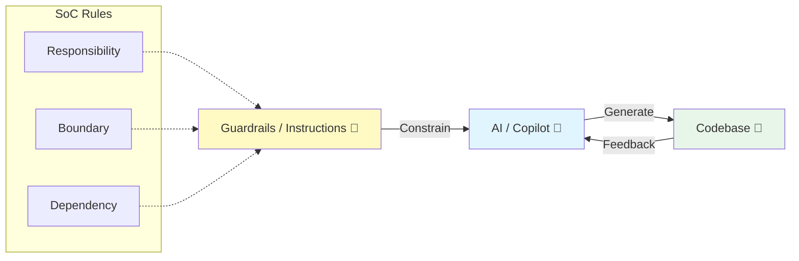

# 第17章：AI導入前提のSoC運用（Copilot/Codex活用＋レビュー）🤖✅💖

この章は「AIを使うほど、SoC（関心の分離）が保ちやすくなる」状態を作る回だよ〜！🧁✨
AIは便利だけど、放っておくと“ごちゃ混ぜコード”も秒速で量産できちゃう😇 だから **AIに「分離の型」を覚えさせて、レビューで崩れない運用**にしていくよ🛡️💕

---

## 17.1 この章のゴール🎯✨

* AIに「分離案を3案」出させて、**設計の比較→決定**ができるようになる🎁
* Copilot/Codexに **プロジェクトのルール（境界・依存・責務）** を覚えさせる🧠📌
* 仕上げに、**“責務・境界・依存”のレビュー観点**でSoCを崩さない✅🔍
* 1人開発でもチームでも回る、**運用ルール（PR/差分/テスト）**を持てる🧰💕

---

## 17.2 AI時代のSoCは「ガードレール勝負」🏎️🛟


AIが強いほど、コードは速く進むよね🚀
でも速いほど、道が悪いと事故る💥

だから最初にやるべきはコレ👇

### ✅ AIに渡すべき“3つのガードレール”

1. **責務（何を担当するか）**：どこまでやってOK？🙆‍♀️
2. **境界（どこで変換するか）**：DTO↔Domain、UI↔UseCase…混ぜない🚪
3. **依存（どっち向き？）**：内側（ルール）を外側（I/O）から守る🛡️

この3つを **ファイルで固定**すると、AIの出力が安定するよ〜📌✨


（VS CodeもGitHubも、この“指示ファイル”に対応してるよ）([Visual Studio Code][1])

---

## 17.3 まずはAIに「うちのルール」を覚えさせよう📚🤖

### ① `.github/copilot-instructions.md`（全体ルール）🧾✨

VS Codeでは、ワークスペース直下の `.github/copilot-instructions.md` を**全チャットに自動適用**できるよ（設定をONにするだけ）([Visual Studio Code][1])
さらに、VS Codeがワークスペースを解析して **instructionsを自動生成**する機能もあるよ（Generate Chat Instructions）([Visual Studio Code][1])

> ここに **SoCの大原則**を書いておくと、AIがずっと守ってくれる🛡️💖

**テンプレ例（そのまま使ってOK）👇**

```md
# SoC / Architecture Rules ✅

## Layers（軽い3層）
- UI: 表示と入力だけ。業務ルールを書かない。
- Application(UseCase): 画面/通信をつなぐ流れ。副作用の起点はここ。
- Domain: ルールの中心。基本は純粋（I/Oしない）。

## Boundaries（境界）
- Domainに DTO / APIレスポンス型 を入れない。
- 変換（mapping）は境界でやる（UI/Application側 or adapter）。

## Dependencies（依存の向き）
- Domain は UI / DB / fetch / logger など外側に依存しない。
- I/Oは interface(Port) 経由で注入する。

## Change policy
- 1PR=1関心。差分は小さく、段階的に。
- 既存の公開APIの破壊はしない（必要なら移行ステップを提案）。
- 変更後は必ず `npm test` と `npm run lint` が通ること。
```

### ② `*.instructions.md`（場所別ルール）📂🧩

VS Codeは `.github/instructions/` に `*.instructions.md` を置けて、`applyTo` で「どのファイルに効くか」を指定できるよ([Visual Studio Code][1])
「Domain配下だけ厳しめに」みたいな運用ができて便利〜💎

**例：`domain.instructions.md`（Domainだけに効く）👇**

```md
---
description: "Domain rules (no I/O)"
applyTo: "src/domain/**/*.ts"
---

# Domain Rules 🛡️
- fetch/DB/Date.now/random/console など副作用は禁止
- DTOは禁止。Domain型だけを使う
- exportはDomainの入口（index.ts）に寄せる
- 関数は小さく、純粋に。引数→戻り値が基本
```

### ③ GitHub側でも同じ仕組みが使える🧠✨

GitHub Copilotはリポジトリ全体の指示として `.github/copilot-instructions.md`、パス別に `.github/instructions/NAME.instructions.md` をサポートしてるよ([GitHub Docs][2])
さらに「AIエージェント向け」の `AGENTS.md` も使える（近い階層のものが優先される、みたいな考え方）([GitHub Docs][2])

---

## 17.4 AIに「分離案を3案」出させる最強プロンプト🎁🤖✨

ポイントは、**“3案＋比較＋移行手順”をセットで要求**すること！
（AIは放っておくと「1案だけドーン！」になりがち😂）

### ✅ コピペ用：3案分離プロンプト

```md
あなたはSoCレビュー担当です。
次のコード（/関連ファイル）について、関心の分離を改善したいです。

## やってほしいこと
1) まず「今の責務」を箇条書きで分解（UI/UseCase/Domain/I-O/変換/状態）
2) SoC的な問題点（混ざり、変更理由、依存の向き、境界の欠落）を列挙
3) 改善案を3つ出す：
   - A: 最小変更（安全に小さく）
   - B: 軽い3層（UI/Application/Domain）
   - C: Ports & Adapters（DIP強め）
4) 各案に「メリット/デメリット/差分の大きさ/テスト方針」を付ける
5) 最後に「おすすめ案」と「段階的リファクタ手順（3〜7ステップ）」を出す

## 制約
- 既存の挙動は変えない（必要なら保護テストを先に提案）
- 1ステップで変更しすぎない（小さなPRに割る）
- Domainは副作用禁止、DTO禁止、依存は内向き
- TypeScriptの型で境界を守る（変換は境界）
```

この形にすると、AIが **“設計の比較”** をちゃんとやってくれるよ🧠✨
しかも「段階手順」まで出るから、実装が迷子になりにくい🧭💕

---

## 17.5 VS Codeの“AI機能”をSoC運用に寄せるコツ🛠️🤖

### ✨ 1) Agent Mode（複数ステップ実行タイプ）

Copilotの agent mode は、コードベースを読み、編集案を作り、ターミナルでコマンドやテストを回して、エラーに応じて直す…みたいな**ループ型**ができるよ([Visual Studio Code][3])
SoCの改善は複数ファイルにまたがるから、相性いい🧩💖

### ✨ 2) Coding agent（GitHub側でPRを作るタイプ）

VS Codeから **issueを `@copilot` に割り当てて**、CopilotがGitHub上で作業→PR作成→あなたがレビュー、って流れもできるよ([Visual Studio Code][4])
「小さく切ったSoC改善タスク」を投げると強い💪✨

### ✨ 3) Codex（IDE拡張で並走 or クラウドに委任）

OpenAIのCodexは「読める・編集できる・実行できる」タイプのコーディングエージェントで、VS Code拡張から並走したり、タスクをクラウドに委任できるよ([OpenAI Developers][5])
（Copilotと同じく、**指示ファイルで“作法”を固定**すると安定しやすい🧠📌）

---

## 17.6 “責務・境界・依存”レビュー観点チェックリスト🔍✅

AIが書いたコードほど、レビューで守るポイントがハッキリしてると強いよ🛡️✨

### ✅ 責務（Responsibility）

* このモジュールは「何のために存在する」？1文で言える？📝
* 「ついでに…」が混ざってない？（ログ・変換・永続化…）😇
* 変更理由が同じもの同士だけが一緒になってる？📌

### ✅ 境界（Boundary）

* DTO/APIの形を **Domainに持ち込んでない**？📦❌
* 変換（mapping）は **境界に寄せた**？🚪
* UI→UseCase→Domain の間で、型が“守り”になってる？🛡️

### ✅ 依存（Dependency direction）

* Domainが fetch/DB/console などに触ってない？⚡
* UseCaseが interface(Port) 経由で外側を使ってる？🔌
* importの向きが「外→内」になってない？（逆向きは事故りやすい）💥

---

## 17.7 AIレビュー用プロンプト（PRや差分にそのまま使える）🧪🤖

### ✅ 「SoCレビューして！」プロンプト

```md
あなたはSoCコードレビュアーです。
この差分をレビューして、SoC観点で問題点と改善案をください。

観点：
1) 責務：1モジュール1関心か？変更理由が混ざってないか？
2) 境界：DTO/Domain/UseCase/UIが混線してないか？変換場所は適切か？
3) 依存：Domainが外側に依存してないか？依存の向きは内向きか？

出力形式：
- ✅良い点
- ⚠️気になる点（どのファイルのどの責務が混ざったか）
- 🛠️直し方（小さな手順で）
- 🧪追加すべきテスト
```

---

## 17.8 “崩さない”ための運用ルール（個人でもチームでも）📌✨

### ルール1：1PR=1関心 🧁

* UI変更とルール変更を同じPRにしない
* 変換追加（DTO↔Domain）だけのPRもアリ🙆‍♀️
  → これ、AIタスク分割と相性よすぎる🤝✨

### ルール2：instructionsは「短く・断定で」✍️

VS Code公式も「短く自己完結で」みたいな方向を推してるよ([Visual Studio Code][1])
長文ポエムにすると、AIが要点を落としやすい😂

### ルール3：AIに“差分を小さく”命令する🧩

* 「まず移動だけ」「次に変換だけ」「最後に削除」みたいに段階化
* で、各段階で `test` / `lint` を回す✅

### ルール4：指示ファイルが効いてるか確認する🔎

GitHub Copilotは、指示が使われた場合に **References に `.github/copilot-instructions.md` が出る**ので確認できるよ([GitHub Docs][2])
VS Code側も、どのinstructionsが使われたか参照で追える仕組みがあるよ([Visual Studio Code][1])

---

## 17.9 VS Codeの「Prompt files」で“定型プロンプト”を資産化💎📌

VS Codeは **prompt files** を作って、エディタ上の▶ボタンで実行したり、オススメ表示させたりできるよ([Visual Studio Code][6])
SoC運用は“毎回同じ質問”が多いから、ここを資産化すると超ラク🥹✨

**例：`soc-3options.prompt.md`（イメージ）**

```md
# SoC 3 options refactor
対象: ${selection}

上のコードについて
- 現在の責務分解
- 問題点
- 改善案3つ（最小/3層/Ports&Adapters）
- おすすめ＋段階手順
を出してください。
制約：Domain副作用禁止、DTO禁止、依存は内向き。
```

---

## 17.10 ミニ課題（今日からSoCが崩れにくくなるやつ）🎓💖

### 課題A：instructionsを入れる🧾

* `.github/copilot-instructions.md` に「3層・境界・依存」を短く書く
* `src/domain/**/*.ts` だけ厳しめの `domain.instructions.md` を追加

### 課題B：AIに3案出させる🎁

* “ごちゃ混ぜ関数”を1つ選ぶ
* 17.4のプロンプトで3案→おすすめ案→段階手順を出させる
* **最小案**で1PR作る（差分小さく！）🧁

### 課題C：AIレビューを通す🔍

* 17.7のレビュー用プロンプトで自己レビュー
* 「責務・境界・依存」が守れてるかチェック✅

---

## 17.11 ちょい最新メモ（TypeScriptまわり）📝✨

TypeScriptは少なくとも **5.9系のリリースノートが 2026-01-07 更新**になっていて、最新ラインとして扱われてるよ([typescriptlang.org][7])
さらに、TypeScript 6.0は「次のTypeScript 7へ橋渡し」になる位置づけ、という話も出てるよ([Microsoft for Developers][8])
（だからこそ、**境界を型で守るSoC**はこの先ますます効いてくる💪🛡️）

---

## 次の学習ルート🚀✨

この章までできたら、次はこんな順が気持ちいいよ〜🧭💖

* SRP（責務）をもう少し深く →
* DIP（依存逆転）を強化 →
* Clean / Hex（Ports & Adapters）を“必要な範囲だけ”導入🧩

---

[1]: https://code.visualstudio.com/docs/copilot/customization/custom-instructions "Use custom instructions in VS Code"
[2]: https://docs.github.com/ja/copilot/how-tos/configure-custom-instructions/add-repository-instructions "GitHub Copilot のリポジトリ カスタム命令を追加する - GitHub ドキュメント"
[3]: https://code.visualstudio.com/blogs/2025/02/24/introducing-copilot-agent-mode "Introducing GitHub Copilot agent mode (preview)"
[4]: https://code.visualstudio.com/docs/copilot/copilot-coding-agent "GitHub Copilot coding agent"
[5]: https://developers.openai.com/codex/ide/ "Codex IDE extension"
[6]: https://code.visualstudio.com/docs/copilot/customization/prompt-files "Use prompt files in VS Code"
[7]: https://www.typescriptlang.org/docs/handbook/release-notes/typescript-5-9.html "TypeScript: Documentation - TypeScript 5.9"
[8]: https://devblogs.microsoft.com/typescript/progress-on-typescript-7-december-2025/ "Progress on TypeScript 7 - December 2025 - TypeScript"
